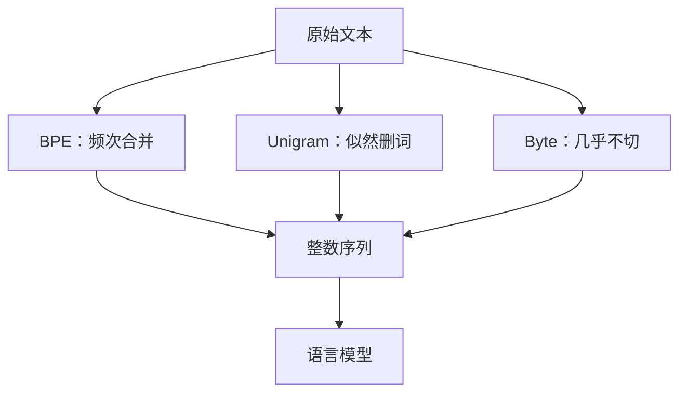

# Tokenizer：BPE / Unigram / Byte

把稀有词切成能在训练数据里反复见到的子词，翻译系统就不必为每个未见词准备一套开放词表。

<footer>—— Sennrich, Haddow, Birch, Neural Machine Translation of Rare Words with Subword Units, ACL 2016</footer>

语言模型不直接吃 Unicode 字符序列。Tokenizer 把字节或字符收成词表里的整数，决定哪些统计共现能被「一个 token」一次性看见。BPE 从字符表出发反复合并最频繁的对；Unigram 从过大的候选词表用似然删词；字节级模型（ByT5）几乎放弃词表，让网络自己在字节上组合。三种方案对应三种对「什么算一个符号」的承诺。词表大小与压缩率的定量权衡下一篇写；本篇写算法本身：训练目标、切分规则、以及和预训练数据的耦合。

## 问题

理想符号应在「压缩」与「可组合」之间：太小（字节）序列长、上下文窗口浪费；太大（整词）词表膨胀、长尾词永远学不够。子词是折中。还要处理噪声：网页拼写错误、混合脚本、HTML 残留。词表若在干净新闻上训练，到 C4 上会出现大量碎片与浪费。tokenizer 是数据管线的一部分，应在清洗去重之后的混合物上训练，并冻结后与模型版本绑定。

未登录与分解稳定性也是问题。BPE 贪心切分对同一词在不同上下文中通常稳定；Unigram 采样切分故意不稳定以正则。训练用采样、推理用 Viterbi，是 Unigram 的常见搭配。ByT5 没有未登录，但「词」的概念完全交给注意力层，小模型可能学不齐。

## 方法

BPE（Sennrich 等人引入神经翻译）初始化词表为字符（或字节），统计相邻对频率，每次把当前最频繁的对合并成新符号，直到词表达到预定大小。切分时贪心：从左到右应用学到的合并。它不显式优化句子似然，优化的是「高频邻接被收成原子」。英语形态（`-ing`、`-ed`）会自然出现，因为它们频繁。

Unigram（Kudo）假设句子由子词独立生成，用 EM 估计每个候选子词的概率，删掉对语料似然贡献小的符号，留下固定大小词表。切分可以取 Viterbi 最优，也可以按概率采样多条切分做正则。SentencePiece 把 Unigram 与 BPE 都做成不依赖预分词的实现，直接在原始文本上训练，对无空格语言关键。

字节级：ByT5 把输入当 UTF-8 字节，词表约 256 再加少量特殊符，没有子词合并。模型必须在深度里学习把字节组成词。代价是序列变长，注意力二次成本上升；收益是无未登录、对噪声与拼写更稳，且不需要一份与训练数据匹配的 tokenizer 快照。

### 预分词与字节基

GPT-2 一类字节级 BPE 先把文本打成字节，再在字节上合并，避免 Unicode 字符表过大，也避免未见字符。传统 BPE 常先按空格分词再在词内合并，英语干净，中文、泰语、代码则依赖预分词是否合理。SentencePiece 的「把空格当成普通字符」让同一套算法跨语言。选择预分词，就是选择哪些边界永远不会被合并：空格预分词保证 token 不跨词；无预分词允许「词+后一词的首字母」这类合并，压缩率可能更高，语义边界更糊。

代码对预分词极敏感。按空格切会把缩进和运算符弄碎；按字节 BPE 可能把常用 API 收成单 token。tokenizer 必须在含代码的混合物上训练，否则 GitHub 文本会被切成过长序列，配比里写的代码 token 百分比并不等于代码「内容」百分比。

## 机制

### 合并与似然的差别

BPE 的合并是确定性的频次贪心，可能留下对似然无用的符号，也可能把不该粘在一起的高频垃圾（网页模板片段）收成单 token——若在未去重的 Crawl 上训练 tokenizer，这一点很致命。Unigram 直接最大化语料的分词似然，删词有明确标准，但对候选初始集敏感：候选太穷，优化无从选择。实践中 Unigram 常从过完备的频率表或种子 BPE 出发。两者都不是形态学分析器；它们只是统计压缩器。Kudo 的子词正则利用 Unigram 的多切分，提高对拼写变体的稳健，这是 BPE 标准贪心切分没有的训练技巧。

字节模型把组合责任上移。ByT5 的实验表明，在足够深度与宽度下，字节级可以追上子词模型的许多任务，尤其在对噪声、罕见形态敏感的设定里；在计算匹配的条件下，更长的序列仍是税。解码器大模型后来仍普遍用字节级 BPE 而不是纯字节，是因为推理长度税比词表存储更贵。

特殊 token（BOS、EOS、PAD、掩码哨兵）必须进词表且永不拆。T5 的跨度哨兵是目标设计对 tokenizer 的侵入：噪声协议与词表一起版本化。换 UL2 或聊天模板而不换词表，要确认哨兵与保留字不冲突。

### 与多语言、代码的耦合

同一套 32K 英语偏向 BPE，中文被切成单字或更碎，韩文、阿拉伯文同样吃亏。多语言要么放大词表，要么接受更长序列。Unigram 在多语言 SentencePiece 里常见，因为可以在联合语料上按似然分配词表名额——仍会偏向高资源，除非训练时对语言做平衡采样。这与领域配比是同一问题在符号层的投影：tokenizer 训练集的配比，决定谁拥有短 token。

## 边界与工程取舍

tokenizer 一旦冻结，改变词表等于改变嵌入矩阵，通常要重训或做复杂的嵌入初始化。不要在预训练中途「升级 tokenizer」。数据换代（新语言、新代码风格）只能忍受次优切分，或付出重训代价。因此第一刀应在目标混合物的样本上训练，而不是用一份英语维基词表撑过全部预训练。

BPE 实现细节会造成不可复现：是否字节回退、如何处理 NFC/NFKC、是否把数字切成单数字。公开模型应发布 tokenizer 文件而不是只报词表大小。ByT5 的可复现性最好（几乎无词表），但与主流解码器工具链不兼容，KV 缓存与上下文长度都以更长序列计价。

不要把 tokenizer 当成与质量无关的预处理。它改变有效上下文、改变代码与多语言的真实份额、改变未登录行为。Gopher、Llama 报告的 token 数，都是某套切分下的计数；换 Unigram 或纯字节，同样字符的「训练预算」数字会变，缩放曲线不能跨词表直接比。

训练 tokenizer 的语料必须已经去重。否则高频转载段落会独占合并名额，词表里出现没有语言学意义的句子碎片。Lee 等人的去重不仅服务语言模型，也服务词表质量。

## 小结

- BPE 按频次贪心合并；Unigram 按子词似然删词；ByT5 几乎在原始字节上建模。
- 预分词决定哪些边界不可跨；字节级 BPE 是大解码器里最常见的折中。
- tokenizer 训练集的领域与语种配比，决定谁获得短符号，与数据配比耦合。
- Unigram 可采样多切分做正则；BPE 默认切分更确定、更好部署。
- 纯字节无未登录、更抗噪声，但序列长度税高，大模型推理通常不选它当默认。
- 词表与特殊哨兵必须和训练目标、聊天模板一起版本化，中途更换代价接近重训。
- 出处：Sennrich et al.，BPE，ACL 2016；Kudo，Unigram / 子词正则，ACL 2018；Xue et al.，ByT5；数据侧对照 Raffel T5 与去重工作。
