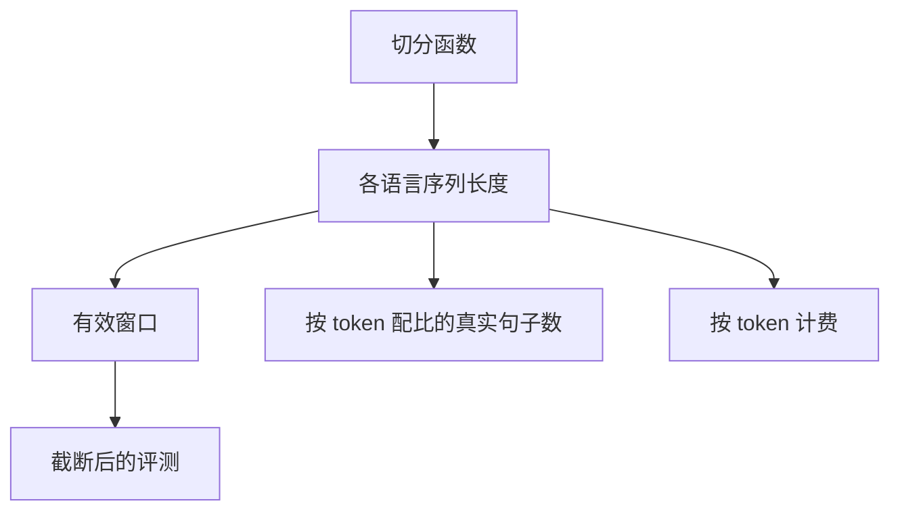

# 分词 fertility 与公平

同一句话在英语里可能是十几个 token，在另一种语言里是四十个；窗口、批量和按 token 计费都会把这种差异写成「能力差距」。

<footer>—— Petrov 等，Language Model Tokenizers Introduce Unfairness Between Languages，NeurIPS 2023</footer>

[上一课](/llm/tokenizer-training-corpus)把词表钉在一份分层语料上。平均压缩率好看，并不表示每一种语言、每一个领域都被同等压缩。本课不重讲语料如何抽样。缺口是：fertility（通常定义为每词或每字符的 token 数）把切分偏见变成可计量的税率，后续的配比、窗口和账单都会乘上这个税率。glitch token 是极端的长尾；本课先看平均值与分位数。

## 问题

[分词器设计](/llm/tokenizer-design)已经提到跨语言不公平。Petrov 等人把多语言基准按「同样语义内容消耗多少 token」摊开：以英语为 1，部分语言要付数倍长度。原因在前几课里已经备齐——[预分词正则](/llm/pretokenization-regex) 的类别假设、[字节回退](/llm/byte-fallback) 对罕见文字的拆解、合并名额被词表语料里的高频语言占满。缺的是：预训练工程要把这个倍数写进数据加载器与评测协议，而不是只写在分析论文里。

按 token 均匀的配比，对高 fertility 语言是「同样百分比、更少的句子」。按文档均匀则相反，短英文页会冲淡长 CJK 页。无论哪一种，若不报 fertility，配比数字没有跨语言含义。Rust 等人对「你的 tokenizer 好不好」的评测，也是在问覆盖与下游，而不是只问词表大小。

### 领域税与语言税叠在一起

代码的标识符、LaTeX、表格数字（尤其 [逐位切分](/llm/digit-splitting) 之后）会把 fertility 抬高。这不是语言不公平，是领域税。报表必须交叉：语言 × 桶。否则会把「代码切得碎」误诊成「英语词表歧视符号」，去扩一张无用的多语言表。

产品按 token 收费时，fertility 直接变成用户价格。同一功能在高 fertility 语言上更贵、更容易触顶窗口。这是政策选择，不是模型能力神话。

## 方法

在冻结词表上，对每个语言与每个数据桶计算：字符数 / token 数、空白分词后的词数 / token 数（无空格语言改用字符或语素近似）、回退字节占比、数字 token 占比。画出相对英语（或相对混合语料均值）的倍率。扩表或重训词表的目标函数应包含「降低最高 fertility 分位」，而不只是降低全局平均长度——平均会被英语网页淹没。

加载器侧有两种补法。一是按「目标语言的有效句子数」而不是按 token 再加权，等于用 fertility 的倒数去调 [配比](/llm/data-mixture-laws)。二是给高 fertility 语言更长的序列上限或更小的微批，以免 padding 浪费。前者改数据分布，后者改计算图形状，不要混成一个旋钮。

### 评测必须声明单位

下游分数若按「固定 token 预算」截断，高 fertility 语言先被截断，分数掉的是窗口，不是理解。应同时报固定字符/固定文档预算下的分数。Petrov 等人的不公平，很多来自这种静默截断。

特殊 token 与聊天模板也要计入 fertility。一轮中英夹杂的系统提示，可能比用户那句短问题更占窗口。模板本地化不是翻译问题，是 token 税问题。

## 机制

fertility 是切分函数 $f$ 在测度 $p$ 上的期望长度。$p$ 来自词表语料与模型语料的错位、以及 Unicode 覆盖。长度进入注意力的二次项与 KV 缓存，于是同样的「上下文 8k」对低 fertility 语言是一篇文章，对高 fertility 语言是一段。MoE 的专家粒度课已经假设 token 是均匀的计算单位；本课指出这个单位对用户语言并不是均匀的语义单位。

## 边界

把英语 fertility 降到极限（超大词表、整词化）会伤害形态泛化，并制造更多欠训符号——下一课 glitch。公平也不是把所有语言拉到同一 token 数：形态丰富的语言可能需要更碎的切分才能组合。目标应是「同语义内容的长度比」落在可接受区间，并在产品层用配比与窗口补偿剩余差距。不要为了报表好看把数字重新焊成整块，那是牺牲算术对齐去买压缩。

## 小结

- 本课不重讲词表语料抽样；只补长度倍率如何变成窗口税与配比税。
- fertility 应按语言 × 领域交叉统计，并用高分位而不是全球平均做优化目标。
- 按 token 的配比与评测截断会把切分偏见写成能力差距。
- 可用倒数加权补偿，但不要回退到乱焊数字。
- 出处：Petrov et al., NeurIPS 2023；Rust et al., *How Good is Your Tokenizer?*, ACL 2021。
