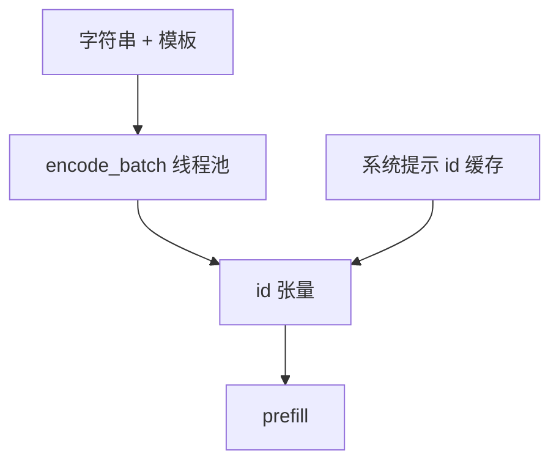

# 分词并行与预处理

GPU 等的常常不是注意力，而是主机上单线程的 BPE：提示一长，TTFT 的第一段已经花在 CPU 上。

<footer>—— Sennrich et al., ACL 2016；Hugging Face tokenizers 用 Rust 并行处理批，见 Wolf et al., Transformers, EMNLP 2020 生态</footer>

[上一课](/llm/moe-inference-batching)把 GPU 上的专家批凑厚。请求进引擎之前，字符串要变成 id。[流式 detokenize](/llm/streaming-detokenize) 写的是输出侧；本课写输入侧：批内并行 encode、与 prefill 重叠、以及聊天模板。Wolf 等人的 Transformers 生态把高速分词做成独立库（Rust tokenizers）：多序列 `encode_batch`。服务若在 Python 里对每条请求 `tokenizer.encode`，长提示下 CPU 成为 TTFT 主项，会计里的 GPU 屋顶线根本摸不到。

## 问题

prefill 是算力绑定，但启动前必须有 id 张量。单条 100K 字符的文档，BPE 是线性扫描加堆合并，可以到数十毫秒以上，且难在 GPU 上做（规则与模型绑定、分支多）。缺口是：把分词当成服务流水的独立阶段——线程池、批、缓存——而不是模型 `__call__` 的前奏。聊天模板（加 special tokens、角色标记）必须与训练一致；模板在 Python 字符串上做完再 encode，不要 encode 后再手工插 id 除非测试对齐。

缓存：系统提示、工具 schema 的 token 应缓存 id，不要每请求重分词。这与 KV 前缀缓存是两层：id 缓存省 CPU，KV 缓存省 GPU。

detokenize 的稳定前缀协议不要与 encode 共享一个锁。一边流式出、一边进新请求，分词器实现必须线程安全或按请求克隆。

## 方法

对到达队列做 `encode_batch`（Rust 侧 rayon 并行），不要 GIL 里逐条。超长单条内部也可切段并行再拼接——仅当分词器允许无跨段状态；BPE 通常要整段。与 GPU：CPU 分词与上一批 prefill 重叠。多模态下一课才加视觉编码器；文本 id 应先就绪，免得视觉流水还等分词。

词表与 [logit bias](/llm/logit-bias) 的 id 列表应在部署时预编译。停用词同理。

## 机制

TTFT = 排队 + 分词 + 搬输入 + prefill。长上下文曲线若只画 GPU，会漏掉第一项。byte-level BPE 对任意字节合法，预分词正则（如 GPT-2 的）可能成为扫描瓶颈，那是预训练工程课的正则；服务侧能做的是并行与缓存。错误的并行（按字符切 BPE）会改变合并，id 与训练不一致，属于静默正确性 bug。

## 边界与工程取舍

不要在 GPU 核里重写一份不完全一致的 BPE。不要为了并行破坏确定性。下一课：视觉编码器如何与文本 prefill 排成流水，而不是先把图编码完再开始一切。

出处：Sennrich et al., ACL 2016；Wolf et al., EMNLP 2020（Transformers）。Hugging Face tokenizers 库为实现出处。

## 小结

- 分词是 TTFT 的 CPU 段；长提示上可以盖过短 prefill。
- `encode_batch` + 系统提示 id 缓存；与 GPU 重叠。
- 模板与训练对齐；禁止不安全的切段 BPE。
- id 缓存与 KV 缓存是两层。
- 线程安全：进出流式同时发生。
- 下一课：多模态编码器流水。
- 出处：Sennrich et al., 2016；Wolf et al., 2020。
