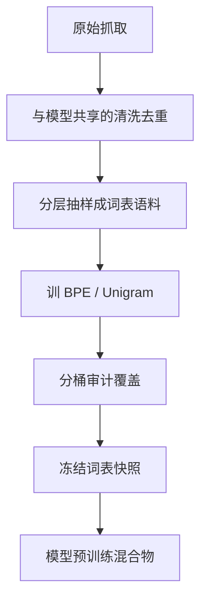

# 分词器训练语料

词表是在哪份文本上数出来的，推理就会把哪类统计当成「一个符号」；用新闻训的 BPE 去切代码，只会得到又长又碎的序列。

<footer>—— 据 Sennrich 等从平行语料学子词；对照 Raffel 等 C4 与后续预训练报告中「词表与数据绑定」的实践整理</footer>

[上一课](/llm/vocab-extension-multilingual)假定你已经有一份「目标语言语料」来长新子词。那份语料若是随手抓的网页，扩展会把模板、导航、乱码焊进 $V$。本课不重讲 append 的编号契约。缺口是：词表训练分布与模型预训练分布不是自动同一件事，必须单独规定、单独清洗。后课的 fertility 与 glitch，都从这份分布的偏置长出来。

## 问题

[BPE 合并](/llm/bpe-merge-rule)数的是相邻对频率，[Unigram](/llm/unigram-segmentation) 极大似然也是对同一语料。语料换了，表就换了。模型预训练会经过 [网页清洗与去重](/llm/web-clean-dedup)、配比、打包；词表若在清洗前的原始抓取上训练，会把 cookie 横幅和重复新闻稿当成最高频对。反过来，若只在维基上训词表、却在 C4 上训模型，网页噪声会大量走碎片或回退，配置里的 token 预算全部失真。

第二层错位是领域。代码、数学、对话、多语言各有自己的高频碎片。词表语料的配比不必等于模型配比，但必须覆盖模型将会看到的字符类与局部模式，否则 [预分词正则](/llm/pretokenization-regex) 再合理，块内也没有可焊的有用对。

### 容量远小于预训练

词表训练通常只用十亿级字符而非万亿 token：合并计数在更小样本上就会稳定。这是优点也是陷阱。小样本里的站点偏差、语言偏差会被放大写进 $V$，之后亿级 GPU 小时都无法改切分，只能改嵌入。词表语料要刻意分层抽样，而不能「从预训练混合物里随便切一刀」。

去重对词表比对模型更敏感。未去重的镜像页会把同一导航焊成超高频符号，占掉本该给内容词干的名额。词表管线应复用清洗规则，阈值可以更严。

## 方法

先冻结与模型相同的清洗：语言识别、启发式质量、文档与段落去重。再按计划中的预训练桶做分层：网页、书籍、代码、对话各抽固定份额，份额向「字符集覆盖」倾斜——目标语言与代码的字符要够，不必按最终 token 配比复制一遍。对代码应用仓库级去重后的子集，避免把某个流行仓库的许可证页焊进词表。

在这份干净混合物上跑 BPE 或 Unigram，加上 [数字切分](/llm/digit-splitting) 与特殊符号。产出快照后，在每个桶的持出样本上量长度、UNK/回退率、数字 token 占比，不通过就改抽样再训表，而不是直接开预训练。词表迭代比模型迭代便宜几个数量级，应在这里烧预算。

### 与模型语料解耦的合法理由

有时故意让词表语料更「干净」或更「多语言均匀」，以免垃圾模板进表；模型仍用更脏、更偏网页的混合物学语义。这合法，但必须记录两份清单。事后无法回答「这个怪符号从哪来」，glitch 课会很难做。绑定规则是：切分函数对模型语料的覆盖要达标，不要求两份字节级相同。

时间切割也要写清。用 2022 年抓取训词表、用 2024 年抓取训模型，新梗与新 API 会变碎。词表应在时间上覆盖模型数据的主要区间，或接受定期 append。

## 机制

词表语料通过频率（或 Unigram 似然）选择 $V$ 的基底。模型语料通过梯度选择参数。两者对最终损失的耦合是：切得过碎，同样文档变成更长序列，有效上下文变短，注意力与位置编码的负担上升；切得过整，罕见块欠训。清洗与分层决定的是前半段。后半段的领域配比改变梯度，不改变已经焊死的合并表——所以词表必须先于大规模预训练冻结。

## 边界

词表语料再讲究，也覆盖不了上线后的新字符与新协议；那是扩展课与特殊 token 课的补丁。也不要把评测集写进词表语料：合并表会为基准里的专有名词提供整词，造成一种隐蔽的污染。下一课 fertility 会把「覆盖」从平均长度拆成按语言、按领域的不公平；本课只把语料这个自变量钉住。

## 小结

- 本课不重讲如何 append；只补词表应从哪份文本上长出来。
- 词表语料要清洗、去重、分层，覆盖模型将见的字符类，容量可以远小于预训练。
- 与模型混合物允许不完全相同，但必须双清单、可审计。
- 词表先于预训练冻结；领域配比改不了已经焊死的切分。
- 评测集不得进入词表训练。
- 出处：Sennrich, Haddow, Birch, ACL 2016；Raffel et al., C4 / T5, JMLR 2020；Kudo & Richardson, SentencePiece, 2018。
