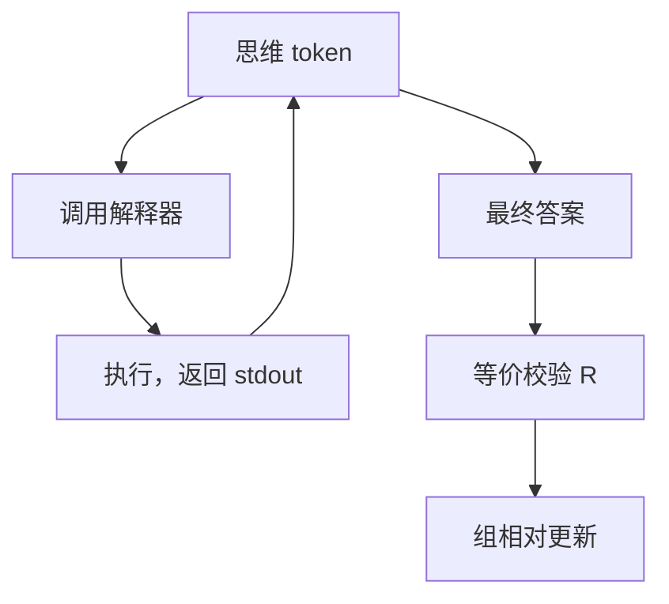

# 工具整合推理 RL

推理链里插入计算器、代码解释器或检索，奖励仍应钉在终局校验；工具只是动作，不是裁判。

<footer>—— Gou 等 ToRA；Qwen2.5-Math 的工具集成；Kimi k1.5 / 后续推理模型的工具 RL</footer>

[上一课](/llm/swe-rl-env)把工具循环用在修仓库。更轻的设定是：一道数学题，允许写代码、调计算器，最终答案仍走 [数学验证器](/llm/math-verifier-equivalence)。缺口是：**RL 会学会滥用工具刷格式或死循环调用，除非把调用代价与终局 $R$ 一起写进目标。** ToRA 等用 SFT 示范工具轨迹；本课写接到 [GRPO](/llm/grpo) 时多出来的动作。

## 问题

纯文本 CoT 在算术上易算错。工具把可靠计算外包。策略要学：何时调、调什么、如何把返回写回链。SFT 示范有限。RL 用终局对错可以学到示范外的调用策略。失败模式：每步都调工具（费用爆炸）、忽略返回继续幻觉、构造使解释器报错的调用骗过「尝试过」塑形。

$R$ 必须是终局答案等价，最多加很轻的格式项。不要用「成功调用次数」当主奖励。调用日志是状态，不是分数。

### 工具输出是环境，不是模型 token 的对数概率

解释器返回应 mask 掉策略损失，或标为环境 token，否则模型学习模仿数字的表面形式而不是调用。这与 SFT 仅回复损失同一逻辑，RL 里更易忘。

检索工具的 $R$ 更脏：文档是否支持答案难以程序化，接近开放域，需细则或人类。本课主场是代码解释器 + 数学终局。

## 方法

动作空间：普通 token + 特殊调用块。环境执行，把 stdout 写回上下文。轨迹结束抽答案，等价判定得 $R$。组采样时每条轨迹独立工具沙箱。PPO 对调用块内外都算比率，但环境 token 的 $\pi$ 不定义，必须 mask。代价：对调用次数软惩罚，与过长过滤并列。

与过程监督：工具轨迹的逐步合法可用「代码是否运行」当稀疏过程信号，仍不要替代终局等价。

## 机制

工具降低算术噪声，使 $R$ 更接近「是否会列式」，RL 优化的是规划。过优化表现为：用代码暴力枚举、超时边缘、或输出恰好让抽取器高兴的打印格式。沙箱时限与内存属于 $R$ 规范。无 KL 时，模型更敢发明奇怪调用，需要过长与过调用过滤。

训练-推理工具版本必须一致。解释器库差一个小数，等价判定会漂。

## 边界与工程取舍

没有解释器的部署不能用训时依赖工具的策略，或要有纯文本回退。SWE 环境更重，本课是单题工具。下一课把算力、步数、准确率收成 RL 缩放，问加更多 RL 是否永远有回报。

## 小结

- 工具是动作，终局 $R$ 仍是校验器；调用次数不能当主奖励。
- 环境返回 token 必须从策略损失里 mask。
- 防死循环与暴力枚举：时限、调用惩罚、与训练一致的沙箱。
- 主场：代码解释器 + 数学等价；检索更脏。
- 出处：Gou 等 ToRA；Qwen2.5-Math TIR；DeepSeek-AI / Kimi 推理模型的工具使用；校验器见 DeepSeekMath。
