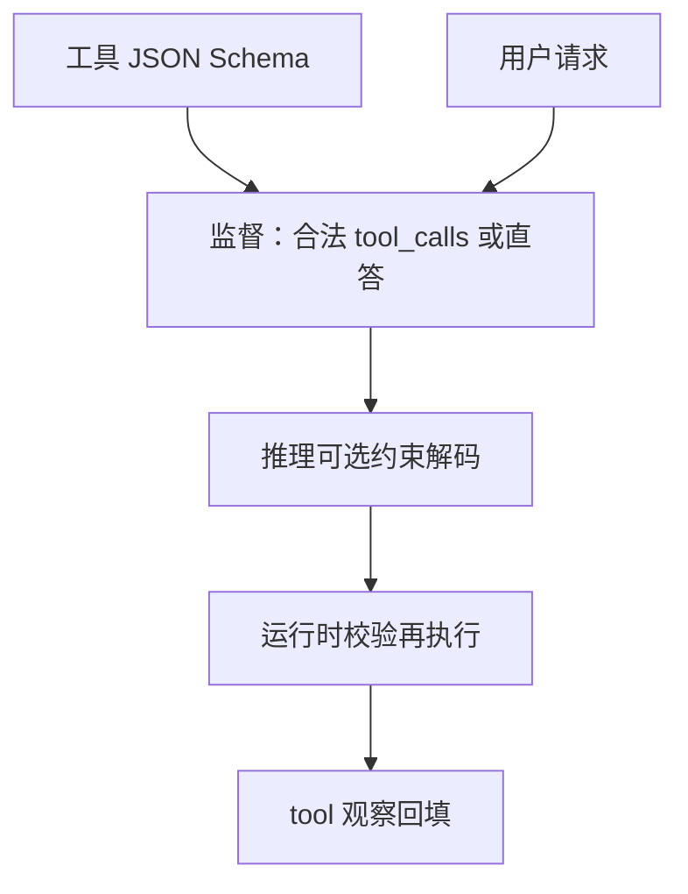

# 工具 schema 训练

工具调用不是散文里的意愿，而是对一份 JSON Schema 的条件生成；监督要落在名字、必填字段与类型上，否则运行时只能靠正则抢救。

<footer>—— 对照 OpenAI 式 function calling 训练；Schick 等 Toolformer 的自监督插入则是另一条数据路</footer>

[上一课](/llm/plan-vs-react) 把控制流分成反应与先规划。两条路都假设模型能产出**合法调用**。[Function calling](/llm/function-calling) 定义了协议信封；本课补训练缺口：如何用 schema 约束的 SFT（及少量 RL）让模型在该调时调、参数可过校验器。后面的多步信用、沙箱默认策略已经会说「这门语言」，而不是只会 ReAct 示范里的假动作字符串。

## 问题

提示里塞工具说明，少样本能让模型偶尔写出对的 JSON，但工具一多、嵌套一深、必填字段一多，合法率下降。解码端用 [JSON schema](/llm/json-schema-decode) 约束可以提高合法率，却不能教「何时调用、调用哪一个」——那是决策，要靠数据。Toolformer 用自监督在文本中插入 API 调用；当代助手则用带 `tools` 字段的对话轨迹做 SFT。本课走后者：显式 schema + 角色交替的监督，与协议课对齐。

缺口还包括负例：不该调用时调用（幻觉工具、该用记忆却去搜）、该调用却闲聊编造。只有正例 SFT 会过度调用。轨迹里需要「直接回答」与「先调工具」两种教师。

### Schema 是词表上的子集，不是自然语言同意义

同一语义 `city: 北京` 写成错字段名就不执行。损失必须对字段名敏感，对无关闲聊不敏感。实现上对 tool_call token 加权、对链式思考（若有）降权，避免模型学会在 Thought 里把参数写对、在 JSON 里写错——运行时只看 JSON。训练用的 schema 与线上白名单必须同版本。多一个未部署的工具名，模型会点名幽灵函数；少一个，会把该任务编成散文。这与 MoE 路由「选不存在的专家」类似，属于接口漂移。

## 方法

### 正例、负例与约束解码何时开

数据：每条样本含系统侧工具列表（JSON Schema）、用户请求、可选多轮，助手要么 `tool_calls` 要么纯文本。执行结果以 tool 角色回填后再答。SFT 在助手与后续轮上做 CE。合成数据：用强模型或脚本对 schema 生成合法 / 非法对照，非法仅作负例（损失推向「不这样写」或拒绝）。真实日志要脱敏、并过滤执行失败但教师仍当成功的脏轨迹。

约束解码可在训练后期或只在推理开。训练全程硬约束会让模型从未见过「被纠正的非法前缀」，线上一旦约束关闭就会崩。建议训练不依赖约束、推理加约束当保险。

## 机制

Schema SFT 把工具名与参数键变成高频模式，降低合法调用的损失。决策边界来自请求与说明文本的对应：说明写得差，模型会调错工具，这是文档问题不是优化器问题。工具说明应像代码注释一样版本化，并出现在训练分布里——只在线上改 description、不重训，等于域移。

多工具时，调用哪个是分类问题，参数是结构化生成。两者可分阶段：先训选工具（名字），再训填槽。联合训更简单，但稀有工具会饿死，类似 MoE 崩溃。应对稀有工具过采样或分组训练。

ReAct 散文格式与 JSON tool_calls 不要在同一检查点里用两套教师混得无标记。迁移时要有显式格式标记或单独 SFT 阶段，否则模型会在 JSON 里夹 Thought，破坏解析器。

### 与可验证奖励的衔接

若工具有单测式校验（SQL 结果对、代码通过），可在 schema SFT 之后用 [可验证奖励](/llm/verifiable-reward) 对「最终任务成功」做 RL，而不是对 JSON 合法做 RL——合法已由 SFT 与约束覆盖。对合法率做 RL 信号太密且与约束重复。RL 应奖终态，合法当过滤。

## 边界与工程取舍

MCP / 动态工具列表使训练时看不见的 schema 在线上出现。泛化依赖模型读 JSON Schema 的能力，应用一批「训练期未出现的工具」做评测，而不是只测见过的日历 API。评测协议课的工具面版本与此对应：泛化集 vs 闭集。

过长 schema 占窗口，真正的用户话被挤掉。应对工具做检索（只放可能相关的定义）——这是另一层路由，错误会让模型看不见该用的工具。训练应包含「列表被截断 / 被检索」的情境，否则线上一切换检索就掉点。

Toolformer 不需要预先声明完整工具清单，靠自监督插入；本课的产品路径是声明式 schema。两者数据不可互换。附录论文课会对照原文，主干只要求你锁住声明式这一条。

## 小结

- Schema SFT 教合法调用与何时调用；约束解码是推理保险不是训练替代。
- 正负例都要：过度调用与幻觉工具来自缺负例。
- 损失对准 tool_call 字段；schema 与白名单同版本。
- 稀有工具会饿死；动态工具要用未见 schema 评测。
- 终态可验证时，RL 奖任务成功，不奖 JSON 合法本身。
- 出处：function calling 产品协议；Toolformer 为对照的另一条数据路。
