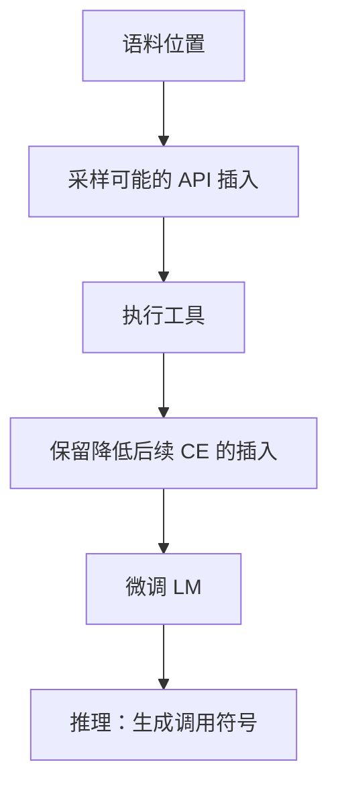

# Toolformer 论文

语言模型可以自己决定在文本哪里插入工具调用：用自监督过滤「调用是否降低后续词损失」，而不必先有完整的对话 schema 语料。

<footer>—— Schick et al., Toolformer: Language Models Can Teach Themselves to Use Tools</footer>

[ReAct](/llm/react-paper) 在推理期交错思考与动作，权重可冻。Schick 等人的 **Toolformer**（NeurIPS 2023）补的是 **学习何时调用**：在预训练式语料上采样 API 插入，只保留能帮助预测后续 token 的调用，再微调。主干 [schema SFT](/llm/tool-schema-sft) 走声明式 tools 字段；本篇对照这条自监督祖先，结束机制课序对照链。

## 问题

当时的 LM 会在需要计算器、翻译、检索时仍靠参数记忆，算错、过时。人工标注「这里该调 API」贵。作者问：能否用 **语言模型损失本身当过滤器**——若插入一次调用（及工具返回）使后续 CE 下降，就当正例。工具集是预先实现的若干 API（计算器、问答、搜索、翻译、日历等），不是动态 MCP 清单。

这与 ReAct 的差别：要更新权重；示范不是人工交错日志，是过滤后的插入文本。

### 自监督插入不是 function calling 协议

序列长得像：文本 + 特殊符号包住调用与结果。解析靠这些符号，不是 JSON Schema 校验。当代产品协议更严，但学习信号的想法可迁移：用「是否有助于下文」筛轨迹。作者包括 Timo Schick、Jane Dwivedi-Yu、Roberto Dessì、Roberta Raileanu、Maria Lomeli、Luke Zettlemoyer、Nicola Cancedda、Thomas Scialom 等。题名 *Toolformer: Language Models Can Teach Themselves to Use Tools*。

## 方法

### 采样插入、过滤再微调

对语料位置采样可能的调用，执行 API，把结果填回，算对后续 token 的损失差。保留改善足够大的样本，微调 LM。推理时模型发出调用符号，执行器回填，再继续生成。评测：数学运算、事实、翻译等能体现工具增益的集，对照不用工具的同尺寸模型。

## 机制

过滤器对齐的是 **下一词似然**，不是任务终态奖励。对计算器，算对往往确实降 CE；对检索，可能筛出「对续写有用的八卦」而非用户任务成功。这是自监督的上限。终态可验证 RL 是后一阶段（主干推理闭环），不要把 Toolformer 的过滤说成 SWE-bench 成功。

工具执行在训练数据构造期离线完成，费用在造数，不在每步 RL 环境。这比多步信用的在线沙箱便宜，但也看不到多步依赖：主要是单点插入，不是长 RecAct 环。

「Teach themselves」指过滤+微调，不是无工具无执行器的神秘涌现。没有 API 实现就没有正例。

### 与 schema SFT、ReAct 的三角

ReAct：冻模型，提示交错。Toolformer：自监督造插入数据，微调。Schema SFT：人类 / 产品日志里的合法 JSON。生产助手通常是第三种为主，第一种当推理格式，第二种的过滤思想可用于合成数据。附录链到此结束。

## 边界与工程取舍

工具集封闭、插入点局部、损失是 LM CE。开放域助手、多步副作用、权限与注入，原文覆盖浅。规模小于后来的 tool-use 专用模型。引用「会用工具」必须写工具列表与造数过滤阈值。

不要把 Toolformer 的特殊符号格式直接当 OpenAI tools 兼容。迁移需要再 SFT。沙箱与白名单在原文是研究执行器，不是 OSWorld 级 VM。

会议 NeurIPS 2023。读实验看他们用的基础模型尺寸与工具种类，再决定能外推多少。

## 小结

- 原文用「插入调用是否降低后续 CE」自监督造数据，再微调。
- 学的是何时插入封闭 API，不是动态 JSON Schema 协议。
- 过滤对齐似然，不对齐任务终态；多步环不是主设定。
- 与 ReAct（提示交错）、schema SFT（产品日志）三分工。
- 出处：Schick 等，Toolformer，NeurIPS 2023。
