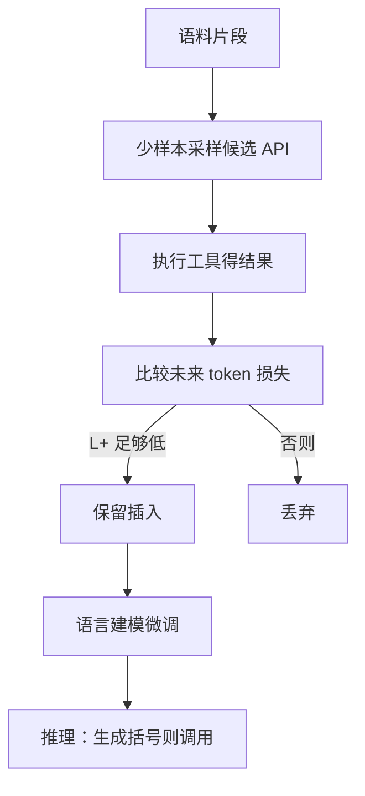

# Toolformer

    
不必为每个下游任务手写少样本轨迹：让模型自己在文本里插入 API 调用，只留下那些能降低未来 token 损失的调用，它就能学会何时算、何时查、何时翻译。

    <footer>—— Schick 等，Toolformer: Language Models Can Teach Themselves to Use Tools，NeurIPS 2023</footer>

Timo Schick、Jane Dwivedi-Yu、Roberto Dessì、Roberta Raileanu、Maria Lomeli、Luke Zettlemoyer、Nicola Cancedda 与 Thomas Scialom（Meta AI 等）的 NeurIPS 2023 论文（arXiv:2302.04761）把工具使用收成**自监督语言建模**。GPT-J 6.7B 量级的模型，用每种 API 少数示范生成候选调用，执行后看是否降低后续词的负对数似然，过滤后再微调。工具包括计算器、问答系统、维基搜索、翻译（NLLB）和日历。它不是 [function calling](/llm/function-calling) 的 JSON 信封，也不是 [ReAct](/llm/react) 的交错 Thought 提示：推理时模型在该调用的位置自己放出特殊记号，宿主填回结果，再继续写。本篇写这条「调用必须对续写有用」的过滤，以及它与后来协议化工具调用的分工。

## 问题

语言模型擅长续写，却在算术、实时事实、时区换算上系统性失败；更小的专用模块在这些点上更强。两条现成路都不理想。一条是海量人工示范（[WebGPT](/llm/webgpt) 一类浏览轨迹、对话里的插件标注），贵。另一条是任务已知时的少样本提示（PAL 把题写成 Python，ReAct 把题写成 Action 序列），换任务就要换示范，也无法在泛化预训练目标里学会「这段文本该不该打断去查表」。

TALM（Parisi 等）已用类似自监督教模型用计算器与搜索，但落在下游微调设定。Toolformer 要的是：工具集合固定、每种只需一把示范，在通用语料上学会插入调用，零样本迁移到下游，且**不牺牲**作为语言模型的核心能力。

### 调用是插入，不是另开一个 Agent 循环

文本被写成：普通 token，遇到需要工具处插入 `⟨API⟩` 参数 `→` 结果 `⟨/API⟩` 一类括号，然后继续原文。训练时结果来自真 API；推理时模型生成左括号与参数，宿主执行，把结果字符串写回，模型再生成后续。没有多步规划器，没有用户可见的 Thought 频道。该不该调用，由「这段插入是否让后面更好预测」决定，而不是由任务标签决定。

特殊记号与 JSON Schema 不是同一层。产品若要把 Toolformer 接到 OpenAI 式 `tools` 字段，需要一层模板把括号格式译成 `tool_calls`。评测「会不会用工具」时不要混用两种解码约束。

## 方法

对每个 API：用少量上下文示范提示模型，在语料片段上采样可能的插入位置与参数（可打分、可多样本）。执行 API，得到结果字符串。对每个候选，比较「插入调用并看到结果」与「不插入」两种前缀下，**未来 token** 的损失。仅当

$$
L_i^{+} < L_i - \tau
$$

时保留该调用（$\tau$ 为阈值，避免无信息的装饰性调用）。过滤后的文本当作微调语料，目标仍是下一个 token，模型因此同时学习：调用位置、参数怎么写、结果怎么读进后续句。推理用贪心或常规解码；当采样到调用起始符，暂停，执行，续写。

工具语义（论文设定，均为合法只读或纯计算工作流）：计算器解算术表达式；问答与维基检索补事实；翻译处理跨语句；日历处理「今天/明天」一类需要系统日期的指代。不引入任意 URL 抓取或凭证操作。主实验：GPT-J 6.7B 经此微调后，在若干数学、事实、时序任务上零样本大幅超过同尺寸基座，部分指标可与大两个数量级的 GPT-3 相比，同时在语言建模保持上不崩。

### 过滤比示范更重要

示范只教格式。真正抑制「每句话都搜一遍维基」的是 $\tau$：调用必须降低后续 NLL。计算器在「需要进位的数字」处留下，在「the two of them」这种假数字处被丢掉。这与 ReAct 少样本里人工示范「何时搜」不同——监督信号来自语言模型自己的压缩目标。代价是：对未来 token 无帮助、但对用户有帮助的调用（例如先查再拒绝回答）不会被留下。

## 机制

插入调用等于在序列里加入一段**由外部过程决定的 token**。若这段过程输出的字符串恰好是后续文本的充分统计，NLL 下降，梯度（微调时）会强化该位置的起始符与参数模式。若 API 返回噪声或与后文无关，NLL 上升，样本被丢。模型学到的不是「工具模块的权重」，而是条件分布 $p(\text{call}\mid \text{prefix})$ 与 $p(\text{args}\mid \text{call})$。执行永远在模型外，与 function calling 相同：生成不等于副作用已发生。

与 PAL 的差别：PAL 一次生成完整程序再执行，中间没有「结果写回再续写原文」；Toolformer 的工具是短 API，插入点在自然语言内部。与 ReAct 的差别：没有显式 Thought，也没有环境回合的奖励，只有语言建模。与 Gorilla 的差别：工具集合小而固定，不检索海量 API 文档。

Schick 等同时列出 Eric Hambro 等作者变体；引用以 NeurIPS 2023 论文为准。不要把 2023 年 GPT-J 实验写成「GPT-4 function calling 的训练配方」。

### 零样本迁移依赖工具仍可用

下游任务若仍能打到同一计算器或同一维基端点，插入策略可以迁移。若生产环境换了搜索引擎排序或禁止该 API，微调过的起始符仍会触发调用，宿主必须失败回填，否则模型会把空结果当事实。论文评测是任务准确率加 LM 保持，不是 [BFCL](/llm/bfcl) 的 AST 分项。

## 边界与工程取舍

Toolformer 不解决工具爆炸：每种 API 要跑一遍「采样–执行–过滤」，维基与问答的执行成本在数据构造期一次性付清。多步依赖（先搜 ID 再取字段）不是主合同，嵌套调用与并行调用要另做解码。安全上，白名单必须在宿主；模型只能从示范过的 API 名里选。后续产品把「自监督插入」换成指令数据里的 tool 角色，见 function calling 文；需要海量变体 API 时见 [Gorilla](/llm/gorilla)。需要浏览器引用链时见 WebGPT。不要在这篇里接任意网页操作或攻击性爬虫——原文工具是计算与检索。

出处：Schick, Dwivedi-Yu, Dessì, Raileanu, Lomeli, Zettlemoyer, Cancedda, Scialom，*Toolformer: Language Models Can Teach Themselves to Use Tools*，NeurIPS 2023，arXiv:2302.04761。相关：TALM；协议层见 OpenAI tools。

## 小结

- Toolformer 用未来 token 损失过滤自监督 API 插入，再微调语言模型。
- 每种工具只需少量格式示范；推理时遇起始符由宿主执行并回填。
- 它教「何时调用对续写有用」，不教 JSON Schema，也不是多步 Agent 循环。
- 出处：Schick et al.，NeurIPS 2023。
