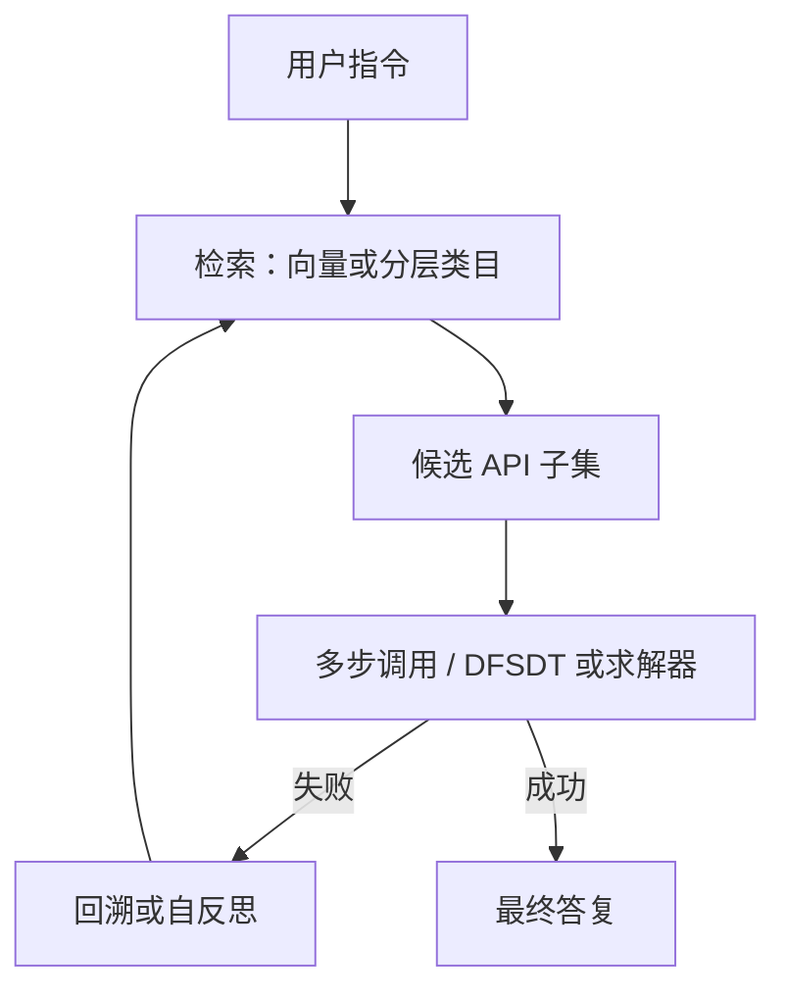

# AnyTool / ToolLLM

    
当 API 以万计，模型不能把说明书一次性塞进上下文：先检索（或分层检索）再决策，搜索树用来在失败的调用之后换路。

    <footer>—— Qin et al., ToolLLM, ICLR 2024；Du et al., AnyTool, ICML 2024</footer>

开源对话模型在指令微调后仍常不会用真实 REST。Qin、Liang、Ye 等人的 **ToolLLM**（arXiv:2307.16789，ICLR 2024）给出数据—训练—评测一整条链：从 RapidAPI Hub 收集 **16,464** 个 REST API、**49** 类，用 ChatGPT 自动造指令与解路径，得到 ToolBench；用基于深度优先的决策树 **DFSDT** 扩大搜索；微调 LLaMA 得到 **ToolLLaMA**，外加神经 API 检索器；**ToolEval** 自动打分。他们报告 ToolLLaMA 在复杂多工具指令上可接近当时的 ChatGPT，并在 OOD 的 APIBench 上有零样本迁移。Du、Wei、Zhang 的 **AnyTool**（arXiv:2402.04253，ICML 2024）不再训练检索器，而用 GPT-4 function calling 做**分层检索 + 求解 + 自反思**，并指出旧评测协议会虚高通过率，另给 AnyToolBench。文中称在 ToolBench 平均通过率上相对 ToolLLM 约 **+35%** 量级。本篇写规模化 API 的架构差别，不写对未授权端点的扫描。

## 问题

把一万个 schema 放进 system prompt 会先把窗口打满，再让模型张冠李戴。需要：**检索**出一小撮候选，再在候选上多步调用。单条 ReAct 链在 API 返回空或报错时容易死：没有后退，只会微扰参数。ToolLLM 要开源模型在真实 RapidAPI 分布上追上闭源工具使用；数据必须自动构造，否则 16k 端点无法人工写轨迹。

AnyTool 认为「先训一个检索器再训一个调用模型」不是唯一解：若骨干已有 function calling，可用层级（类目 → 工具 → API）把搜索空间切开，失败则反思并重新激活整条流水线。他们还认为：若评测把「模型说完成」或过宽的成功判定算通过，数字会虚高。于是改协议、加 AnyToolBench。问题从「会不会调一个天气 API」变成「在万级库里找对门、调通、并在评测上不自欺」。

### 单工具指令与多工具指令必须分表

ToolBench 覆盖单工具与多工具场景。多工具才强迫检索 + 规划：可能要先查 A 的 id 再交给 B。只报一个平均通过率，会让单工具记忆效应抬总分。OOD（APIBench / 未见 API）测的是读文档泛化，不是 RapidAPI 背题。AnyTool 的分层在类目级先剪枝，对多工具的组合爆炸更关键。

Qin et al.，ToolLLM，ICLR 2024，arXiv:2307.16789：16,464 API、49 类、ToolBench / DFSDT / ToolLLaMA / ToolEval。Du, Wei, Zhang，AnyTool，ICML 2024，arXiv:2402.04253：分层检索、自反思、GPT-4 工具调用、AnyToolBench；相对 ToolLLM 的 +35% 量级绑定他们修订后的协议与论文表。

## 方法

ToolLLM 三阶段造数：(1) 收集 RapidAPI 的 REST 与文档；(2) 提示 ChatGPT 生成涉及这些 API 的指令；(3) 再让 ChatGPT 搜索一条合法调用链当监督。DFSDT：在决策树里深度优先展开，节点是推理与 API 调用，失败则回溯扩搜索，而不是一条链走到黑。ToolLLaMA 在这些轨迹上微调；推理时检索器先给候选 API，再多轮决策。ToolEval 用自动评价减少人工看轨迹。

AnyTool 三模块：分层 API 检索器（按 RapidAPI 的类目/工具层级问 GPT-4 该下钻哪支）、求解器（在候选上 function calling 直到回答或失败）、自反思（判定当前解不可行则带着失败上下文重启检索—求解）。不训练额外模块，依赖 GPT-4 的工具字段。评测上他们收紧成功定义，并构造更贴近「用户只给自然语言、库很大」的 AnyToolBench。

### DFSDT 与自反思都是「失败后换路」，搜索预算不同

DFSDT 把搜索写进开源模型的解码过程，节点多、费用随树宽指数敏感，但可离线蒸馏进 ToolLLaMA。AnyTool 把换路写成一次反思后的再进入，搜索更粗、每步更贵（GPT-4）。二者都不是单轮 JSON。报通过率必须写：是否允许搜索树、最大 API 调用次数、检索 top-k。把 ToolLLaMA 单链分数和 AnyTool 带反思的分数画在同一栏，不公平。

## 机制

万级工具的核心机制是**把选择从生成变成先检索后生成**。检索错了，后面的规划再强也在错误子集上优化。ToolLLM 的神经检索器是可学习模块，受 ToolBench 分布约束；AnyTool 的分层利用了 RapidAPI 已有的树，用语言模型当路由器，免去训检索器，但对类目名称质量敏感。DFSDT 增加的是测试时探索：同一指令多条轨迹，提高「存在一条能跑通的链」的概率，类似搜索，不是更大的权重。

虚高通过率的机制：若金标准只检查「调用过某类 API」而不检查参数是否满足用户约束，模型会调一个相关但错误的端点仍得分。AnyTool 改协议，就是把评测往功能正确性靠。这与 WebArena 不比对动作、SWE-bench 要测试转绿是同一哲学在 API 域的版本。ToolEval 自动化方便迭代，但评委模型本身会偏袒某种轨迹风格，人工抽查仍需要。

RapidAPI 上的端点会下线、要钥、有配额。论文数字绑定当时的快照与包装器。复现应对失败端点单独统计「环境错误 vs 模型错误」，否则通过率不可比。不要把「能调 16k API」写成已授权访问任意网络主机——范围是该 Hub 上登记且评测包装器允许的 REST。

## 边界与工程取舍

### 合成指令与真实日志不是同一分布

ToolLLaMA 的教师是 ChatGPT，轨迹风格与错误都会遗传。AnyTool 绑 GPT-4 与 function calling，开源复现成本是 API 账单而非训练。二者都假设文档质量足够做检索；真实企业内部 API 文档更差，分层树可能不存在，要自建目录。ToolBench 指令是合成的，和真实用户日志的长尾不同：用户会省略槽位、用错术语、一次要办两件不相关的事。产品上仍应对执行层做白名单与鉴权，模型侧检索不能授予新权限。把 Hub 上「公开登记的 REST」写成「任意主机任意路径」，超出论文合同。

与单函数 SFT（[tool-call-sft](/llm/tool-call-sft)）：那条线假设可见工具很少；本篇假设可见工具极多，检索是一等公民。与 MCP：MCP 解决进程发现，不解决万级 API 的语义检索。不要在 MCP 服务器里塞一万个 tool 然后指望模型自己 list——仍要检索或分层。

出处：Qin, Liang, Ye, Zhu, Yan, Lu, Lin 等，*ToolLLM: Facilitating Large Language Models to Master 16000+ Real-world APIs*，ICLR 2024，arXiv:2307.16789。Du, Wei, Zhang，*AnyTool: Self-Reflective, Hierarchical Agents for Large-Scale API Calls*，ICML 2024，arXiv:2402.04253。

## 小结

- ToolLLM：16k RapidAPI + ToolBench 合成轨迹 + DFSDT + ToolLLaMA 检索调用。
- AnyTool：同一规模库上用 GPT-4 分层检索、求解与自反思，并收紧评测协议。
- 万级工具必须先检索后调用；失败后换路的预算要写进分数。
- 通过率对评测协议极度敏感；环境端点失效要单列。
- 出处：Qin et al. ICLR 2024；Du et al. ICML 2024。
