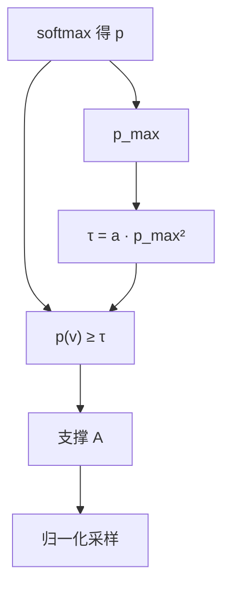

# Top-a / quadratic sampling

    
门槛与当前最大概率的平方成正比时，高峰被切得很狠、平局被放得很开：这是社区里对「相对峰高」截断的一条更陡的曲线，而不是新的训练目标。

    <footer>—— 解码器实现中的 top-$a$ / quadratic 截断；相对峰高的系统研究见 Nguyen 等人的 min-$p$，质量核见 Holtzman nucleus</footer>

Top-$a$ 在本地推理 UI 与若干采样器里作为截断选项出现：下一步只保留满足 $p(v)\ge a\cdot p_{\max}^{2}$ 的 token，再归一化采样。它与 min-$p$ 同属「相对冠军」家族，差别是地板对 $p_{\max}$ 二次而不是一次。高峰时 $p_{\max}^{2}$ 仍大，截断极狠，接近只留近义头部；平坦时 $p_{\max}^{2}$ 迅速变小，门槛塌下去，行为接近几乎不截断。没有一篇与 Holtzman、Meister、Hewitt 同等地位的会议论文把它立为理论对象；本篇按数学对象来写：二次相对地板与一次相对地板、绝对 $\varepsilon$、nucleus 质量核之间的几何，以及工程上如何避免空核与和 min-$p$ 重复叠层。

## 问题

Nucleus 的核宽度由累计质量决定，不直接看峰有多尖。绝对 $\varepsilon$ 看原子大小，不看峰。Min-$p$ 引入 $\tau=p_{\mathrm{base}}p_{\max}$，让门槛跟置信度走。仍有人觉得一次比例在 $p_{\max}$ 很高时不够狠：冠军 $0.95$ 时，min-$p=0.1$ 的门槛是 $0.095$，核里还能塞进不少 $0.1$ 左右的碎项；若希望「非常确信时近乎贪心」，需要门槛随 $p_{\max}$ 升得更快。平方项提供这条更陡的曲线。反过来，$p_{\max}=0.25$ 时 $p_{\max}^{2}=0.0625$，再乘一个小于 $1$ 的 $a$，门槛可以低到把大半词表留下，高温创作时不易被截死。

二次没有信息论推导。它不是典型集，也不控制序列困惑度。把它写进产品，等于选择一条特定的 *相对阈值函数* $g(p_{\max})=a p_{\max}^{2}$。任何单调的 $g$ 都会给出一种截断器；二次只是其中形状较陡、参数又少的一个。评估应针对形状，而不是针对名字。

### 与 min-$p$、$\varepsilon$ 的同一几何族

三类门槛都可以写成 $\tau=g(p_{\max},H,\varepsilon)$。$\varepsilon$：$g$ 为常数。Min-$p$：$g$ 对 $p_{\max}$ 线性。Top-$a$：$g$ 对 $p_{\max}$ 二次。$\eta$：对 $\mathrm{e}^{-H}$ 自适应，间接与平坦程度有关。画成 $\tau$–$p_{\max}$ 曲线，二次在右端（高置信）高于线性，在左端（低置信）低于线性——若 $a$ 与 $p_{\mathrm{base}}$ 按某一点对齐的话。不先对齐就比较「谁更狠」没有意义。社区默认 $a=0.2$ 与 $p_{\mathrm{base}}=0.1$ 不是同一工作点。

名称里的 $a$ 不是 nucleus 的 $p$，也不是 min-$p$ 的 $p_{\mathrm{base}}$。$a=0.2$、$p_{\max}=0.9$ 时 $\tau=0.162$；同一 $a$、$p_{\max}=0.4$ 时 $\tau=0.032$。报参数必须同时报公式。

## 方法

计算 $p=\mathrm{softmax}(z/T)$，$p_{\max}=\max_v p(v)$，

$$
\tau = a\cdot p_{\max}^{2},\qquad A=\{v:p(v)\ge\tau\}.
$$

$A$ 为空则回退 $\{\arg\max\}$。在 $A$ 上归一化采样。$a=0$ 关闭截断（$\tau=0$）。$a$ 过大则即使平坦也切得过狠，失去二次在左端放宽的本意。实现上与 min-$p$ 只差一行乘法；不要同时开两者，最终支撑是更紧的那条门槛，调参无法解释。

与 nucleus 叠用时同样取交集。若产品已经用 nucleus 处理长尾，再加 top-$a$ 主要在高峰步把核进一步收成近贪心。这可能是想要的（确信时少胡话），应写成「高峰近贪心、平局仍靠 nucleus」，并扫 $a$ 与 $\tau_{\mathrm{nuc}}$ 的网格，而不是两个默认值相乘。

## 机制

设冠军概率为 $m$。线性门槛 $c m$ 与二次门槛 $a m^{2}$ 的比值为 $(a/c) m$。$m$ 靠近 $1$ 时二次相对线性更紧（当 $a$ 与 $c$ 同量级）；$m$ 小于 $c/a$ 时二次更松。于是同一套「相对峰高」叙事下，二次把动态范围拉得更开：自信时更像贪心，犹豫时更像温度采样。这与人在写作时的直觉接近——想词时很宽，词已经到嘴边时很窄——但 LM 的 $m$ 未必等于「词到嘴边」：校准差的模型会在胡话前仍然给出很高的 $m$，二次会把胡话核收成一个高自信错误。校准越好，二次越像在执行该直觉。

### 高峰误信与平局真不确定

二次放大了 $m$ 作为置信度代理的权重。若模型在实体名上过度自信，$a p_{\max}^{2}$ 会删掉正确的次优实体。Min-$p$ 同有此问题，二次更重。若模型在标点与功能词上 $m$ 很高，二次几乎锁死标点选择，对散文影响小，对需要罕见标点的格式可能有影响。平坦的真不确定（多个近义动词）是二次想保护的区域：门槛塌下，nucleus 或温度仍能在其中选。把 top-$a$ 当「万能创意旋钮」会在校准差的模型上得到更武断的错误，而不是更丰富的正确续写。

数值上 $m^{2}$ 在半精度里通常无问题，$m$ 不会小到下溢后再平方才出事；真正的空核来自 $a$ 大且 $m$ 中等、同时叠了重复惩罚把次优项压到 $\tau$ 以下。回退规则与 [$\varepsilon$-sampling](/llm/epsilon-sampling) 相同。

Top-$k$ 的 $k$ 是基数约束，top-$a$ 的 $a$ 是相对二次地板。名字里都有 top，集合构造毫无关系。不要把 $a$ 理解成「再留百分之 $a$ 的词表」。

## 边界与工程取舍

### 与 typical、min-$p$ 选一条曲线即可

没有权威论文表格可抄，$a$ 必须在目标模型与温度上自扫。与 Meister 的局部典型相比，二次 *保留峰值*（只要峰值高于 $\tau$，而峰值总是 $\ge\tau$ 当 $a\le 1/m$ 即 $a\le 1$ 量级时恒成立：$m\ge a m^{2}\iff 1\ge a m$，因 $m\le 1$、$a\le 1$ 时常真）。典型集可能丢掉峰值；top-$a$ 不会。若目标是少套话，二次帮不上忙，应用 typical 或对比搜索。若目标是高温下仍连贯，二次与 min-$p$ 同一赛道，应直接对照两者的 $\tau$–$m$ 曲线再选一条，不要两条一起开。

投机无损要求草稿用同一 $a$ 与同一 $T$ 构造 $A$。CFG 在混合 logits 之后再算 $p_{\max}$。服务默认值应在文档里写出公式字符串 `a * p_max**2`，避免调用方按 nucleus 的语义传入 $0.9$。评测开放生成时把 $T$、$a$、是否另有 nucleus 写成协议；只写「开了 top-a」无法复现。

不要把二次门槛推广成「再乘一次 $p_{\max}$ 一定更好」。三次会在中等 $m$ 上过早塌到数值噪声以下，等于低温时近贪心、中温时突然全开，中间没有可用区。二次已经够陡。更有原则的自适应应看熵（$\eta$、typical、Mirostat），而不是继续加 $p_{\max}$ 的幂。

出处以采样器实现与相对峰高截断的几何为准。系统实验与高温叙事对照 Nguyen et al. 的 min-$p$（2024）；质量核对照 Holtzman et al., ICLR 2020。不要给 top-$a$ 编造会议论文页码。

## 小结

- Top-$a$ 保留 $p(v)\ge a p_{\max}^{2}$ 的 token，是相对冠军的二次地板，不是质量核，也不是典型集。
- 相对 min-$p$ 的线性地板，二次在高 $p_{\max}$ 更紧、在低 $p_{\max}$ 更松，动态范围更大。
- 它放大「用 $p_{\max}$ 当置信度」的假设；校准差时会把高自信错误切成近贪心。
- 与 nucleus、min-$p$、$\varepsilon$ 同属逐步截断，不要无声明取交集。
- 峰值始终可进支撑（常见 $a$ 下），故不能靠它去套话；少套话应看 typical 或对比搜索。
- 参数 $a$ 必须与温度联合扫描，并在 API 文档里写出公式。
- 出处：解码器中的 top-$a$ 规则；相对峰高截断的对照见 Nguyen et al., *Min-P Sampling*, 2024；nucleus 见 Holtzman et al., ICLR 2020。
