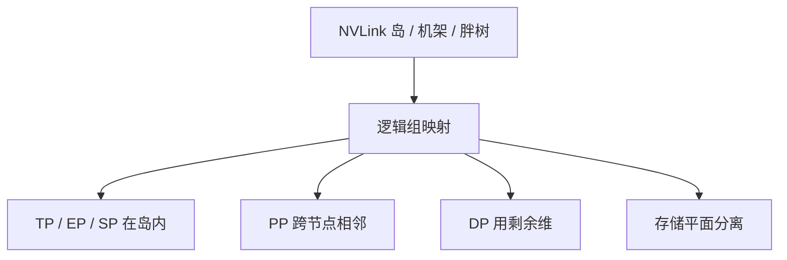

# 拓扑感知放置

把张量并行和专家并行留在 NVLink 岛上，把流水的阶段边界和数据并行的梯度放到节点间网络；放反了，重叠日历只是在遮挡一条注定更慢的链路。

<footer>—— 据 Shoeybi 等 Megatron 的高带宽域假设；Lepikhin 等 TPU 网格；MegaScale 的集群放置实践</footer>

[上一课](/llm/dataloader-pipeline)保证 token 能及时上卡。卡与卡之间的集合通信走哪条物理链路，决定 $T_{\mathrm{comm}}$ 能不能被 GEMM 盖住。本课不重讲预取槽。缺口是把 DP、TP、PP、EP、SP 这些逻辑组映射到机架、NVLink 域与 IB 分区，使 DualPipe 双流、MoE All-to-All、Ulysses 置换不要挤在同一条过订阅切面上。最后一课把即使放置正确、机器仍会坏的概率写成一等公民。

## 问题

[张量并行](/llm/tensor-parallel) 每层多次通信，必须短、胖、稳定，对应 GPU 板内或节点内 NVLink。[流水线并行](/llm/pipeline-parallel) 通信次数少、体积是边界激活，适合节点间。MoE 的 All-to-All 对延迟抖动敏感，EP 组应尽量落在同一高带宽域。Ulysses 的 A2A 体积随 $s$ 涨，SP 组同样。数据并行 All-Reduce 可以跨更远，但梯度体积大、可与计算重叠。逻辑上正交的组，物理上若随便 `rank % k`，会把 TP 跨到 IB。

TPU 上的网格放置（GShard）从一开始就是拓扑问题。GPU 集群的胖树过订阅使「任意 All-to-All」在满载时崩溃。放置是调度课所有日历的硬件前提。

### 双流与保存流量

DualPipe 要双向带宽。异步检查点要对象存储带宽。加载器要读带宽。三者若走同一 NIC，落后者会周期性出现在「刚保存的那几步」。放置也包括 IO 面：训练通信与存储平面分离，或至少错峰。

同一节点多 GPU 的 PCIe 切分也会把「看起来是 NVLink 组」变成假高带宽。应以实际 NCCL 拓扑检测为准，而不是主机名正则。

## 方法

输入：集群拓扑图（NVLink 岛、机架、leaf-spine、超节点）。输出：rank 到 GPU 的置换。优先满足：`TP ⊂ NVLink`，`EP ⊂ NVLink 或超节点`，`SP` 次之，`PP` 沿机架深度排列以缩短相邻阶段，`DP` 跨剩余维。MegaScale 一类工作强调自动探测与校验：作业启动时跑一次小 All-Reduce 环测，发现错位立即失败，而不是训三小时再查。

换弹性计划时重新跑放置，不要沿用已死节点的 rank 号。热备节点应在同一 NVLink 岛内，否则 shrink 后 TP 组被拆到 IB。

### 与日历的联合验收

放置对不对，用通信暴露时间与 P99 栅栏等待验收，而不是用「配置里写了 topology_aware=true」。重叠课的 profiler 是验收工具。

防火墙式的机架隔离（安全域）可能禁止理想放置。应把约束写进计划表，选出次优合法点，而不是静默跨域。

## 机制

集合通信的延迟由最慢的那一跳决定。逻辑组的直径必须匹配算法假设的直径。TP 假设直径是 NVLink；一旦直径变成跨 spine，公式里的「可重叠」不再成立。放置是把假设嵌进物理。

## 边界

放置不增加链路带宽，过订阅仍在。它也不能让坏 GPU 变好。下一课给出万卡上故障成为期望事件的定量图景：即使拓扑完美，MTBF 仍随 $N$ 下降，检查点、弹性、落后者治理是在付概率的账。

## 小结

- 本课不重讲加载槽；只补逻辑并行组到物理链路的映射。
- TP/EP/SP 优先 NVLink；PP 走节点间；DP 更远；IO 面分开。
- 启动环测校验；弹性后重放置。
- 用暴露时间验收，不信配置布尔。
- 出处：Shoeybi et al., Megatron-LM；Lepikhin et al., GShard；Jiang et al., MegaScale。
