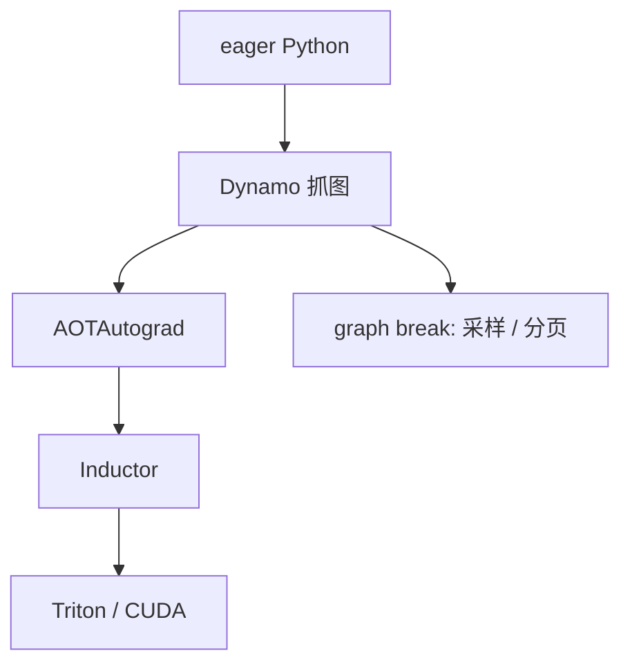

# torch.compile 与 Inductor

把动态 Python 字节码收成图，再由编译器后端生成融合核：训练和推理都可以少付一次次算子启动，而不必先把模型手写成 CUDA。

<footer>—— Ansel et al., PyTorch 2: Faster Machine Learning Through Dynamic Python Bytecode Transformation and Graph Compilation, ASPLOS 2024</footer>

[上一课](/llm/long-context-memory-curve)把会计收到三条曲线。本单元换成「引擎里的细节」：公式允许的屋顶，还要核与编译器去贴近。PyTorch 2 的 `torch.compile` 用 TorchDynamo 抓图、AOTAutograd 拆正反向、Inductor 降到 OpenAI Triton 或 C++/CUDA。服务引擎常常 *不用* 这条路径（vLLM 手写注意力），但自定义层、采样前后处理、以及尚未手写的 MLP 仍走编译器。本课写它能融什么、decode 上为什么经常融不动注意力。

## 问题

eager 模式每步是一串小核：RMSNorm、SiLU、残差加。decode 已在带宽墙，核启动与中间张量写回 HBM 会把有效带宽再削一截。手写融合核质量高、覆盖窄。缺口是自动融合：在动态形状（连续批变长、分页 KV）下仍能抓到图。Dynamo 靠字节码分析，遇到数据依赖的 Python 控制流会 graph break，融合在断裂处停止——LLM 服务里最常见的断裂是：采样、分页译址、以及 `if` 出来的投机接受。

`reduce-overhead` / `max-autotune` 模式改的是 CUDA Graph 与选择策略，不是另一套注意力算法。编译不改变 [SDPA](/llm/flashattention) 的数学；没有对应模板时 Inductor 会生成比 FA 慢的通用核。

## 方法

对静态或半静态部分（固定 $B$、固定 $n$ 的 MLP、Norm）`compile` 收益最大；注意力应显式走 FA / FlashInfer，而不是指望 Inductor 写出同等 IO 感知核。CUDA Graph 要求形状稳定：连续批的 $B$ 与 $n$ 每拍都变，整模型一张图会频繁重录。实践是「静态子图 + 动态注意力核」拼起来，或对 bucket 形状各录一张图。首次编译延迟打在冷启动，服务要预热。

动态形状用 `mark_dynamic`；过度动态会让 Inductor 放弃融合或反复编译。与[采样器内核](/llm/sampler-kernel)的关系：采样含 RNG 与不规则参数，通常留在手写核，不要 compile 进同一张图后还 graph break 在 `multinomial`。

## 机制

融合提高算术强度：中间激活留在寄存器或 SRAM，少写 HBM，正好补 decode 的强度缺口。但注意力的 IO 感知算法有专门的在线 softmax 结构，通用编译器短时间追不上 FA 论文里的手工分块。因此「整模型 compile」在 LLM decode 上的真实收益往往来自 MLP/Norm，注意力加速来自插件。CUDA Graph 减 CPU 发射延迟，在小核很多时显著；大 FA 核主导时收益变薄。

## 边界与工程取舍

不要在分页 KV 上强迫整图静态。不要把 compile 的加速比（相对 eager 朴素 SDPA）拿去和已经接好 FA 的引擎比。数值：编译可能改运算顺序，半精度下尾差要验收。下一课：即使编译了，块大小仍要自动调。

出处：Ansel et al., ASPLOS 2024。Triton 见 Tillet et al., MAPL 2019。

## 小结

- `torch.compile` 抓图并融合；LLM decode 的注意力通常仍走手写 FA。
- graph break 出在采样、分页、投机控制流。
- CUDA Graph 要形状桶；连续批不能一张图打天下。
- 收益主要是少写中间激活与少启动，贴近带宽屋顶。
- 冷编译要预热，计入 TTFT 或启动 SLA。
- 下一课：核参数自动搜索。
- 出处：Ansel et al., ASPLOS 2024。
