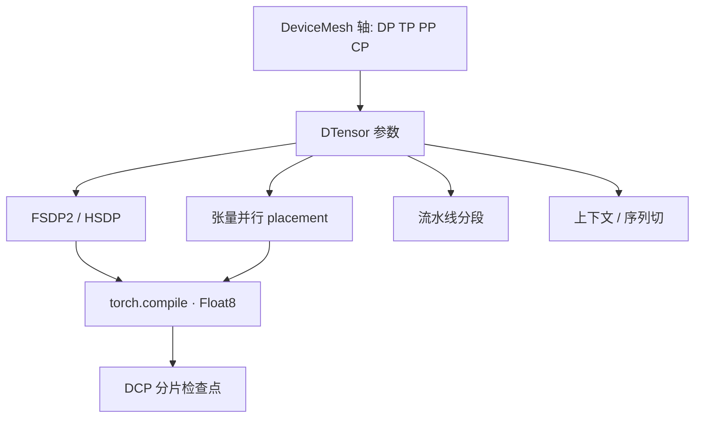

# TorchTitan

    
并行不该散落在互不兼容的第三方运行时里：把切分写成 DTensor 在 DeviceMesh 上的属性，4D 才能和 torch.compile、Float8、分布式检查点叠在同一份 PyTorch 原生作业里。

    <footer>—— Liang et al., TorchTitan: One-stop PyTorch native solution for production ready LLM pretraining, arXiv:2410.06511</footer>

预训练到 Llama 3.1 405B 量级，要把数据并行、张量并行、流水线、上下文并行与检查点、混合精度叠在一起。现成栈往往各管一段：Megatron 管 TP/PP，DeepSpeed 管 ZeRO，编译器与 FP8 核又在第三个仓库，组合作业的工程税很高。**TorchTitan**（Meta PyTorch 团队，代码 `pytorch/torchtitan`）的主张是：**PyTorch 原生**的一站式预训练系统——用 Distributed Tensor（DTensor）与 DeviceMesh 做可组合的 4D 并行，接 [FSDP2](/llm/fsdp)、`torch.compile`、Float8、SymmetricMemory，并给出 Llama 3.1 家族在 H100 上的配方。本篇按 2410.06511 写组合方式与公开加速比，不把某一版 nightly 的未定 API 当规范，也不编造未写入论文的 16K 卡作业数字。

## 问题

论文把现有分布式系统的缺口写成几条：并行技术难以叠加；架构不模块，新硬件和新切分进不去；没有吃到编译器与新数值格式；生产上的分布式检查点、故障恢复与调试工具不足；依赖外部、维护不同步的库，反而用不上 PyTorch 自己的核。根因是缺少贯穿全栈的**统一张量与设备抽象**：没有它，并行、检查点与优化仍然碎片化。

TorchTitan 的研究贡献被作者写成：把并行与优化的原则收成一套模板，扩展 DTensor 的 n 维切分，使其与 `torch.compile`、state dict 检查点兼容，并在 Llama 3.1 8B–405B 上从 8 卡扫到 512 卡，验证弹性扩展。它是完整训练系统，而不是技术清单。

### 原生 DTensor 把切分写成张量属性

DeviceMesh 声明网格轴：例如数据并行轴、张量并行轴、流水线轴、上下文轴。DTensor 是逻辑上完整、物理上分片的张量，单设备语义保持不变。FSDP2 的 `fully_shard` 把参数切在 DP 轴上；TP 用列/行切的 placement 作用在同一张 DTensor 上；二者组合不再经过「先包 Megatron 层再包 ZeRO 引擎」的双重运行时。HSDP 在节点内深切、节点间复制，对应 `data_parallel_replicate_degree` 与 `data_parallel_shard_degree` 同时大于 1——以仓库配置名为准。

每个模型提供 `parallelize_*`：按固定顺序套 TP、激活检查点、compile、FSDP 包装，避免维之间的非法组合。流水线用 `pipeline_module_split` 把模块切到 PP mesh 的各段。上下文并行沿序列切，使长上下文的激活能放下。顺序很重要：先 TP 再 FSDP 与先 FSDP 再 TP 的通信形状不同，论文把「可组合」定义成有文档的顺序，而不是任意排列。

FSDP2 相对 FSDP1：composable API、DTensor 布局、可以配置前向后是否立即 reshard。调试时不要假设 `named_parameters()` 指向未切分权重；应用 `summon` 一类 API 查看完整参数。

## 方法

4D = DP（含 FSDP2 / HSDP）+ TP + PP + CP。论文在 Llama 3.1 上给出从 1D 到 4D 的配方：小模型可以只开 FSDP（1D）；70B 进入 2D（FSDP+TP）；405B 进入 3D（再加 PP）；长上下文再加 CP 成 4D。这是作者在 H100 上的经验曲线，不是定理：以太网机房可能更早需要 PP，NVSwitch 域更大则 TP 可以更宽。

硬件协同：Float8 训练把 GEMM 收到 FP8；SymmetricMemory 用来做对称内存上的通信优化（文档中的异步 TP 等）。激活检查点可调粒度，在内存与重计算之间走。`torch.compile` 作用在已切分的图上，论文强调他们为 DTensor+compile 修过关键缺陷，否则切分与编译器互相踩。分布式检查点走 PyTorch DCP，按 DTensor 的 state dict 存，故障恢复不必先聚合到单机。Flight Recorder 一类工具用来查卡住的集合通信。

### 4D 与 Llama 3.1 配方

论文报告：在优化过的基线上，堆叠训练优化后，Llama 3.1 **8B / 128 GPU / 1D** 加速约 **65.08%**；**70B / 256 GPU / 2D** 约 **12.59%**；**405B / 512 GPU / 3D** 约 **30%**。GPU 为 NVIDIA H100。4D 被用来展示长上下文可训，而不是再报一条更大的百分比。这些数字是相对**作者的优化基线**的墙钟改善，不是相对随机 Megatron 脚本的 MFU 对比，也不能外推到 A100 或别的模型族。Llama 3.1 405B 原文训练用了远大于 512 的集群；TorchTitan 论文演示的是系统在 512 卡 3D 下仍能高效，不是复现 16K 卡预训练。

65% 出现在 8B、1D、128 卡，因为基线在小模型上更容易被 compile/Float8 拉开；70B 的 12.59% 更小，说明 2D 时通信与内核已经更接近屋顶。读百分比时必须带模型、卡数与维数。

## 机制

可组合的关键是：每一种并行只改 DTensor 的 placement 或模块到 mesh 的映射，集体通信由 DTensor 原语发出，而不是各库各写一套 NCCL wrapper。FSDP 的 All-Gather 与 TP 的 All-Reduce 作用在不同 mesh 维上，只要维正交，语义就是 Kronecker 式的网格。PP 不切单层矩阵，只切深度，与 TP 正交；微批填气泡。CP 切序列，注意力跨段通信，与 batch 维的 DP 正交。非法组合（例如在 PP 段之间再做需要全层权重的操作却忘记聚集）会在单设备语义上失败——这正是「保持单设备语义」这条不变量的用处。

弹性扩展：改 mesh 形状等于改作业，检查点必须能按新 placement 加载。论文把这当成生产性质，而不是研究原型。Float8 与 compile 改的是核与通信融合，不改 4D 的数学切分。

### 相对 Megatron / DeepSpeed 的位置

[Megatron-Core](/llm/megatron-core) 同样可组合，但是 NVIDIA 积木 + Transformer Engine，模型往往要写成 Core 模块。[DeepSpeed](/llm/zero-stages) 用 JSON 档位与引擎包装模块。TorchTitan 赌的是：你愿意跟 PyTorch 2.x API（FSDP2、DTensor、compile），用较少的外部运行时换可维护性。它不是「更快所以替代 Megatron」；405B 配方仍可能在 Core 里有更熟的 MoE 路径。仓库后来加的 DeepSeek-V3、Qwen3 等 `parallelize_*`，以当时代码为准，不要全部算进 2410.06511 的实验表。

## 边界与工程取舍

不要把 65% / 12.59% / 30% 写成对任意基线的承诺。不要在 FSDP1 包装下假设 DTensor 配方能直接跑。不要把 SymmetricMemory、异步 TP 当成所有硬件上都已默认打开。检查点格式与 Megatron / Hugging Face 之间需要转换，不是改扩展名。论文评估在 H100；换互联带宽，4D 的最优维数会动。

生产还依赖数据加载、tokenizer、容错重启策略；Titan 提供日志与 DCP，但不包含你的业务调度器。MoE 的 expert parallel 在后续仓库演进中出现，引用时写清论文版（Llama 稠密 3.1）与代码版。

出处：Liang、Liu 等 *TorchTitan*，arXiv:2410.06511；代码 github.com/pytorch/torchtitan。FSDP 见 PyTorch 文档。Llama 3.1 规模数字来自 Dubey 等，用来说明预训练需求，不是 Titan 论文自己训了 16K 卡。

## 小结

- TorchTitan 是 PyTorch 原生的 LLM 预训练系统：DeviceMesh + DTensor 上组合 4D 并行。
- 与 compile、Float8、DCP、FSDP2 同一栈；Llama 3.1 8B/70B/405B 在 H100 上报告 65.08% / 12.59% / 30% 相对优化基线的加速。
- 位置是原生可维护模板，不是自动替代 Megatron-Core 或 DeepSpeed。
- 出处：arXiv:2410.06511。
