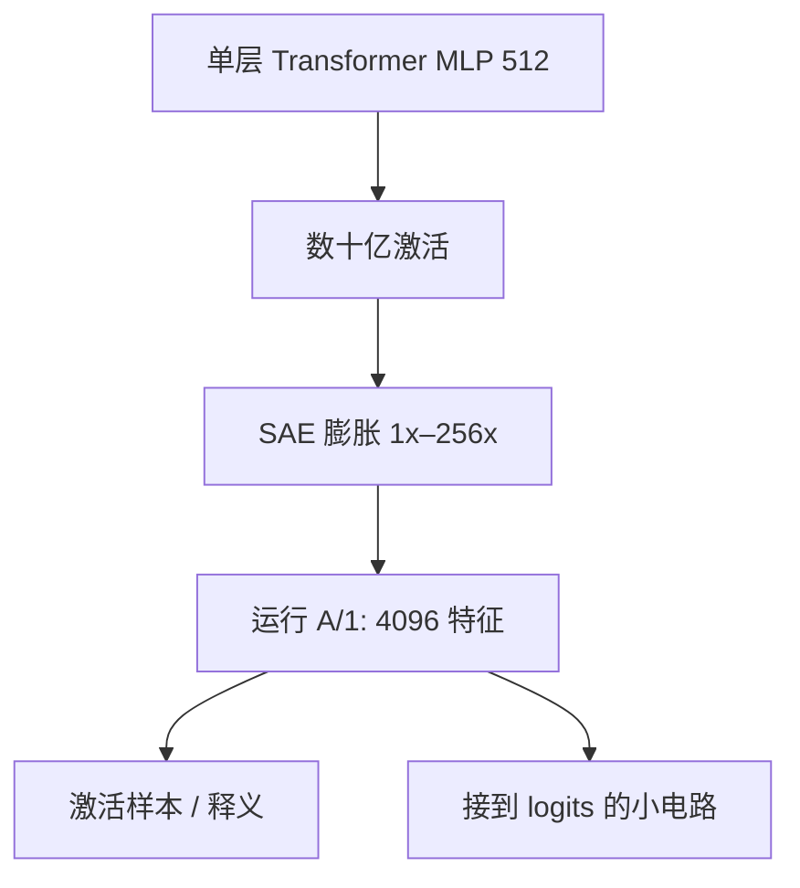

# Towards Monosemanticity

    
我们用一种弱的字典学习——稀疏自编码器——从已训练模型里抽出特征，作为比神经元本身更单义的分析单元，并在小 Transformer 上展示这套单元足以支撑基本的电路分析。

    <footer>—— Bricken et al., Towards Monosemanticity: Decomposing Language Models With Dictionary Learning, 2023</footer>

*Towards Monosemanticity* 是 Anthropic 2023 年 10 月 4 日发表在 transformer-circuits.pub 上的长文。Bricken、Templeton、Batson、Chen、Jermyn 与 Olah 等人把 [Toy Models](/llm/toy-models-superposition) 里的动机落到一个真实的（尽管很小的）语言模型上：单层 Transformer，MLP 宽 512，用最多 80 亿个激活样本训练 [SAE](/llm/sae-sparse-autoencoder)，膨胀倍数从 $1\times$（512 特征）扫到 $256\times$（131072 特征）。详细解释性分析集中在一次他们称为 A/1 的 4096 特征运行。目标不是发布生产级显微镜，而是给出一份足够细的存在性证明：从叠加里拆出可解释特征、并且能开始做电路，这条路在小模型上走得通。

## 问题

神经元作为分析单元失败在多义：同一 MLP 通道在 DNA 片段、法律套话、HTTP 请求上都可以亮。若因此改用任意线性方向，又没有原则去挑哪一条。需要一种无监督程序，输出一组比神经元更单义、又仍能重构 MLP 激活的方向，并证明它们对下游 logit 有因果作用。当时已有 Sharkey 等人的中期 SAE 实验与 Cunningham 等人的并行稿；这篇的定位是把「成功」写到可以逐特征阅读的粒度，而不是只报平均自动释义分。

小模型是刻意的。一层、512 神经元，电路短，人工可以读完一批特征的激活样本。若在这里都拆不开，放大到 Claude 没有意义；若在这里能拆开，才值得付 [Scaling Monosemanticity](/llm/scaling-monosemanticity) 的账单。

### 单义是相对神经元的，不是相对世界的

论文不声称特征与人类概念一一对应，只声称相对 MLP 神经元，同一特征的激活样本更常能用一句话概括。DNA、希伯来文、营养声明、法律语言等类别在 A/1 里分开出现，而这些性质在单个神经元上看不见。这是操作意义上的 monosemanticity：条件分布更集中，而不是哲学上的「纯粹意义」。膨胀倍数升高时，特征会分裂：一个粗概念变成若干更窄的触发器。A/1 的 4096 不是「世界上有 4096 个概念」，而是 $8\times$ 膨胀在可解释性与完整覆盖之间的一个工作点。读某个编号的特征，必须带着这次运行的宽度。

## 方法

在 MLP 激活 $x\in\mathbb{R}^{512}$ 上训练 SAE：ReLU 编码器、过完备解码器、MSE 加 $L_1$。数据来自语言模型前向，规模到数十亿 token 量级，以避免字典只记住一小撮语料赝像。扫描膨胀倍数是为了看：更宽的字典是否继续长出新的可解释特征，还是只复制旧的。他们报告死特征、重构、以及大量人工与半自动的特征卡片——激活最高的上下文、对损失的贡献、与其他特征的共现。

电路分析的基本动作是：把特征当节点，看它如何从嵌入或注意力读入、如何写到 logits。因为模型只有一层 MLP，这条链足够短，可以把「HTTP 特征」或「碱基特征」接到具体的输出偏好上。这比只看激活样例强：样例是相关，写到 logits 才是模型在用。

$$
x_{\mathrm{MLP}}\approx b+\sum_{i=1}^{F} f_i\,d_i,\qquad f=\mathrm{ReLU}(W_{\mathrm{enc}}x+b_{\mathrm{enc}})
$$

A/1 取 $F=4096$。同一架构下 $F$ 再大，出现更多细特征，也出现更多需要人工判断的碎片。

### 弱字典学习是设计选择

作者称 SAE 为 weak dictionary learning：不做迭代稀疏推断，只用一次线性编码加 ReLU。选择理由是可扩展——要对多样语料上的激活做分解，迭代编码在当时不现实。弱，意味着不保证 $f$ 是给定字典下的最优稀疏码；强，意味着能把规模做到「特征开始看起来像东西」。后续 Gated / JumpReLU 是在同一弱框架里修偏差，不是改回 K-SVD。

## 机制

### 非负稀疏检测器替换多义神经元

拆开叠加的直觉是：编码器学会一套近乎互斥的检测器，每个检测器对应原来挤在 512 维里的一个稀疏方向。ReLU 保证系数非负，符合「特征有强度、没有负的同一特征」这一简化；负向概念会另学一个特征。$L_1$ 逼着大多数检测器保持关闭，于是一次前向里只有少数卡片被点亮，分析者可以读这少数卡片，而不是读 512 个多义神经元。

与玩具模型的关系是直接的。玩具说明过完备近正交方向可以降低损失；这篇说明在真实 token 激活上，梯度下降会找到一批人类能命名的方向。命名来自样本，不是来自标签监督——这既是优点（无监督）也是风险（叙事可以过拟合样例）。作者用大量卡片降低抽样偏差，但不能消灭它。

「Towards」写在标题里是准确的：通向单义，不是已经到达对整网计算的完全分解。一层模型没有跨层特征对齐问题，也没有生产模型里的安全相关抽象（奉承、权力寻求）需要处理。那些是下一篇缩放工作的对象。

## 边界与工程取舍

模型太小，能力有限，找到的特征分布不能外推成「大模型的概念表」。80 亿激活仍然可能漏掉长尾特征。$L_1$ 导致的幅度收缩会让重构系统性地偏小，需要后来的门控或阈值修正。自动与人工释义都无法证明特征是计算原子：可能只是稳定相关。

把这篇当工程规范也不合适。生产级宽度、JumpReLU、全层套件、开放权重，分别是 Templeton 与 Lieberum 等人的工作。正确的引用是：它把 SAE 从「值得一试」推进到「在小 LM 上可以读特征、可以开始画电路」；完备性、缩放定律和开放生态都不在这篇的交付里。

不要用 A/1 的某个特征编号去检索其他论文的字典。编号是一次训练运行的局部索引。可迁移的是方法：冻结模型、过完备 SAE、膨胀扫描、特征卡片加因果读写。编号本身没有跨运行意义。

## 小结

- Bricken 等人在 512 宽单层 Transformer 的 MLP 上训练 SAE，展示特征比神经元更单义。
- 膨胀从 $1\times$ 到 $256\times$；精细分析以 A/1 的 4096 特征为主。
- 弱字典学习（一次 ReLU 编码）是为了在数十亿激活上可扩展。
- 价值在特征卡片与接到 logits 的小电路，不只在平均重构。
- 标题中的 Towards 标明限度：小模型、单层、不完备字典。
- 出处：Bricken et al., *Towards Monosemanticity: Decomposing Language Models With Dictionary Learning*, Anthropic, 2023。
