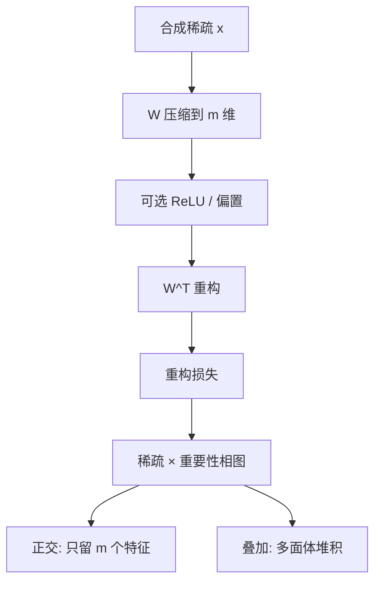

# Toy Models of Superposition

    
我们用小型 ReLU 网络和带稀疏特征的合成数据，研究模型何时把多于维度数的特征塞进隐藏层；至少在有限情形里，叠加状态下仍能做简单计算。

    <footer>—— Elhage et al., Toy Models of Superposition, 2022</footer>

*Toy Models of Superposition* 是 Anthropic 机制可解释性团队 2022 年 9 月的长文（transformer-circuits.pub，arXiv:2209.10652）。Elhage、Hume、Olsson、Schiefer、Wattenberg、Olah 等人不直接解剖 GPT，而是造一个足够小、能把权重画出来的瓶颈网络，让 [叠加假说](/llm/superposition-hypothesis) 变成可看的相图与多面体。论文的贡献不是新优化器，而是一套可复现的实验：何时放弃特征、何时挤在一起、挤出来的几何像什么、以及叠加是否只是存储还是也能计算。后来的 SAE 路线把这篇当动机；本篇写玩具本身的设定、相变与几何，避免把 2023 年以后的字典学习结果写回 2022 年的实验表。

## 问题

真实模型太大，无法把每个方向的干涉项画成矩阵。若叠加只在故事里出现、不能在可控数据上关掉或打开，就无法知道多义性到底来自拥挤还是来自特征定义本身。需要一个世界：特征的含义由构造给出（第 $i$ 维就是第 $i$ 个特征），稀疏度与重要性是旋钮，隐藏宽度小于特征数。在这个世界里，若训练后仍能恢复多于 $m$ 个特征，叠加就不是修辞。

第二个问题是 privileged 基。残差流旋转等价；MLP 的 ReLU 打破旋转对称，神经元轴变得特殊。玩具必须能切换这两种几何，否则无法解释「为什么有的层看起来更像多义神经元，有的层看起来像没有基的粥」。

### 最小模型要能看见 W

论文的核心对象是一层瓶颈。一种无隐藏非线性的版本把 $n$ 维稀疏输入压到 $m$ 维再试图重构；另一种给隐藏层加 ReLU，使 $W$ 的列与神经元对齐，便于直接读「这个神经元在编码哪些特征」。两种都足够小，可以把 $W^\top W$ 画成热图：对角是特征是否被表示，非对角是干涉。解释性在这里是字面的——图上的块就是假说里的几何。玩具的特征是坐标轴，真实语言的特征不是。论文证明的是「在特征已知且稀疏时，梯度下降会学会叠加」，不是「语言模型的特征已经列在某张表里」。把玩具里的五边形直接当成 GPT 神经元的形状，是把演示当成测量。

## 方法

输入 $x$ 的各维独立地以概率 $S$ 为非零（稀疏），并带一个重要性权重。模型学习

$$
h=\mathrm{ReLU}(Wx),\qquad \hat x=\mathrm{ReLU}(W^\top h+b)
$$

或去掉隐藏 ReLU 的更简版本 $h=Wx$。损失是重构误差，有时对重要特征加权。训练后检查：$W$ 的哪些列范数仍大（特征被保留）、列之间夹角如何（正交还是挤成星形）、以及干预某一列是否只破坏对应特征。

相图的横轴常用稀疏度（或 $1-S$），纵轴用特征相对重要性。低稀疏、高维需求时，最优是选择最重要的 $m$ 个特征做正交基，其余列缩到近零——没有叠加。提高稀疏或让更多特征变得重要，会跨过一条边界：许多列以锐角共存，ReLU 负责挡串扰。边界看起来像一阶相变：不是慢慢多塞一个，而是几何突然从「正交选择」换成「多面体堆积」。

### 几何：从对径点到正多面体

叠加不只是「随便挤」。列向量的端点往往落在低维正多面体或 Thomson 问题的能量极小上：对径点、正三角形、正四面体、五边形。均匀分布在球面上的点使最坏干涉尽量均匀，这是在给定 $k$ 个特征共享一个小平面时的自然解。论文把这种现象和均匀多胞形联系起来，说明叠加有离散的几何相，而不只是随机投影。对解释性的含义是：相关特征可能形成可可视化的「星座」，而不是均匀的噪声方向。

## 机制

### 存储叠加与计算叠加

存储与计算要分开看。存储叠加：额外特征以干涉为代价住进已有空间。计算叠加：论文构造了绝对值一类电路，使同一套拥挤方向上仍能完成逐特征的非线性。这意味着网络可以在不分配独占神经元的情况下做逐特征处理，相当于噪声地模拟一个更宽的稀疏网。若真实 MLP 也如此，那么「电路」可能写在超完备特征之间，而不是写在 512 个神经元之间——这正是后来要用 [SAE](/llm/sae-sparse-autoencoder) 换基底的原因。

偏置项的作用常被低估。$b$ 可以提供一个负的默认值，让小干涉落在 ReLU 以下、大信号跨过阈值。没有偏置，过滤干涉的能力下降，相图会移动。特权基实验则表明：一旦有逐坐标非线性，多义性会表现在单个神经元上；没有时，多义性仍在，只是没有「神经元」这个名字可挂。

对抗样本在玩具里可以读成「沿着干涉方向推一把」。叠加把不该共现的特征绑到近方向上，微小扰动就能点亮错误特征。这是论文给出的定性联系，不是对 ImageNet 攻击的完整理论；它提醒的是：拥挤的表示可能把鲁棒性和可解释性绑在同一笔几何税上。

## 边界与工程取舍

合成独立性与真实语言的长程共现差得很远。语法特征几乎总是和词义一起出现，相图上的「稀疏」在语料里可能不成立。玩具没有注意力、没有位置、没有残差分支的加法结构。它也不能决定字典宽度该取多少——那是经验超参，见 [Towards Monosemanticity](/llm/towards-monosemanticity) 的膨胀倍数扫描。

把玩具当教学法极好：可以复现相变、画出五边形。把它当测量装置则不够。真实模型需要另一套：在冻结的大模型激活上做无监督分解，再用自动释义与因果干预验收。玩具回答「为什么值得找过完备方向」；验收要另写。

论文明确写了限度：演示叠加会发生、多义与单义神经元都能形成、某些计算可在叠加中进行。没有声称已经找到语言模型的全部特征，也没有给出从玩具到 GPT 的误差界限。后续工作若只引用这篇当作「SAE 一定能解开真实模型」，是把动机论文当成了完备性定理。

## 小结

- 玩具模型用已知稀疏特征与窄隐藏层，把叠加变成可画的 $W$ 与相图。
- 稀疏度与重要性跨过边界后，表示从「选 m 个正交特征」跳到「多面体式拥挤」。
- ReLU 与偏置提供特权基和干涉滤波；残差流没有这套轴。
- 叠加不限于存储，简单电路可以在拥挤方向上计算。
- 几何解常落在均匀多胞形；这是干涉均匀化，不是语言语义的分类学。
- 出处：Elhage et al., *Toy Models of Superposition*, Anthropic, 2022, arXiv:2209.10652。
