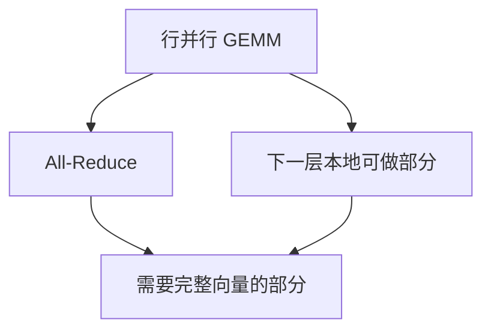

# TP 通信重叠

层内 All-Reduce 与下一层的 GEMM 在数据依赖上不是铁板一块：切对流水，通信可以躲进计算的阴影里。

<footer>—— Shoeybi 等 Megatron-LM 的切分使非线性局部化；推理引擎把短 AR 与下一层投影重叠</footer>

[上一课](/llm/custom-allreduce)把短 All-Reduce 的路径选好。本课问墙钟能不能 *藏* 掉它。训练里通信重叠是老问题；decode 每层计算很瘦，阴影浅，重叠更难、也更值钱。依赖链是：行并行 GEMM 产出部分和 → AR → 下一层需要完整向量。若下一层能先做不依赖完整向量的工作（比如已经列切、只需要本地 KV 的注意力），就可以错开。切错则 AR 成为硬屏障。

## 问题

逐步时间 $\approx T_{\mathrm{cmp}}+T_{\mathrm{comm}}$ 若串行。重叠后 $\approx \max(T_{\mathrm{cmp}},T_{\mathrm{comm}})+$ 无法隐藏的暴露通信。decode 上 $T_{\mathrm{cmp}}$ 小，能藏的通信有限；prefill 上 $T_{\mathrm{cmp}}$ 大，AR 更容易藏。缺口是按阶段决定要不要为重叠改切分与流（CUDA stream），而不是处处套训练的 overlap 模板。

投机校验让一层的查询变宽，$T_{\mathrm{cmp}}$ 上升，重叠窗口变大——加速比不只来自少步，也来自更好藏通信。

暴露通信是无法与任何本地计算并行的那一段：依赖尚未满足。流水图画错会把「已重叠」写进文档，profiler 上 NCCL/自定义 AR 仍与 GEMM 串行。

## 方法

注意力：头在本地，softmax 不通信；输出投影行并行后 AR。MLP：列切上投影本地非线性，下投影后 AR。重叠点：上一层 AR 与下一层 QKV 或上投影的本地部分。实现用双流：计算流与通信流，事件同步。CUDA Graph 要包含两流，否则捕获后重叠消失。自定义 AR 的持久工作组必须能在通信流上跑。

测：Nsight 上看 AR 与 GEMM 的时间条是否交叠。只看逐步毫秒会把重叠与更快的 AR 混在一起。

## 机制

数学依赖不能违背：残差加若需要完整 $Y$，AR 之后才能加。有的实现把残差放进融合核，通信必须先完成。为重叠而拆融合，可能得不偿失——decode 上融合省的 HBM 可能大于重叠省的暴露通信。应用 profiler 决定，不要按训练论文的百分比抄。

## 边界与工程取舍

跨节点 TP 的 AR 更长，更值得重叠，但也更难与自定义路径结合。MoE 的 all-to-all 是另一类通信，不要与稠密 TP 的 AR 重叠策略混写。下一课：还在用 NCCL 时，有哪些旋钮。

出处：Megatron-LM；NVIDIA 对 Transformer 引擎通信重叠的工程说明。不发明 arXiv。

## 小结

- 重叠把逐步时间从和变成近似 max；decode 阴影浅。
- 切分必须留下「AR 未完成也能做」的本地工作。
- 双流 + 事件；CUDA Graph 要含通信流。
- 拆融合换重叠未必赢，用 trace 决定。
- prefill / 投机宽查询更好藏。
- 下一课：NCCL 调优。
- 出处：Shoeybi et al., Megatron-LM。
