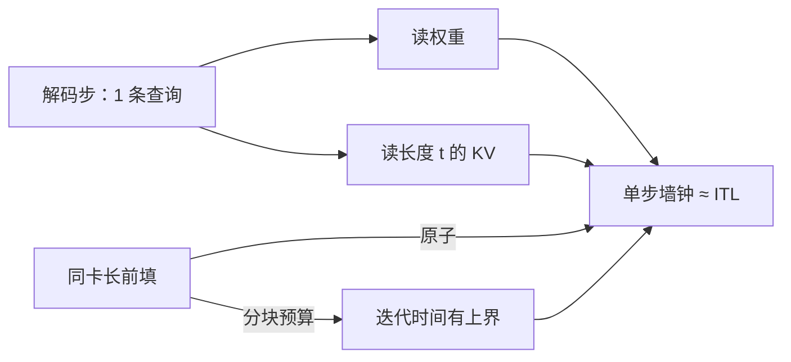

# 交错延迟 TPOT / ITL

    
生成一旦开始，用户盯着的就不再是一次前填，而是词与词之间的空隙；空隙被批大小、KV 长度和偶发的长作业共同拉长。

<footer>—— 对照服务系统中 time-between-tokens 与 decode 带宽瓶颈</footer>

首字出现之后，延迟的形态换了。交错延迟描述的是后续 token 之间的间隔：文献和工程里会见到 ITL（Inter-Token Latency）、TBT（Time Between Tokens）、以及 TPOT（Time Per Output Token）。它们都在回答同一件事——自回归每一步有多慢——但聚合方式不同，不能互换着写进 SLA。[TTFT](/llm/ttft) 钉住前填；本篇钉住解码循环，并说明为何它通常是显存带宽问题，又如何被前填作业从旁干扰。

## 问题

解码第 $t$ 步只新增一条查询，注意力对已缓存的 $t-1$ 个键打分，再经前馈与词表投影采出下一个 token。单步相对当前长度是线性的 $O(t d)$，但每一步都要把模型权重和 KV 从 HBM 读到计算单元。当批次不够大、上下文已经很长时，算术强度低，GPU 算力闲着等总线。用户感知是打字机节奏：空隙均匀则像流畅生成，空隙突然拉到数百毫秒则像卡顿——即使平均 TPOT 仍然「看起来可以」。

指标名称容易打架。ITL 通常指相邻两个输出 token 的墙钟差，是一个序列，有中位数和尾部。TBT 在 Sarathi-Serve 里用作服务水平目标，强调生成过程中每一步都要在时限内完成，而不是整段平均。TPOT 常被报成一个标量：用生成阶段总时间除以输出 token 数（有时扣除首 token，以免把 TTFT 摊进去）。用 TPOT 均值去承诺「不会卡」，会漏掉被整段前填堵住的那几次超长 ITL。

### 平均与尾部不是同一张合同

设一次回复输出 $m$ 个 token（不含提示）。若 $t_i$ 是第 $i$ 个输出 token 的完成时刻，则

$$
\mathrm{ITL}_i = t_i - t_{i-1},\qquad i=2,\ldots,m,
$$

而常见的 TPOT 是 $\frac{1}{m-1}\sum_i \mathrm{ITL}_i$，或把 $t_m-t_1$ 拿去除数。P99 ITL 可能由一次与长前填拼批的迭代决定，对均值贡献很小，对「文字停住」的投诉贡献很大。交互式产品应同时约束 TTFT 与 TBT/ITL 尾部；离线批作业可以只看吞吐和平均 TPOT。

有的看板把端到端时间除以全部输出 token，把 TTFT 也摊进去。提示越长，这个「TPOT」越差，看起来像解码变慢，其实是前填被算进了每个字。生成阶段的时钟应从首 token 完成之后起算。

## 方法

解码步的屋顶线由两边决定。算力上，一步的 FLOPs 约为一次前向：注意力 $O(t d)$ 加前馈 $O(d^2)$（对当前这条查询）。带宽上，要读一份权重（若未用图捕获下的常驻/复用策略，每步仍像扫完整模型）以及 $O(t \cdot h_{\mathrm{kv}} \cdot d_k)$ 的 KV。批次 $B$ 把权重读出摊到 $B$ 条查询上，算术强度上升；KV 读出则随 $B$ 和平均长度上升。于是出现经典张力：加大 $B$ 提高吞吐、降低每 token 的权重成本，但单步墙钟变长，ITL 上升。

工程上能直接动的旋钮包括：限制并发解码数以守住 TBT SLO；用 CUDA Graph 或等价图捕获砍掉 CPU 启动开销（这对短步的 ITL 很关键）；用 GQA/MLA 或分页 KV 减少每步搬的字节；避免在同一次前向里塞进无界的前填。Sarathi-Serve 把「每步最多处理多少 token」写成预算，使单次迭代时间有上界，从而把 ITL 从随机变成可规划。

### 干扰来自与前填共用迭代

若调度允许一条长度为 $n$ 的原子前填与正在生成的请求同卡排队，下一次前向可能突然变成 $O(n^2)$ 的计算作业。所有同批解码的 $\mathrm{ITL}_i$ 在这一拍被拉到前填时长。这就是 generation stall：不是解码算法变慢，是调度把两种屋顶线绑在一起。[Chunked prefill](/llm/chunked-prefill) 把前填切到预算以内，stall 变成「每步多付一段有界计算」；[SplitFuse](/llm/splitfuse) 把解码 token 与前填 chunk 融进同一前向，权重读出被更多 token 摊掉，吞吐常升，但每个解码步都要等这段混合计算结束，ITL 的基线会高于纯解码批。

## 机制

ITL 的物理图像随 $t$ 变化。$t$ 很短、模型很大时，步延迟由扫权重主导，加长上下文不明显；$t$ 到数万、KV 头未压缩时，步延迟由扫 KV 主导，再加并发只让总线更挤。FlashAttention 系内核在解码上的问题常常不是 $n\times n$ 矩阵写不写得出，而是查询太少、SM 吃不满，需要 [FlashDecoding](/llm/flashdecoding) 沿 KV 维再切并行。这些是单步内部的加速，不改变「步与步之间仍要等一次前向」的串行合同。

批处理把多条请求的一步融合成一次前向。最慢的那条——最长 KV、或同批里的前填 chunk——决定这一拍的墙钟，短请求的 ITL 被它绑住。连续批处理允许请求在步间加入和退出，平均占用上升，但 ITL 分布取决于每一拍的组成。token 预算的意义就是给这一拍的组成加容量约束，使绑定期可预期。

推测解码改变的是「每拍产出几个被接受 token」，不是取消 ITL。草稿被拒时，用户侧空隙会突然变长。报 TPOT 时要说明是按被接受 token 计还是按前向次数计，否则加速比会对不上体感。

### 如何报一条可复现的曲线

至少要固定：模型与精度、是否 CUDA Graph、最大并发、KV 是否分页、提示长度与输出长度、以及前填是否分块。横轴用输出位置或上下文长度，纵轴用 ITL 的 P50/P99，另画一条平均 TPOT 作对照。不要只给「tokens/s」：那是吞吐，把并发藏进了分子。单请求 tokens/s 的倒数才接近该请求的 TPOT；系统 tokens/s 可以在 ITL 很差时仍然很好。

## 边界与工程取舍

守住 ITL 往往要牺牲排队中的前填：解码优先的调度让新请求的 TTFT 变长。反过来，前填优先让已在打字的用户卡顿。混合批次是折中，不是免费午餐；分离式服务把折中换成 KV 传输与副本异构。pipeline 并行下，迭代时间不均匀会造成气泡，Sarathi 强调均匀 token 数，动机之一就是稳定 TBT。

不要把核函数微秒优化和调度秒级卡顿混为一谈。注意力内核再快，一次未切片的 100k 前填仍会打出用户可见的停顿。反之，调度已经把迭代钉在 50 ms，再换更快的解码核，P99 可能几乎不动，因为前填 chunk 或通信才是该拍的主项。优化前先看 ITL 直方图里的双峰：一峰是纯解码，一峰是混合或通信。

流式前端的渲染、打字机动画和网络分帧都会在 ITL 之上再加一层。服务端 P99 已经 40 ms 时，用户仍可能觉得一顿一顿，那是客户端合并包或主线程卡顿。SLA 要写清测的是服务端 token 时间还是端到端显示时间。

## 小结

- ITL/TBT 是相邻输出 token 的墙钟间隔；TPOT 多为其平均。交互式 SLO 应约束尾部，而不是只报均值。
- 解码步通常带宽受限：权重与 KV 的读出决定基线，批次在吞吐与单步时延之间权衡。
- 与原子前填同卡是 generation stall 的主因；分块与混合批次给迭代时间加盖，但抬高 ITL 基线。
- 生成阶段计时应从首 token 之后起算，避免把 TTFT 摊进 TPOT。
- 系统 tokens/s 描述吞吐；单请求 ITL 描述体感。两者可以反向运动。
- 内核优化只作用于单步内部；步间组成由调度决定，先看直方图再选优化对象。
- 出处：对照 vLLM 连续批处理与 Kwon 等对解码服务的讨论；TBT 预算见 Agrawal 等 Sarathi-Serve（OSDI 2024）。
