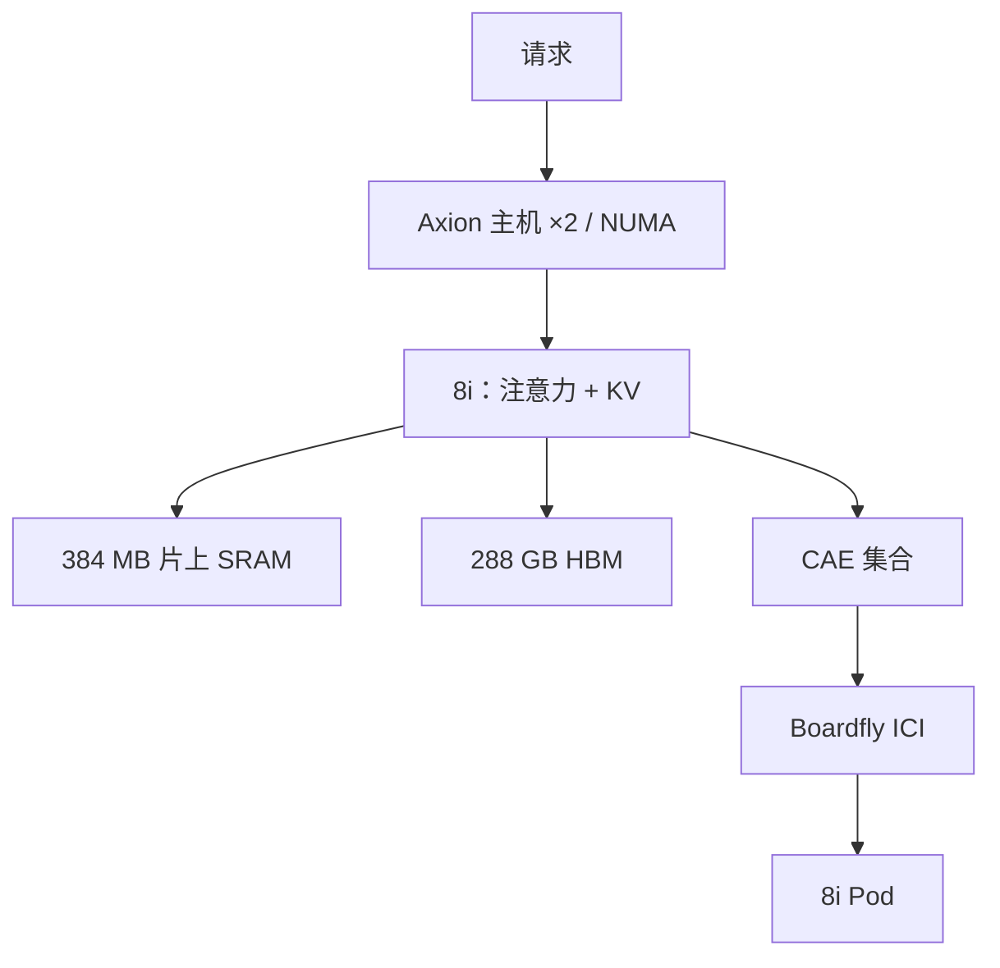

# TPU 8i（Zebrafish）推理

    
384 MB 片上 SRAM 与 288 GB HBM 是为了把推理工作集留在硅上；互连改 Boardfly，是为了 MoE 的直径而不是训练的 3D 环面。

    <footer>—— Google 第八代 TPU 官方博文：TPU 8i 的四条推理向改动</footer>

**TPU 8i** 是第八代里做推理、后训练与强化学习采样的那颗芯片。报道中的代号 Zebrafish；对外名称 8i。与 8t 同期宣布（2026-04-22），官方写当年晚些时候 GA。和训练芯片不同，Google 给 8i 列了可引用的每芯片存储与互连数字：HBM **288 GB**、片上 SRAM **384 MB**（上一代的 3×）、ICI **19.2 Tb/s**（2×）、Boardfly 把网络直径降 **50% 以上**、Collectives Acceleration Engine（CAE）把片上集合延迟最多降约 **5×**，推理性价比相对上一代高约 **80%**。单芯片峰值 FLOPS 仍未出现在该博文的条目中——**公开信息有限**，本篇不抄第三方 PFLOPS。

## 问题

Agent 与 MoE 服务把「等」放大：每步 decode 要读 KV，专家并行要 All-to-all，多智能体并发把尾延迟变成产品。训练向的 3D torus 在万卡上对带宽友好，对「任意两芯片之间跳数」不友好。推理芯片若沿用同一张图，集合的直径会先打死 TPOT。第二堵墙是内存：KV 与激活工作集如果每步都打 HBM 甚至主机，算力再高也闲着。8i 的问题是同时加 **片上容量**、**HBM 容量**、**更胖的 ICI** 和 **更扁的拓扑**，并加一颗专做集合的 CAE，而不是再堆训练用的 MXU 叙事。

官方还改了主机：每台服务器物理 CPU 主机数加倍，换 Axion，用 NUMA 隔离。推理路径上 tokenization、批调度、工具调用都在主机；主机不够时，加速器数字全是假的。

### SRAM 是为 KV 工作集标定的

博文写明：8i 的 SRAM 容量按生产规模推理模型的 KV 占用标定。384 MB 不是「缓存越大越好」的广告词，而是把热工作集从反复打 HBM 里救出来的预算。规划仍要按分片后的本地 HBM 288 GB 去算并发 × 序列；SRAM 不替代 HBM 的 KV 主存储，它改变的是层内/集合的往返。

80% better performance-per-dollar 与「同样成本服务近两倍客户」是官方产品句。没有附上对照代际的测试集与并发曲线。容量规划用 288 GB / 19.2 Tb/s / 直径减半这些物理量，把 80% 当 TCO 列而不是 tokens/s SLA。

## 方法

软件栈与 8t 对齐：JAX、MaxText、PyTorch、SGLang、vLLM，裸金属。推理编译仍是 XLA 友好的静态 bucket：decode 的 batch 与序列桶要在编译期钉住，动态长度会逼出反复编译。ICI 19.2 Tb/s 给的是 MoE 路由与张量并行逐步通信的屋顶线；拓扑是 [Boardfly](/llm/boardfly)，不是 8t 的 3D torus。Pod 规模官方用层次描述（四芯片积木 → 八板成组 → 三十六组），**未在同一篇博文给出 Pod 芯片合同数**；第三方常写 1,152 / 1,024 active——公开信息有限，规划以日后规格页为准。

CAE 把全局集合从通用 TensorCore 路径上卸下来，目标是高并发下的 on-chip 延迟。它不是稀疏专家的自动加速器，也不是 SparseCore 换皮：官方点名的是 collectives。RL 与后训练被放进 8i 的产品句，因为采样与在线更新同样吃逐步延迟，但并行策略仍要自己在 ICI 域内收紧。

### 和 v5e / v6e 推理档的差别

[v5e / v6e](/llm/tpu-v5e-infer) 是已在 Cloud 文档里有完整每芯表的效率档：16/32 GB HBM、2D 环面、单机最多 8 芯。8i 是新一代推理专用硅，HBM 288 GB、ICI 19.2 Tb/s、拓扑换代。不要用 v6e-8 的 8 芯心智模型去填 8i Pod；也不要在 8i GA 前把博文数字写进生产配额脚本。v5e/v6e 的 Sax / Pathways 多机路径，8i 的编排名称以 GA 时的 Cloud 文档为准，本篇不提前发明产品名。

## 机制

Decode 受 HBM 带宽与 KV 驻留约束；prefill 才吃满矩阵单元。8i 把 HBM 提到 288 GB，是为了让更长上下文、更大并发的 KV 不必那么早切到多机 DCN。SRAM 3× 降低的是层内暂存与集合缓冲的往返。Boardfly 降直径，All-to-all 的跳数分布变窄，尾延迟随最慢那一跳走，这正是 MoE 服务要买的东西。CAE 5× 是「片上集合延迟」的官方上限表述，不是端到端 TPOT 的 5×。

NUMA：加倍的主机是为了让 CPU 侧不再先饱和。把 tokenizer 和工具沙箱打到错误的半边，表现为芯片算力吃不满，和 v5e 8 芯 VM 上的亲和性问题同类，只是 8i 把主机做成第一等设计点。

8t / 8i 官方称相对 Ironwood 最高约 2× 能效（performance-per-watt）。这是芯片到机房液冷整栈叙事，第四代液冷 CDU 是配套，不是用户可调的频率旋钮。推理 TCO 仍要另算主机、交换机与空置率。

## 边界与工程取舍

GA 前无稳定的 Cloud SKU 表，切片形状、每主机芯片数、计价都未在本篇所引博文列出。单芯片 FLOPS 公开信息有限：不要用报道里的 10.1 PFLOPS 一类数字写进内部容量计算器，除非 Google 规格页出现同数。Boardfly Pod 小于 8t 的 9600 芯片 superpod，大模型若单 Pod 放不下，会碰到 8i 域外的 Virgo/DCN，逐步延迟按另一档计。

### 静态图与并发桶

TPU 推理的习惯仍是编译好的 decode 循环：形状一变就要再编译。8i 的 288 GB 让单芯片能放下更长 KV，但不自动变成 GPU 那种动态 paged attention 生态。服务侧要把并发、序列长度收成少数 bucket，用连续批把请求填进同一形状，否则 CAE 与 Boardfly 的延迟优势会被 Python 逐步调度吃掉。投机解码、MTP 一类变长草稿，需要运行时与编译器明确支持，不能从「推理芯片」四个字推出已有 vLLM 里每一条投机路径。RL 采样若与在线服务混部，采样批次的形状更乱，更应隔离切片，避免把 serving 的静态图打成训练式动态网格。

不要在 8i 上用 8t 的 torus 跳数估 MoE。不要把 384 MB SRAM 理解成「KV 全进 SRAM」——官方是工作集与 KV 占用的标定，主存储仍是 288 GB HBM。延迟敏感服务先证明单 Pod ICI 够，再付多 Pod。框架名单（vLLM / SGLang / JAX）表示官方方向是开放软件，不表示 2026-04 宣布当天每条内核路径都已打满 8i。

出处：Google *Two chips for the agentic era*（288 GB、384 MB、19.2 Tb/s、Boardfly 直径、CAE、80% perf/$）；Next ’26 *What’s next in Google AI infrastructure*。拓扑细节见 [Boardfly](/llm/boardfly)。

## 小结

- TPU 8i 是第八代推理/RL 芯片；Zebrafish 为报道代号。
- 官方每芯片：288 GB HBM、384 MB SRAM、ICI 19.2 Tb/s；峰值 FLOPS 博文未列全，公开信息有限。
- Boardfly 降直径，CAE 降片上集合延迟；主机加倍并改 Axion。
- 产品叙述：推理性价比约 +80%，能效相对 Ironwood 最高约 2×。
- 规划用存储与互连物理量，等 Cloud 规格页再填 FLOPS 与 Pod 芯片数。
- 出处：Google 第八代 TPU 官方博文。
