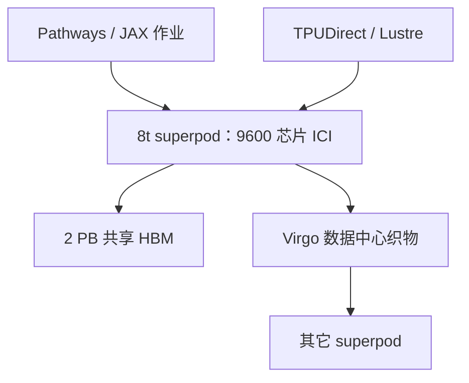

# TPU 8t（Sunfish）训练

    
一个 superpod 九千六百颗芯片、两拍字节共享 HBM：训练要的是算力、统一内存和 ICI，而不是把推理的 SRAM 配比抄过来。

    <footer>—— Google *Our eighth generation TPUs: two chips for the agentic era*；Cloud Next ’26 AI infrastructure 博文</footer>

第八代 TPU 第一次拆成两颗芯片。面向训练的是 **TPU 8t**；公开报道里的内部代号是 Sunfish，Google 对外合同名是 8t。2026-04-22 的官方博文写：将于当年晚些时候 GA，Cloud 客户「即将可用」。单芯片峰值 FLOPS、HBM 带宽的完整规格表，未出现在上述两篇官方博文的条目里——**公开信息有限**，本篇不填写第三方转述的每芯 PFLOPS。能钉的是系统级数字：9600 芯片、2 PB 共享 HBM、121 ExaFlops、ICI 带宽相对上一代翻倍、单 superpod 算力约 3×。

## 问题

训推合一的芯片要同时伺候稠密 matmul 的吞吐、以及 decode 的 HBM/SRAM 与集合延迟。Agent 时代把训练（含大规模 RL 的采样环）和在线推理的 SLO 拉得更开，Google 的选择是分两套硅。8t 的问题是：前沿模型的开发周期要从「月」收到「周」，需要更大的 **scale-up 域**（一张 ICI 网上的芯片数与共享 HBM），以及跨机房还能被 Pathways 看成一个逻辑作业的 scale-out。上一代 Ironwood（TPU7x）已经把 Pod 做到九千芯量级；8t 要在近似的封装规模上把每 Pod 算力抬到约三倍，并把 ICI 带宽加倍，避免通信先打满。

第二问是 goodput。芯片峰值只有在集群不因坏链、检查点、存储饿死而停转时才有意义。官方把 8t 的工程目标写成超过 **97% goodput**：实时遥测、坏 ICI 链路自动绕行且作业不中断、OCS 在无人干预下绕开故障。百分比点在万卡作业上是按天计的训练时间。

### 不要用推理芯片的表头做训练容量

8i 公开了 288 GB HBM 与 384 MB SRAM，那是为 KV 工作集与 MoE 延迟。8t 官方强调的是 superpod 共享内存池与训练吞吐。把 8i 的每芯片容量抄到 8t 的并行度规划里，或反过来用 121 ExaFlops 去除以请求数当单查询推理吞吐，都是错代。单芯片 FLOPS 在官方博文未列全表之前，规划应用 Pod 级 121 ExaFlops 与「约 3×」相对量，再等 Cloud TPU 规格页。

121 ExaFlops 是官方写在 9600 芯片 superpod 上的系统算力，未在同一段标明精度。第三方报道常写成 FP4 聚合。本篇引用时带「官方系统数字、精度以规格页为准」，不把每芯 12.6 一类未在博文出现的数写成合同。

## 方法

部署单位仍是切片加 ICI，再经 **Virgo** 把多个 superpod 连成数据中心织物，见 [Virgo](/llm/virgo-ici)。官方配套：JAX、Pathways、TPUDirect（存储绕过主机直达 TPU）、更快的 Managed Lustre / Rapid Buckets。8t 与 8i 都改用 Axion Arm 主机，官方称第一次两颗芯片都跑在自研 CPU 上，以便做整机而不是只做加速器。框架列表含 JAX、MaxText、PyTorch（TorchTPU）、SGLang、vLLM，并提供裸金属，减少虚拟化税。

可靠性是一等公民：故障 ICI 绕行、OCS 重配、检查点与存储要能支撑「加速器利用率 ≥95%」一类叙述（存储段写 Rapid Buckets 目标）。训练作业的网格应把通信密的维留在 ICI superpod 内，数据并行、流水线的长距离维再上 Virgo。Pathways 把百万芯片跨站点收成一个逻辑集群，那是控制面与容错模型，不是把 ICI 延迟延伸到跨城。

### 和 TPU7x 对照时只比官方列

Cloud 文档里 TPU7x（Ironwood）有每芯 BF16/FP8、HBM、ICI 的表。8t 在 2026-04 的市场博文里用系统级对照：芯片数 9600（7x 文档是 9216/Pod）、共享 HBM 两拍字节、算力 121 EFLOPS、ICI 带宽 2×。不要用 7x 的每芯 2307 TFLOPS BF16 去乘 9600 当 8t 峰值——代数、数值格式与稀疏核都可能变，乘法是发明 FLOPS。等 `cloud.google.com/tpu` 规格页列出 8t 行之后，再替换本段的「公开信息有限」。

## 机制

Scale-up 网上的训练通信仍是集合：AllReduce 梯度、MoE 的 All-to-all、张量并行的 AllGather。ICI 加倍的意义是让这些集合的时间常数跟得上「约 3×」的计算，否则加速比会被通信吃掉。共享 2 PB HBM 的软件含义是：超大模型与优化器状态可以在 superpod 内当统一池寻址（经 XLA/Pathways 的切分），而不是 9600 份互不看见的本地缓存。这与 GPU 机柜的 NVLink 域类似，只是域的半径按 Google 的 ICI torus 计——8t 仍走 **3D torus** 做 Pod 内互连；把 8i 的 Boardfly 抄过来规划 8t 的跳数是错的。

Goodput 机制是 RAS：链路级绕行比作业级重启便宜。OCS 把「坏一块箱子」变成「光学上把它移出网格」。主机侧 Axion + NUMA 隔离减少 CPU 侧数据加载抢加速器。存储 10× 与 TPUDirect 解决的是输入管道，不是 matmul 本身。

代号 Sunfish 出现在行业报道与芯片对照图说明里，便于和 Broadcom 合作设计的叙事对上。写采购单与 API 名称用 TPU 8t。未在官方规格页出现的每芯 SRAM 容量、每芯 HBM GB，本篇留空。

## 边界与工程取舍

8t 与 8i **都能**跑多种负载，官方写 specialization 解锁效率。用 8t 做延迟敏感 decode，会付训练向的互连与 SRAM 配比；用 8i 做万卡 pretrain，会碰到 Boardfly Pod 规模上限。Cloud 供给池、配额与 GA 日期以控制台为准。跨站点百万芯片是 Pathways 的逻辑作业，梯度同步的物理延迟仍受广域网约束，不要把「near-linear scaling」理解成跨洋 AllReduce 与 Pod 内一样。

### 数值格式与「约 3×」怎么用

官方写 nearly 3× compute per pod、系统 121 ExaFlops，但未在同一段给出每芯 BF16 / FP8 / FP4 分列。训练配方若仍以 BF16 为主，不能把系统 EFLOPS 直接当 BF16 屋顶；若编译器走较低精度，又不能把未公布的每芯 FP4 抄进内部表格。正确用法是：用 9600 芯片与 2× ICI 做并行度与通信时间的相对规划，用「约 3× / 121 EFLOPS」做机房功率与作业墙钟的数量级，把每芯 TOPS 留到 Cloud 规格页出现之后再替换。Ironwood 的每芯表可以对照历史，不能做乘法外推。

不要发明每芯 FLOPS。不要把 121 ExaFlops 当推理规划器的分母。对照 GPU 时只比官方系统数字（芯片数、共享内存、织物规模），不要用未公布的 8t 单芯片精度表去打 Rubin 的产品页。液冷与整机能效（官方相对 Ironwood 最高约 2× performance-per-watt，与 8i 共用这句话）是数据中心约束，不是 XLA 的 `precision` 参数。

出处：https://blog.google/innovation-and-ai/infrastructure-and-cloud/google-cloud/eighth-generation-tpu-agentic-era/ ；https://cloud.google.com/blog/products/compute/ai-infrastructure-at-next26 。ICI 与 Virgo 的分工见同日博文及 [Virgo](/llm/virgo-ici)。

## 小结

- TPU 8t 是第八代训练芯片；Sunfish 是公开报道中的代号，合同名 8t。
- 官方系统规格：9600 芯片、2 PB 共享 HBM、121 ExaFlops、ICI 带宽 2×、约 3× 每 Pod 算力。
- 单芯片峰值 FLOPS 官方博文未给全表，公开信息有限，不填写。
- 训练网格优先 ICI superpod，跨 Pod 走 Virgo + Pathways。
- Goodput 目标 >97%，靠链路绕行与 OCS，而不是只靠检查点。
- 出处：Google 第八代 TPU 官方博文与 Next ’26 基础设施公告。
