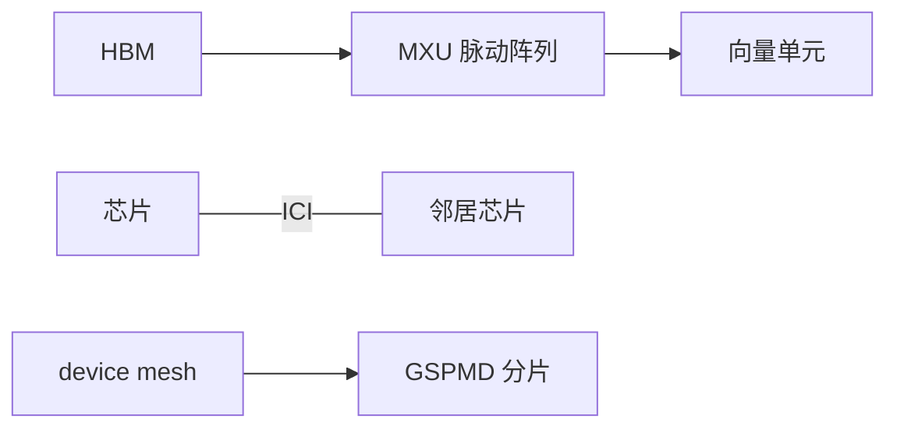

# TPU 架构基本

TPU 把矩阵乘收成脉动阵列，把片间通信收成 mesh。没有 CUDA warp，也没有 NCCL 这张表；集体是芯片上的邻接交换加编译器安排的副本。

<footer>—— Jouppi 等 ISCA 2017 的第一代 TPU；后续 v2/v3/v4 公开论文与 Google 文档中的 mesh / ICI</footer>

[上一课](/llm/cluster-fair-scheduling) 收在 NVIDIA 机群调度。本课打开「其他加速器」：生产上另一条已规模化的路是 TPU。缺口不是把 [NVLink](/llm/nvlink) 翻译成新名词，而是 **计算单元与互连从一开始就为稠密矩阵和同步副本设计**。后课对照晶圆级、确定性 LPU 等；对比方法课会要求你用同一套屋顶线，而不是用 CUDA 生态当唯一坐标。

## 问题

第一代 TPU 论文展示的是推理向的脉动阵列：权重驻留，激活流过，PCIe 连主机。到 v2 以后，训练需要 HBM、向量单元、以及芯片间互连（ICI），pod 内组成二维或更高维 mesh。程序员在 JAX / XLA 里看见的是 `device_mesh` 与分片标注（后来的 GSPMD），看不见 stream 与 NCCL 算法字符串。

问题是迁移：把 Megatron 的 TP/PP/DP 网格画到 TPU mesh 上，维必须嵌在 ICI 的邻接上，就像 GPU 的 TP 必须嵌在 NVLink 域。嵌错维，集体变成多跳转发，等效于在以太网做层内 All-Reduce。TPU 没有「先探拓扑再选 Ring/Tree」的运行时神话——编译器在编译期把集体降到邻接通信。错了就慢，而且往往在编译期就定死。

公开材料包括 Jouppi 等人的 TPU v1、v2/v3 pod、以及 v4 的光学电路交换等。本课只引用已发表结构，不填写未公开的某代峰值与未发布芯片代号的规格。

## 方法

三块积木：MXU（矩阵乘单元 / 脉动阵列）、向量/标量单元（非 GEMM）、HBM。训练精度沿 BF16 / 较新的低精度格式走，和 GPU 的 Tensor Core 是同一类「稠密 GEMM 优先」，细节不同。互连：片上把核连起来，片间 ICI 成 mesh；更大规模用数据中心网络或公开描述过的光学交换把 pod 接起来。

并行：数据并行是沿 batch 维复制；模型并行是沿隐藏维切到相邻芯片。XLA 把 All-Reduce 做成沿 mesh 维的折叠。你要做的是把最密的通信放在 mesh 的短边，而不是在运行时拧 `NCCL_ALGO`。

软件栈是 TPU 的一部分：XLA、JAX、部分 PyTorch/XLA。没有这一栈，硬件屋顶线到不了。对比 GPU 时必须把编译器成熟度算进去——后课对比方法会把它写成一维，而不是脚注。

## 机制

脉动阵列让数据在 PE 间流动，减少对 HBM 的往返，算术强度高的 GEMM 吃满。小 kernel、控制密集、不规则稀疏，阵列利用率下降——这是和 GPU SIMT 不同的弱项。Mesh 上的集体延迟按跳数走，类似 [torus](/llm/dragonfly-torus) 课的嵌入问题：逻辑维对齐物理维则 $\alpha$ 可接受；随机分片则每步多跳。

主机仍在：数据加载、检查点、编译。输入 pipeline 墙与 GPU 集群同类。TPU pod 的调度是 gang，且机型池更同质，碎片化模式不同，但「整 mesh 同时到齐」的约束更硬。

[预训练通信](/llm/pretrain-comm) 的层次化 All-Reduce 在 TPU 上体现为「先沿某一 ICI 维 reduce 再沿另一维」。思想相同，实现不是 NCCL。

## 边界与工程取舍

不要用某一代 GPU 的 TFLOPS 去除某一代 TPU 的 TFLOPS 当结论——存储层次、互连、精度、编译器全不同。不要假设 CUDA 核可以「稍改」跑上 MXU。不要把 Colossus / 内部未公开网络写进容量规划；只用公开 pod 结构。下一课 Cerebras 把「阵列」放大到晶圆，互连问题变成晶圆上的 2D mesh，而不是机柜 ICI。

## 小结

- TPU：脉动矩阵单元 + HBM + 片间 mesh（ICI），集体由编译器降到邻接交换。
- 并行维必须嵌在 mesh 上，没有运行时 Ring/Tree 决策表可补救。
- 软件栈（XLA/JAX）是屋顶线的一部分。
- 不规则与小 kernel 是相对弱项；稠密 Transformer 训练是设计点。
- 出处：Jouppi 等 TPU 论文与 Google 公开的 pod / mesh 文档。
