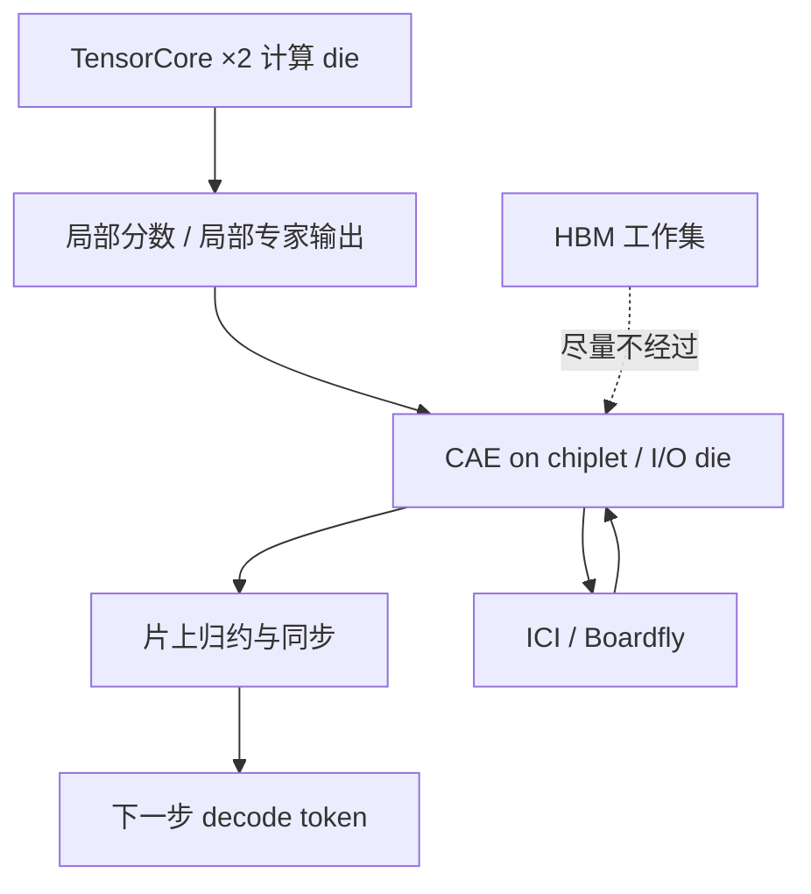

# CAE 集合加速引擎

    
为解决采样瓶颈，TPU 8i 用 CAE 在近零延迟下跨核聚合结果，专门加速自回归解码与思维链所需的归约与同步；专用硅把片上集合延迟再压低约 5 倍。

    <footer>—— Google Cloud Next 2026 技术说明与第八代 TPU 博文中的 Collectives Acceleration Engine</footer>

训练要的是大 GEMM 填满脉动阵列，推理要的是每一步 token 都能尽快跨核对齐。Google 在第八代 TPU 上把这两件事拆成两颗芯片：TPU 8t 面向大规模预训练，TPU 8i 面向低延迟推理与智能体循环。8i 上最显眼的新块不是再加一颗 TensorCore，而是 **Collectives Acceleration Engine（CAE，集合加速引擎）**：把归约、同步从计算核与 HBM 路径上卸下来，放到靠近互连的 chiplet 上做。本篇只写 CAE 作为公开材料里的硬件合同——它替换了什么、加速哪一类集合、以及为什么这对 decode 比对 prefill 更敏感。不把 8t 的 Virgo / 9600 芯超切片数字抄到 8i 上，也不发明未公布的单次 All-Reduce 微秒数。

## 问题

自回归解码每产生一个 token，参与张量并行或专家并行的芯片就要同步一次：注意力输出要对齐，路由元数据要广播，采样结果要回到下一步的查询。训练步里这些集合往往被大矩阵乘淹没；decode 的有效 batch 小、每步计算短，集合延迟会直接变成每 token 时间。GPU 上这件事通常交给 NCCL 一类软件调度：一次 kernel 启动、一次网络操作、再一次写回。TPU 历来把集体通信收进 XLA 内核、走 [ICI](/llm/tpu-training)，但计算仍在 TensorCore 所在的核上完成——数据要进计算 die，常常还要碰 HBM。

智能体工作负载把这个问题放大。多步思维链、工具调用、多智能体「蜂群」都是一串短 decode，中间夹着同步。Google 把这种空等叫做 waiting room：算力闲着，等集合回来。8i 要回答的不是「再堆多少 FLOPS」，而是「片上归约能不能不再绕计算核」。

### 从 SparseCore 到 CAE 的硅面积交换

前代推理/训推一体芯片（公开材料里对照的是 Ironwood）在核上放 **SparseCore**，专做 embedding 查找与 MoE 的 gather-scatter。8i 拿掉四颗 SparseCore，换成两颗 TensorCore（在 core die 上）加一颗 CAE（在 chiplet die 上）。这是明确的产品选择：推理芯片不再把硅预算押在推荐系统式的稀疏查找上，而押在跨核归约的延迟上。8t 仍保留 SparseCore 与训练向的解码引擎；不要把 CAE 写成「第八代 TPU 每颗都有」。

CAE 加速的是**片上**集合延迟，不是机柜之间的 DCN。Google 宣称相对前代最多约 5 倍的 on-chip collective latency 下降。跨芯片仍走 ICI；8i 把 ICI 写到每芯片 19.2 Tb/s，并换用 Boardfly 层次拓扑。把 5× 理解成「整个 Pod 的 All-Reduce 快五倍」是错的量纲。

## 方法

公开描述里，CAE 的位置比算力峰值更重要。Hot Chips 一类技术报道把它画在 ICI I/O die、靠近封装边缘的网络硬件，而不是嵌在 TensorCore 阵列中间。归约在互连侧完成，就少一次「把部分和搬进计算 die、再写 HBM、再读出来」的往返。Google 博文的说法是：CAE 卸载全局操作，把片上延迟最多降低约 5 倍，从而削弱 waiting room。

每个 8i 芯片：两颗 TensorCore + 一颗 CAE。CAE 聚合跨核结果，针对自回归解码与 chain-of-thought 里的 reduction 与 synchronization。它不是通用 DMA，也不替代 XLA 里所有集合原语；它是把那类「小消息、高频率、必须等齐」的同步做成固定功能。

### 与 Boardfly、SRAM、主机的分工

CAE 解决的是芯片内部与紧邻 ICI 端口的同步；Boardfly 解决的是 8i Pod 里芯片之间的直径。公开材料写：Boardfly 从四芯全互连积木往上搭，把约 1024 芯配置的最大网络直径相对旧拓扑降一半以上（报道里常见「16 跳降到 7 跳」这一对照）。二者叠在一起，才是 8i 对 MoE token 路由与多芯 decode 的答案：集合既短、跳数也少。SRAM 提到约 384 MB、约为前代三倍，用来把推理工作集（尤其是 KV）留在片上；HBM 约 288 GB。CAE 不增加容量，它减少的是「已经在附近的数据还要再走一圈存储」的时间。

主机侧，8i 与 8t 都改用 Axion Arm CPU，并加密主机密度。那是控制面与数据加载的优化，不是集合引擎。排障时要分开问：是 CAE 路径没打上、是 ICI 轴映射错了、还是 KV 已经溢到 HBM 甚至主机。三者的症状都是「decode 慢」，机制完全不同。软件入口仍是 JAX / PyTorch / SGLang / vLLM 一类公开栈；CAE 对用户应当是编译器选中的原语，而不是新 API。

## 机制

为什么训练芯片不需要同一块硅。大微批、长序列的一步里，矩阵乘以毫秒计，集合以相对小的比例出现；把 SparseCore 留给 embedding 与 MoE 路由更划算。Decode 一步可能只有一层或几层的窄 GEMM，同步次数却按 token 线性涨。延迟的绝对值——而不是带宽的平均值——决定交互式吞吐。Google 把 8i 的性价比增益写成相对前代约 80% 的 performance-per-dollar，并把并发智能体作为目标负载；CAE 是这条叙事里「让同步不再排队」的那一块。

片上归约还能改变数值协议的落点。若 All-Reduce 的部分和在 I/O die 上完成，累加顺序、归约树形状由硬件固定，而不是由每次 kernel 发射决定。这对可复现性通常是好事，对「必须与 GPU NCCL 树对拍到 bit」则是另一套合同。不要假设 8i 上的集合与 8t 三维环面上的集合是同一算法；拓扑不同，树就不同。

### 它加速什么、不加速什么

加速：跨 TensorCore 的 reduction / barrier 一类、decode 每步都出现的短集合、需要把采样 token 立刻送到下一跳的同步。不加速：大权重的 All-Gather（那是带宽问题，靠 ICI 与 HBM）、跨切片的 DCN 通信、主机侧 Python 调度。MoE 的 token 路由既吃 ICI 带宽也吃同步；Boardfly 降直径，CAE 降片上等待，二者缺一，专家并行的尾延迟仍会打满。

「near-zero latency」是产品语言，不是测量值。规划时把它读成：目标是把片上集合从「可与 GEMM 比肩的等待」压到「相对一步 decode 可忽略」。具体微秒必须以当时 Cloud 文档或 Hot Chips 幻灯为准，本篇不填写未在官方表出现的数字。

## 边界与工程取舍

不要在 8t 训练作业里寻找 CAE 计数器。不要把 5× 片上延迟写成端到端 tokens/s 的 5×。不要用 v5e / Ironwood 的 SparseCore 调优经验去猜 8i 的 embedding 路径——那块硅已经拿掉。8i Pod 规模、Boardfly 分组在公开博文里有层次图，具体可售切片形状以 Cloud 控制台为准；GA 时间官方只写「年内」。

功耗与液冷是系统级故事，不是 CAE 专有。第八代宣称相对 Ironwood 最多约 2× 的 performance-per-watt，那是整机与数据中心共设计，不能归因到单一引擎。数值格式、ICI 双向字节率的更细档位若未出现在产品表，保持空白。

与 GPU 对照时，可以说「固定功能的集合卸载」类似把 NCCL 的热路径下沉到网卡或交换机，但链路是 ICI 网格而不是 NVLink 完全图，算法由 XLA 选。可移植的是「decode 要为同步付税」这一观察，不是某次 5×。

出处：Google《Two chips for the agentic era》（Cloud Next 2026）中 CAE、19.2 Tb/s ICI、Boardfly、288 GB HBM / 384 MB SRAM 的公开表述；技术报道对 I/O die 位置与 SparseCore 替换的转述。峰值 FLOPS 与未公布的集合微秒不在本篇展开。

## 小结

- CAE 是 TPU 8i 上的专用集合引擎，放在 chiplet / I/O die，卸载跨核归约与同步。
- 它替换前代核上的 SparseCore 预算，服务 decode 与思维链，而不是 embedding 查找。
- 官方把片上集合延迟最多降约 5×；这是 on-chip 指标，不是 Pod 或 DCN 的加速比。
- Boardfly 降网络直径，SRAM / HBM 留工作集，CAE 降同步等待，三者分工不同。
- 8t 走训练向互连与 SparseCore，不要把 CAE 写成第八代通配特性。
- 不要发明未公布的 All-Reduce 时延或把营销 5× 当成墙钟定律。
- 出处：Google 第八代 TPU 官方博文；对照 [TPU 训练栈](/llm/tpu-training) 的 ICI / slice 术语与 [TPU v5e 推理](/llm/tpu-v5e-infer) 的 serving 切片合同。
