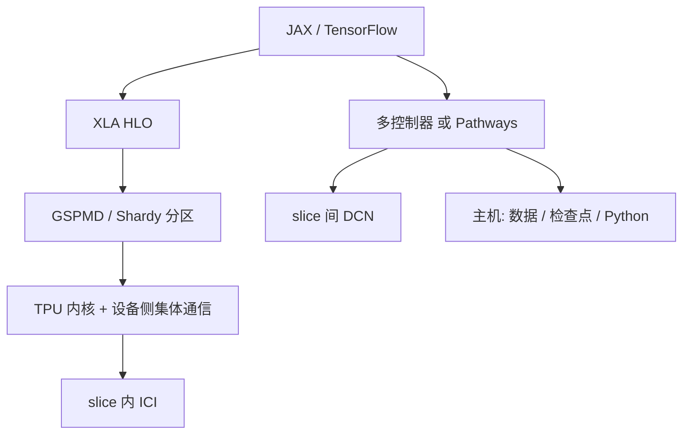

# TPU 训练栈

芯片用 ICI 织成切片，编译器用 XLA 把单程序切到网格上，编排层再决定这块网格落在一个 Pod 里还是跨过数据中心网络。

<footer>—— 对照 Google TPU / JAX / XLA 公开文档与 Pathways、GSPMD 论文中的栈描述</footer>

GPU 训练栈是 CUDA、NCCL、框架运行时各管一段。Google 的 TPU 训练栈更像一条编译器贯穿的管道：前端（TensorFlow 或 JAX）把训练步收成静态形状友好的图，XLA 生成设备内核并插入集合通信，芯片之间走 **ICI**（Inter-Chip Interconnect），主机只通过 PCIe 一类链接喂数据与启动。本篇按公开材料把硬件岛、编译器、运行时、编排四层对齐，便于和 [GSPMD](/llm/gspmd)、[GShard](/llm/gshard)、[Pathways](/llm/pathways) 对上号。不填写未在 Cloud 文档或已发表论文里出现的单通道 ICI 速率，也不把某一代 TPU 的峰值 FLOPS 表抄成自己的测量。

## 问题

只说「在 TPU 上训练」无法复现一次作业。必须说清：计算跑在一片由 ICI 全互连（或高维环面 / 网格）的芯片上，还是跨了多个 slice、中间是 DCN？程序是每台 TPU 主机一份 JAX 进程的多控制器，还是一个客户端看全部设备？切分是 `pmap` 时代的显式轴，还是 `NamedSharding` 交给分区器？检查点、数据加载落在主机 CPU 还是加速器旁路？

这四问对应四层。缺一层，故障会从「HLO 里多了一次 All-Gather」误诊成「TPU 芯片慢」。GPU 上同类问题是 NCCL 走了 PCIe 而不是 NVLink；TPU 上则是逻辑 mesh 轴落到了 DCN 而不是 ICI。

### 切片、Pod、ICI、DCN

JAX 文档沿用 TPU 术语：芯片之间的快速专用互连叫 ICI；由 ICI 连成的一块芯片集合叫 **slice**（切片）；切片之间走数据中心网络 DCN。一个 TPU Pod 是更大的 ICI 域产品形态，具体芯片数随代数变——v3 公开评测里常见 2048 核量级的作业，v4 及以后的 Pod 规模以当时 Cloud TPU 拓扑文档为准。主机（TPU VM）经 PCIe 连到一块板上的若干芯片；Python 跑在主机上，重计算跑在芯片上。ICI 不经过主机内存。把集合通信想象成 NCCL 可以，但链路与拓扑是环面 / 网格，不是 NVSwitch 的完全图，算法选择由 XLA 做，而不是用户挑 `Ring` 或 `Tree`。

多切片训练必须显式构造 hybrid mesh：ICI 轴与 DCN 轴分开。`jax.make_mesh` 适合单切片；跨切片用 `create_hybrid_device_mesh` 一类辅助，把通信密的维（模型并行）放在 ICI，把副本维放在 DCN。轴放反，编译仍然成功，步时会像「用以太网做张量并行」。

## 方法

前端：JAX 以 `jit` 为界把纯函数编成 XLA 计算；TensorFlow 则经图或 `tf.function` 进入同一编译器。并行意图写成 mesh 上的 `PartitionSpec`：哪一维张量对准哪一条设备轴。`with_sharding_constraint` 给中间结果钉锚。需要手写通信时用 `shard_map` 或 `lax.psum` 一类原语。检查点常用 Orbax 等库按分片写。数据加载在多控制器下由各 TPU 主机本地读；Pathways 单控制器下默认数据路径可能经过客户端 CPU VM，大规模应改用主机侧 colocated 加载——这是 Cloud 文档的产品约束，不是芯片物理。

中端：XLA 把 StableHLO / HLO 优化成 TPU 内核。GSPMD（及后来的 Shardy）在编译管线中传播切分并插入 All-Reduce、All-Gather 等。TPU 内核可以包含较长的控制流与设备侧集体通信，这是论文对比 GPU 时强调的一点：一次 compiled function 可以在芯片上停留很久，主机不必每层发一次 kernel。PJRT（Process Just-in-Time Runtime / plugin runtime）把编译器与具体设备解耦：JAX 经 PJRT 插件与 TPU 运行时对话，Cloud 上的 Pathways 则走 IFRT 代理，使同一份 JAX 切到另一套编排。

### 代数与产品代际

公开产品线上有 TPU v2/v3、v4、v5e（偏吞吐 / 推理与性价比）、v5p（偏训练）、以及随后的 Trillium 等名称。每一代改的是脉动阵列峰值、片上内存、ICI 拓扑与每主机芯片数。软件栈的合同相对稳定：仍是 XLA + mesh 切分。不要把 v3 论文里的利用率直接当 v5p 的 KPI；也不要把 GPU 的 NVLink 域大小（8 或 72）拿来理解 TPU slice——slice 的形状是购买与配额里的拓扑，例如 4×4×4 一类三维网格，具体以 Cloud 控制台与文档为准。本篇不罗列各代 TFLOPS，以免与过期产品页打架。

训练配方在 TPU 上长期以 BF16 为默认计算格式（指数位与 FP32 同宽），这与 GPU 上 FP16 要损失缩放的历史不同。稀疏 MoE 走 GShard 式容量桶，使动态路由仍能进静态编译。流水线可以是 GSPMD 里的移位缓冲，也可以是 Pathways 图上的多阶段节点。选哪一种，取决于是否要跨切片、是否要异构资源。

## 机制

TPU 芯片的矩阵单元是脉动阵列：权重与激活按规则流水，适合大 GEMM。编译器的工作是把切分后的本地形状喂满阵列，并把无法本地完成的维变成 ICI 上的集体操作。ICI 的拓扑是规则网格，集合算法可以沿环、沿维做归约，延迟与跳数相关。这与 NVSwitch 上「任意到任意高带宽」不同：mesh 轴与物理维对齐时，邻接通信便宜；逻辑上相邻、物理上绕远时，步时会无声变差。`make_mesh` 按拓扑重排设备顺序，就是为了让逻辑环落在物理环上。

多控制器 JAX：每个主机一份客户端，`jax.distributed.initialize` 后进程互相知道，SPMD 同步执行。优点是数据加载自然分散；缺点是跨切片的 XLA 集体在 TPU 上传统上受 ICI 限制，要靠 hybrid mesh 或 Pathways 才能把 DCN 收进同一套编程模型。Pathways 把客户端收成一个，compiled function 之间的边可以跨 DCN，函数内部仍走 XLA+ICI。

「TPU 比 GPU 强」不是栈的结论。栈的结论是：切分在编译器里、通信在设备内核里、互连是专用网格。换到 GPU 时，同一份 JAX 可能走 XLA:GPU 或另一插件，集体通信落到 NCCL，拓扑启发式全换。可移植的是标注语义，不是步时。

### 故障、配额与静态性

切片是调度单位：坏一块芯片，往往整片或整作业受影响，而不是像单卡 GPU 那样缩掉一张继续。配额按 topology 卖，作业申请的是形状，不是「随便 128 张」。编译假定形状与网格在这一步稳定；动态 batch 要 pad 到静态上限。这与 GPU 上 eager + 动态图的文化相反。想弹性多任务、共享底层权重，要上 Pathways 一类编排，而不是在单切片多控制器里写复杂 `if`。

## 边界与工程取舍

不要在未对齐物理拓扑的 mesh 上做宽模型并行。不要把检查点写成「所有分片 gather 到客户端再写 GCS」——万亿参数会把单控制器内存打爆，应按分片就近写。不要假设每代 TPU 的主机–芯片比例相同；数据管道的 CPU 核数随板型变。不要引用未公开的 ICI 双向 TB/s 或未发布的 v 下一代阵列尺寸。

数值上，TPU 的 BF16/FP32 混合与 GPU Transformer Engine 的 FP8 延迟缩放不是同一套协议。同一模型两栈对拍，应对齐主权重精度、是否随机层、以及集合通信的归约顺序。MoE 从 TPU permute 迁到 GPU All-to-All 必须重测容量因子与 drop 率。

出处：JAX 并行与多进程文档中的 ICI/slice/DCN 术语；Xu 等 GSPMD；Barham 等 Pathways；Google Cloud TPU 与 Pathways on Cloud 文档。峰值与拓扑表以作业提交时的产品页为准。

## 小结

- TPU 训练栈分层：ICI 切片 → XLA 内核与分区器 → JAX/TF 前端 → 多控制器或 Pathways 编排。
- 逻辑 mesh 必须映射物理互连：密通信维留 ICI，副本维才走 DCN。
- GSPMD/Shardy 管一张 compiled function 内的切分；Pathways 管函数间与跨岛。
- 静态形状、容量桶、切片级故障半径，是相对 GPU eager 栈的真实约束。
- 不要把某一代公开利用率或未公布 ICI 带宽写进容量规划。
- 出处：Google JAX / Cloud TPU 公开文档；GSPMD 与 Pathways 论文。
