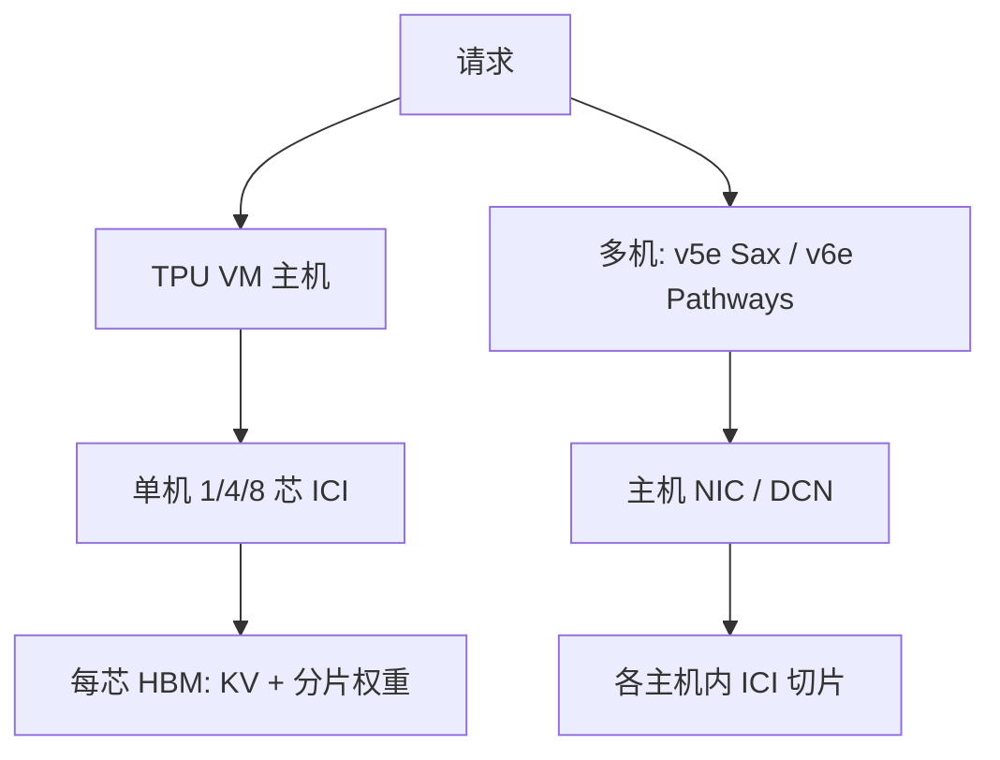

# TPU v5e / v6e 推理

    
e 是效率档：同一代里用更小的 HBM 与 2D 环面换更低的单查询成本；推理要先问切片是否还在单主机 8 芯之内，再问编译器有没有把 KV 留在 HBM。

    <footer>—— Google Cloud TPU v5e / v6e（Trillium）架构文档</footer>

训练栈——XLA、ICI、Pathways——见 [TPU 训练栈](/llm/tpu-training)。本篇只写 Cloud 文档里 **v5e 与 v6e 作为推理产品** 的合同：单芯片规格、哪些切片算「serving 优化」、多机推理走哪条编排。不填写未在文档出现的单通道 ICI 速率，也不把某一代的内部代号峰值抄成自己的测量。v5p 是同代的性能档，Pod 更大、面向训练；不要用 v5p 的表头规划 v5e 的 decode 显存。

## 问题

GPU 推理习惯「一张卡一个模型副本，多卡再张量并行」。TPU 的部署单位是**切片（slice）**：由 ICI 连成的 2D 环面子集，挂在一台或多台 TPU VM 上。v5e / v6e 每主机最多 8 芯片。单机推理文档明确支持到 8 芯；再往上，v5e 写的是 Sax，v6e 写的是 Pathways on Cloud。选错编排，编译仍然成功，KV 与集合通信会漏到主机或 DCN，逐步延迟按以太网而不是 ICI 计。

第二问是容量。v5e 每芯 **16 GB** HBM、带宽 **800 GiB/s**；v6e 每芯 **32 GB**、**1638 GBps**。70B 级 BF16 权重单芯放不下，必须模型并行切到切片内。INT8 峰值分别是每芯 393 TOPs 与 1836 TOPs，BF16 是 197 TFLOPs 与 918 TFLOPs——prefill 看算力，decode 看 HBM。用 GPU 的「80 GB 一张」去估 TPU 并发，会少算切分、多算单芯上下文。

### 文档规格（公开表）

v5e：每芯一颗 TensorCore，四个 MXU；ICI 双向 **400 GBps**、4 端口；Pod 256 芯、2D torus；主机 8 芯、主机 DRAM 512 GiB；主机 NIC 2×100 Gbps。Serving 的 VM：`ct5lp-hightpu-1t` / `4t` / `8t` 对应 1/4/8 芯，切片形状 1×1、2×2、2×4。8 芯 VM 有两个 NUMA 节点，CPU–芯片亲和性不对称。

v6e（产品名 Trillium，API 称 v6e）：每芯一颗 TensorCore、**两个** MXU，另有 SparseCore；ICI 双向 **800 GBps**；HBM 与 BF16 峰值相对 v5e 约 4.7× 算力、2× 容量与带宽（表：918 TFLOPs BF16、1836 TOPs INT8）。Pod 仍 256 芯。`v6e-8`（`ct6e-standard-8t`）把 8 芯挂到**单台** VM，文档写明为推理优化；其它形状多用 4 芯半主机 VM 做多机训练。多机推理走 Pathways。

v5e 文档把产品写成「训推一体」，但 serving 与 training 的供给与 SLA 不同：在 serving 池上跑训练可能可用性差，在 training 池上跑 serving 可能延迟差。切片形状表里 4×4 及以上是训练行，不要拿来当单机推理模板。

## 方法

单机：把模型编译进 1/4/8 芯网格。张量并行轴必须落在 ICI 上。KV 驻留各芯 HBM；GQA 减头之后按芯切序列或切头。静态形状友好：decode 的 bucket（序列桶、batch 桶）要在 XLA 编译时钉住，否则每换长度就重新编译。这与 GPU 动态 kernel 的习惯相反。INT8 路径吃 393 / 1836 TOPs 表头，前提是量化进了编译器承认的 dtype，而不是主机上假量化。

多机：v5e 用 Sax 做多主机 serving；v6e 用 Pathways。二者都是「客户端看一块逻辑网格」，但故障域、数据加载与批调度不是同一套运维手册。混合 mesh 必须把通信密的维放在 ICI，副本维放 DCN，见训练栈文。推理的 All-Reduce / All-Gather（若用于张量并行）对逐步延迟敏感，跨主机只有在模型单机放不下时才该出现。

### v6e-8 与 SparseCore

v6e 相对 v5e 的推理可见变化：单芯容量翻倍，长上下文 KV 不必那么早切到多机；HBM 带宽约 2×，decode 屋顶线上移；ICI 2×，8 芯张量并行的逐步通信更宽；BF16 峰值约 4.7×，prefill / 大 batch 更靠近计算墙。SparseCore 是文档列出的特殊功能，面向嵌入 / 稀疏查找一类，不是 Transformer 稠密 GEMM 的主路径——不要把 SparseCore 写成「MoE 专家自动加速」。能量效率文档称相对 v5e 改善（产品叙述 67% 一类），那是 TCO 列，不是 tokens/s。

## 机制

TPU 内核可以在设备上停留整段编译图，主机不必每层 launch。对 decode 这是双刃剑：静态图对固定 bucket 极快，对不规则并发要靠批处理把请求填进同一形状。KV 更新必须在编译器可见的缓冲里原地写，否则每步复制整段缓存。ICI 是环面不是 NVSwitch 完全图，集合算法由 XLA 选；把 GPU 的 Ring/Tree 经验直接当旋钮，没有对应 API。

NUMA：8 芯 VM 上 CPU0 到 Chip0 快于到 Chip4。数据加载与 embedding 查找若走错半边，会表现为「芯片算力没吃满」。v6e 8 芯 VM 给 360 vCPU / 1440 GB 主机内存，就是为了让主机侧 tokenization、批调度与 I/O 不挡 8 芯；v5e 8 芯是 224 vCPU / 384 GB，主机更容易先成为瓶颈。

公开表的 HBM 是每芯容量，不是「切片自动统一寻址」。8×16 GB = 128 GB 要靠模型并行把层或张量切开，KV 也按并行轴切开。规划 max batch × max seq 时按分片后的本地 HBM 算，再留碎片与运行时开销。

## 边界与工程取舍

### 供给池、编译图与 GPU 心智模型

不要在 v5e 上用 v6e 的 32 GB 去估 70B 的单机可行性。不要把 Pod 级 50.63 PFLOPs（v5e BF16）除以请求数当单查询吞吐——那是 256 芯训练屋顶。多机推理的产品路径随代数变（Sax vs Pathways），作业脚本不能假设同一客户端库。JAX 模型未用 `jit` 钉住 decode 循环，会在 Python 里逐步调度，TPU 变成昂贵的 CPU 协处理器。serving 文档还区分「为延迟供给的切片」与「为吞吐供给的切片」：把训练作业下到 serving 池，抢占与可用性按另一套 SLA 计。

INT8 表头要编译器真正发出整数 MXU 才能兑现。主机侧假量化再上 BF16 计算，得到的是正确性实验。v5e 的 16 GB 在 GQA 之后仍可能被长上下文 KV 打满：八芯切片是 128 GB 总量，但张量并行把权重切开的同时，KV 也按头或序列切开，本地 16 GB 里还要留运行时与碎片。规划 max_seq 必须按分片后的本地预算，而不是 8×16 的加法幻觉。

与 GPU 对比时只比公开列：容量、带宽、互连域大小、软件是否吃 INT8/BF16 MXU。TPU 没有 CUDA 生态里的 Marlin / FlashAttention 即插即用，注意力实现走 XLA / Pallas / 厂商核。选型：成本敏感、已在 JAX、形状可桶化 → v5e/v6e serving；要动态批与 CUDA 核生态 → GPU。v6e-8 是「单主机满 8 芯」的推理甜区；再大先证明 8 芯 HBM 不够，再付多机编排。

出处：Google Cloud 文档 *TPU v5e*、*TPU v6e*（系统架构表、serving VM 类型、v6e-8 推理优化、Sax / Pathways 多机推理指引）。训练对照同站 TPU 训练与 JAX 网格文档。峰值以文档表格为准，随 SKU 修订以当时页面为准。

## 小结

- v5e / v6e 推理的部署单位是 2D ICI 切片；单机到 8 芯，再上分别走 Sax 与 Pathways。
- 公开每芯规格：v5e 16 GB / 800 GiBps / 197 BF16 TFLOPs；v6e 32 GB / 1638 GBps / 918 BF16 TFLOPs。
- decode 受 HBM 与 KV 分片约束；prefill 才吃满 MXU。静态 bucket 是 XLA 的一等公民。
- v6e-8 把 8 芯绑到单 VM，是文档写明的推理形态。
- 不要用 v5p 或 GPU 单卡 80 GB 的心智模型去填 TPU 并发表。
- 出处：Cloud TPU v5e / v6e 架构文档。
