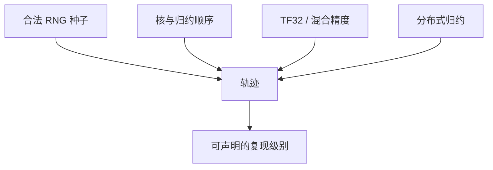

# 训练确定性

同一条命令跑两次得到不同的权重点，不一定是算法随机；浮点结合律、算法选择与未种子化的 dropout，都会把轨迹分叉。

<footer>—— Pineau et al., Improving Reproducibility in Machine Learning Research, NeurIPS 2021；实现约束见 PyTorch / CUDA 对确定性算法的说明</footer>

[上一课](/llm/model-soups-averaging)把多检查点平均当成功能。缺口是：若两次名义相同的训练已经不是同一条轨迹，汤与 EMA 的对照实验无法解释。本课写训练期的**确定性来源**，把「种子」从「dropout 的 RNG」扩大到算法、精度与通信。下一课的静默数据损坏是硬件在确定性软件之下仍能改比特的情况；两课不要混。

## 问题

随机性的合法来源：数据 shuffle、dropout、增强、初始化。这些应用同一个种子应可复现。非法或半合法来源：

- GPU 上 `atomicAdd` 顺序、归约树的结合律：浮点非结合，$a+(b+c)\neq (a+b)+c$，多线程归约每次不同。
- 非确定性算法：某些卷积、某些 `scatter` 实现为换速度不保证顺序。
- TF32 / 允许的精度放松：同一 GEMM 两次舍入不同。
- 数据加载的 worker 顺序、文件系统枚举未排序。
- All-Reduce 实现与拓扑：多机浮点归约顺序随网络。

Pineau 等人把可复现性写成研究规范：报告种子、环境、以及哪些操作被设为确定性。LLM 预训练几乎从不全确定——成本不允许关掉最快的核——但**对照实验**必须声明哪一层是锁死的。否则「加了 cap 之后更好」可能是另一条随机轨迹。

`torch.manual_seed` 不够。还需 CUDA 种子、cuDNN benchmark 关闭或 deterministic 旗标、DataLoader `generator` 与 `worker_init_fn`。漏一层，表面种子相同，shuffle 已不同。

## 方法

分层锁定：

1. **算法种子：** Python / NumPy / 框架 / CUDA。
2. **确定性算法：** 打开框架的 deterministic 模式，接受更慢的核。验收：单机、关 TF32、小模型两步，权重逐比特或至少余弦相似度 $\gt 1-10^{-6}$。
3. **精度策略：** 锁 TF32 / BF16 / loss scale，不要「默认随驱动变」。
4. **数据：** 文件列表排序、shuffle 种子、packing 边界定义。
5. **通信：** 对照实验尽量同规模、同后端；跨机器的逐比特复现通常放弃，改比「同配方多种子的均值与方差」。

大模型上把第 2 项全开可能不可接受。实践是：代理模型上全确定以验证代码无未种子化 RNG；大模型上锁 1、3、4，把 2 与 5 当成噪声，用多种子报告。不要假装 70B 两跑会逐比特相同。

## 机制

dropout 的 RNG 与数据顺序会进入 [自动微分](/llm/autograd-graph) 的图：同样的参数，不同的被 drop 的边，VJP 不同，$v$ 不同，之后整条 Adam 轨迹分叉。浮点非结合发生在看似与 RNG 无关的 GEMM 上，即使关掉 dropout 也会分叉。因此「关 dropout 就确定」是错的。FlashAttention 等融合核内部也有归约顺序；确定性模式可能根本没有对应核，只能退回物化注意力。

与 EMA：两条轻微分叉的轨迹，EMA 后仍分叉，只是差的高频被滤掉一部分。确定性是实验设计，EMA 是估计器，不能互相替代。

## 边界

本课不管评测解码的采样随机性——那是推理。也不把确定性当成正确性：两次相同的 NaN 仍是 NaN。下一课 SDC：软件已锁，硬件仍可能翻转位，表现为「不可复现且不可用种子解释」的损失跳变。

## 小结

- 种子只覆盖合法 RNG；浮点结合律、非确定核、精度与通信都会分叉轨迹。
- 代理模型上追求近逐比特，以抓未种子化 bug；大模型用多种子统计。
- 关 dropout ≠ 确定；融合核可能没有确定性实现。
- 对照实验必须声明锁了哪一层，否则汤与消融无法解释。
- 出处：Pineau et al., NeurIPS 2021；框架对确定性算法的文档。
