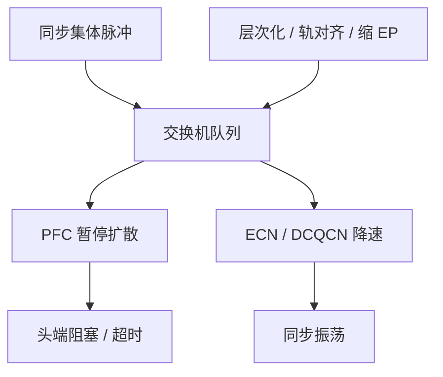

# 训练网络的拥塞控制

集体流量是同步的脉冲，不是数据中心那种长期平滑的大象流。PFC 能保证无损，也能把拥塞暂停扩散成整步挂起；ECN 能标拥塞，也能被集体同时打满而失效。

<footer>—— 对照 RoCEv2 上的 PFC / DCQCN 与 InfiniBand 拥塞控制；集体同步波见前几课</footer>

拓扑课把边画好了：[轨优化](/llm/rail-optimized-topology) 让 DP 走平面，[Dragonfly / torus](/llm/dragonfly-torus) 让局部性对齐。本课写边上 **排队时发生什么**。缺口是：$\alpha$–$\beta$ 模型假设 $\beta$ 稳定；训练一步里所有 rank 同时发同样大小的块，交换机缓冲区被同步 incast 打满，有效 $\beta$ 塌缩，尾延迟变成 step time。[预训练通信](/llm/pretrain-comm) 提过抖动；本课把拥塞控制协议接到集体模式上。

## 问题

RoCE 常用优先级流控（PFC）做无损：端口拥塞就暂停对端发送。训练 All-Reduce 的同步波会让许多端口同时触及阈值，暂停沿依赖链传播，出现「头端阻塞」：一条慢流把整条轨冻住，NCCL 表现为偶发超时而不是平滑降速。DCQCN 一类 ECN 方案用标记降速，避免暂停扩散，但对齐的集体可能同时被标、同时降、同时再加速，形成振荡。InfiniBand 有自己的拥塞控制与自适应路由，症状类似，旋钮不同。

问题不是选一个「永远正确」的协议，而是：**集体脉冲的时间尺度比拥塞控制的反馈环更短**。一步只有几十到几百毫秒，控制环还没收敛，下一步又来了。缺口是把训练流量当成特殊负载：少流、大根、同步，而不是互联网 TCP 的假设。

SHARP 一类网内归约减少的是到达根的字节，从而减轻 incast，这是拥塞预防，不是拥塞控制。有硬件就用在 DP All-Reduce 上；All-to-All 仍然没有加法可卸载。

## 方法

分层处理。预防：轨对齐、层次化 All-Reduce、把 EP 缩进 [NVLink](/llm/nvlink) 域、错开检查点、限制并发进程组。这些减少同时到达同一端口的字节。

控制：RoCE 上谨慎开 PFC（尽量限在该优先级、避免 pause 风暴），用 ECN / DCQCN 做主控；把交换机缓冲区与标记阈值按集体消息大小标定，而不是按通用数据中心模板。IB 上开自适应路由要确认集体是否允许乱序；NCCL 对乱序的容忍随版本与协议而变，先测再开。

观测：不要只看平均带宽。看每步 All-Reduce 耗时直方图、PFC pause 计数、ECN 标记率、以及「单 rank 拖死全组」的离群。NCCL 超时先当网络尾延迟，再查算法死锁。

应用层也能减脉冲：梯度分桶、与反向重叠、把一次大 All-Reduce 切成与计算交错的 chunk——这正是 NCCL 通道与框架桶的工作。切太碎则掉进 $\alpha$ 区；切太整则 incas 更狠。拐点仍用带宽模型课的曲线。

## 机制

无损网络把丢包换成暂停。集体的依赖是全连接的：一个 rank 停，全组停。于是 pause 的爆炸半径等于进程组大小，不是单流。有损 + 重传（纯以太网 TCP）爆炸半径也大，因为 NCCL 常用 RDMA 语义，不走 TCP；改走 TCP 会让 $\alpha$ 烂掉，训练集群很少这么做。所以训练网几乎总在「无损 RDMA」世界里处理拥塞，手段是暂停或标记，不是丢包重传。

多租户把两列同步波叠在同一交换机上，相位随机，有时错开反而更好，有时对齐成双倍 incast。隔离（专用轨、专用优先级、专用交换机分区）比调一个全局 DCQCN 参数更稳。这是调度与网络的交接面。

静默丢包与 CRC 错误会表现为极长尾，而不是拥塞控制振荡。监控要把「队列满」与「链路错」分开，否则会把光纤问题调成 ECN 阈值。

## 边界与工程取舍

不要在没有测量 pause 计数时关闭 PFC「因为听说会风暴」——有的结构没有 PFC 会丢包，NCCL 更惨。不要把数据中心 web 流量的拥塞配方抄到训练平面。不要期望拥塞控制修复画错的并行网格：EP 跨满 Clos 是体积问题，不是阈值问题。

下一课梯度压缩从应用层减 $n$，从而减脉冲高度。它与拥塞控制正交：先画对拓扑，再决定要不要压缩。

## 小结

- 训练集体是同步脉冲，拥塞控制反馈往往慢于一步。
- PFC 防丢包但会把头端阻塞扩到全组；ECN 防暂停但可能同步振荡。
- 预防（层次化、轨、缩组、网内归约）优于只拧阈值。
- 观测用逐步直方图与 pause / 标记计数，不只看平均带宽。
- 出处：RoCEv2 PFC / DCQCN 实践；InfiniBand 拥塞控制；NCCL 超时排障。
