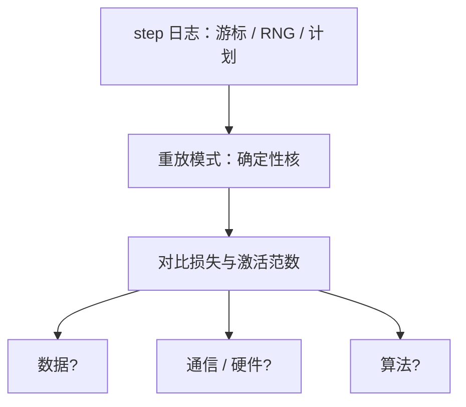

# 训练重放与可复现

同一份配置、同一份数据游标、同一份 RNG，应能把损失尖峰再走一遍；做不到，就分不清是坏卡、非确定 CUDA 还是数据管道偷偷换了样本。

<footer>—— 据 Pineau 等对机器学习可复现性的要求；对照框架确定性算法与大规模训练日志实践</footer>

[上一课](/llm/straggler-mitigation)可能换过节点、调过预取。下一次损失尖峰时，需要回答：这是数据里的脏样本、非确定求和，还是硬件。本课不重讲 P99。缺口是训练重放：记录足以把全局 batch 再跑一遍的信息，以及哪些并行原语从一开始就放弃 bit 级相同。弹性事件必须出现在重放说明书里，而不是假装 run 是一条光滑曲线。

## 问题

GPU 上的原子加、非确定 reduction、FlashAttention 的变体、异步保存与训练抢流，都会让两次前向差一个 ULP，几天之后差出可见损失。完全 bit 级相同在万卡上通常不作为目标。可复现的工程定义应分层：同一检查点、同一微批、同一并行计划下，损失应对拍到规定的容差；跨弹性事件只要求 token 会计正确。缺的是把这层定义写进配方，并保存重放所需的种子与游标。

数据管道是最常见的假非确定：多进程解码顺序、gzip 并行、过滤阈值随时间改。去污染指纹库一更新，同一游标会对上不同文档。重放必须冻结指纹库版本。

### RNG 有多份

Python、NumPy、框架、CUDA、Dropout、路由噪声、数据 shuffle，各有种子。只设一个 `seed=42` 不够。MoE 路由若用噪声，种子要进检查点。FIM 挖空位置、α 采样的多项分布，同理。

确定性算法开关会严重降速。应作为「重放模式」打开，而不是生产默认。

## 方法

每个全局 step 记录：检查点 id、数据游标、全部 RNG、并行计划、软件版本（含注意力核）。尖峰时：拉起同计划、开确定性算法、只跑该微批或其后 N 步，对比激活范数与损失。若单卡重放正常、多卡失败，查集合通信与落后者。若多卡也失败，查数据解码。

弹性后在日志打 `nondet_event=elastic`。审计曲线时分段，不把事件两侧点在同一条「可复现」线上。异步检查点的「latest」指针也要进记录，以免重放加载了后一次损坏点。

### 与评测

训练中评测的采样若无种子，曲线不可比。评测集版本与去污染清单版本一并冻结。

对拍 1F1B 与 DualPipe 时，容差要比「两次相同调度」更宽，但仍应排除数量级错误。

## 机制

浮点结合律在并行归约上不成立，bit 级相同需要固定归约树。大规模训练选择固定计划 + 记录种子，把不确定性关进声明过的盒子（弹性、非确定核）。重放是把盒子外的变量全部钉死，看盒子内是否仍爆炸——若仍爆炸，才是算法或数据。

## 边界

重放不修复故障率，只缩短诊断。它也不能在换了词表之后对拍旧 run。下一课把「训练中评测」从偶然的 `print(loss)` 收成有预算、不挡训练、可重放的信号管道，否则早期信号本身成为不可复现的噪声源。

## 小结

- 本课不重讲慢卡治理；只补分层可复现与微批重放。
- 生产不追求万卡 bit 级；重放模式才开确定性核。
- 冻结数据、指纹、种子、并行计划；弹性单独标注。
- 多份 RNG 全部进检查点。
- 出处：Pineau et al. 对可复现性的讨论；PyTorch 确定性算法；MegaScale / Llama 3 训练日志实践。
