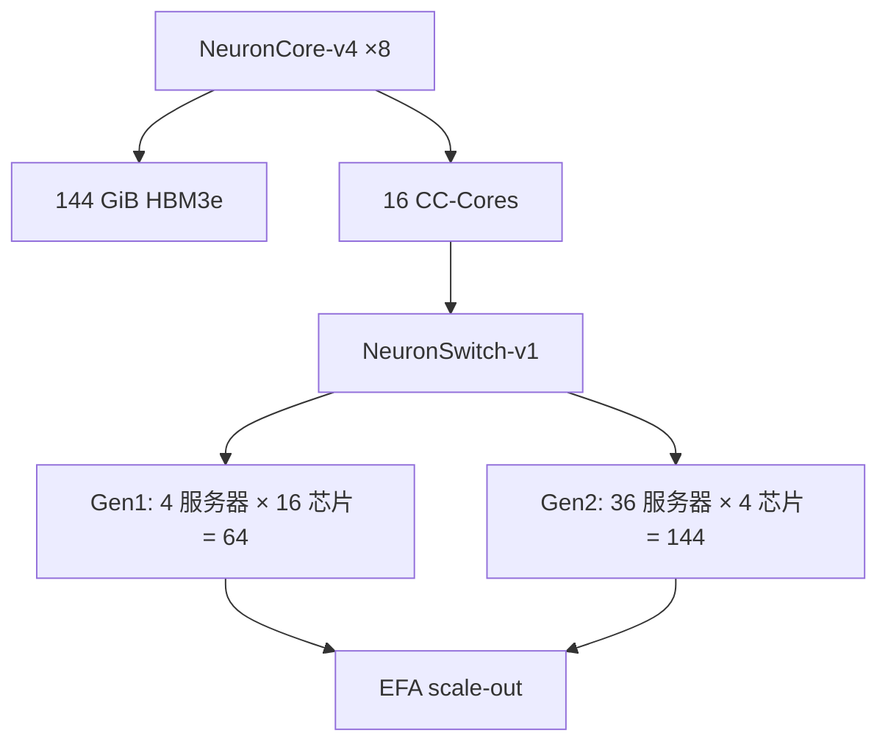

# Trainium 3 与 Trn3 UltraServer

    
Trainium3 是 AWS 第一颗 3nm AI 芯片：单芯片约 2.52 FP8 PFLOPS、144 GB HBM3e；UltraServer 把最多 144 颗收成一块全互连的 scale-up 域，峰值约 362 FP8 PFLOPS。

    <footer>—— AWS Neuron Trainium3 / Trn3 架构文档与 2025-12 EC2 Trn3 UltraServers 发布说明</footer>

[Trainium2](/llm/trainium2-inferentia2) 把八颗 NeuronCore-v3 和 96 GiB 交给 Trn2，scale-up 仍是点对点 NeuronLink 与 2D 环面。Trainium3（文档称第四代 AWS ML 芯片）把核换成 **NeuronCore-v4**，内存换成 144 GiB [HBM3e](/llm/hbm3e)，并把 UltraServer 内部拓扑从环面改成 **NeuronSwitch-v1 的 all-to-all**。本篇按 Neuron 硬件文档对齐单芯片规格、Gen1/Gen2 UltraServer、以及 PCIe 交换结构，不把 Bedrock 营销页的「3× / 5× tokens per megawatt」写成可复现基准，也不提前填写 Trainium4 的未交付峰值。

## 问题

MoE 与长上下文推理的通信模式，已经不是「沿环做 All-Reduce」能优雅覆盖的。专家并行要 All-to-All，decode 要低延迟的小集合，训练还要在同一块内存池里做张量并行。Trn2 UltraServer 的 64 芯片、环面互连，对稠密同步友好，对不规则的专家流量会绕路。Trainium3 要同时做三件事：把 FP8 峰值大约翻倍、把 HBM 容量与带宽各抬一档、把 scale-up 域做成交换机语义而不是邻居语义。

第二问是规模档。不是所有作业都需要 144 芯片一块域。Neuron 文档把 Trn3 UltraServer 分成 **Gen1（64 芯片）** 与 **Gen2（144 芯片）**，都走 NeuronLink-v4 + NeuronSwitch-v1，但服务器切分不同。选错档，要么把小作业绑在过大的同步域上，要么把本该 all-to-all 的 MoE 拆到 EFA 对面。

### 单芯片公开规格

每颗 Trainium3：**八颗 NeuronCore-v4**，合计约 **2,517 MXFP8/MXFP4 TFLOPS**、671 BF16/FP16/TF32、2,517 稀疏 FP16/BF16/TF32、183 FP32；**144 GiB** 设备内存，**4.9 TB/s**；DMA 同样 4.9 TB/s 带就地计算。NeuronLink-v4 在芯片架构页写 **每设备 2.56 TB/s**；UltraServer 规格表写每设备 **2,048 GiB/s**。两处计量口径不同（链路峰值 vs 系统表），引用时对表，不要用其中一个去「证伪」另一个。16 个 CC-Core 编排芯片间集合。可编程性沿用动态形状、控制流、RNE / 随机舍入，以及 GPSIMD 自定义算子。Logical NeuronCore Configuration（LNC）仍可以把多颗物理核合成一个逻辑核。

相对 Trainium2：FP8 约 2×（1299 → 2517 TFLOPS），BF16/FP32 几乎持平；HBM 1.5× 容量、约 1.7× 带宽；片间互连文档表写 1280 → 2560 GB/s/chip，约 2×。MXFP4 是这一代新列，Trainium2 表为不适用。3nm 是发布说明里的工艺节点，不是用户可见的 API。

EC2 发布页把单芯片写成 2.52 FP8 PFLOPS，与架构页 2,517 TFLOPS 是同一数量级的四舍五入。UltraServer「362 FP8 PFLOPS」= 144 × 2.517。稀疏峰值不要拿来规划稠密 MoE；文档对 FP8 的稀疏口径与 BF16 并不相同。

## 方法

软件入口仍是 **Neuron SDK** 与 PyTorch 集成：图经编译器生成 NEFF，形状桶、LNC、集合由运行时插入。发布说明强调「不必改一行模型代码」——那是框架对齐的目标，不是跳过编译与分片标注。性能工程师可以下到 kernel 与自定义算子；这与 GPU 上 CUDA 内核不是同一 ISA，Marlin / FlashAttention 不能直接搬。

拓扑是这一代真正改写的合同。Trn1/Trn2 的 NeuronLink 是点对点，集合沿已知邻居走。Trn3 用 **基于 PCIe 交换机的互连** 做芯片到芯片，地址路由：每颗芯片由 `(rack, server, chip)` 标识，打进 PCIe 地址高位，交换机按 BAR 匹配出端口。对工作负载透明——Neuron Runtime 编码地址、配置交换机。片内同步用硬件信号量：写远端 HBM 后跟一次 semaphore，数据与信号走同一物理路径，保证序。

### Gen1 与 Gen2 UltraServer

Gen1：四台服务器、每台 16 颗 Trainium3，共 64 芯片一块 scale-up 域。文档表：稠密 MXFP8 约 161 PFLOPS，HBM 约 9.2 TB、314 TB/s 量级带宽，主机 768 vCPU / 8,192 GiB，EFA 12,800 Gbps。形态接近 Trn2 UltraServer 的 64 芯片规模，但互连从环面换成 all-to-all。

Gen2：36 台服务器、每台 4 颗芯片，共 144 芯片。同服务器内走第一级 NeuronSwitch-v1，跨服务器走两级交换机与 NeuronLink-v4。表：MXFP8/MXFP4 约 362 PFLOPS，设备内存 20,736 GiB（发布页约 20.7 TB），带宽 705.6 TB/s，主机 2304 vCPU / 27,648 GiB，EFA 28,800 Gbps。发布页把相对 Trn2 UltraServer 的系统增益写成最多约 4.4× 性能、3.9× 内存带宽、4× 每瓦性能——这是整机对比，不是单芯片 2× FP8 的线性外推。

带宽分层（架构页）：服务器内（sled）每芯片 256 GB/s（4× PCIe Gen6 x8，经 intra-server 交换机）；机架内跨服务器 320 GB/s（5× Gen6 x8）；跨机架 128 GB/s（2× Gen6 x8 直连）。规划 MoE 时把密 All-to-All 放在 UltraServer 域内，把数据并行副本放在 EFA 上。轴放反，编译仍成功，步时会像「用以太网做专家并行」。

## 机制

All-to-all 交换结构对 MoE 的意义是：任意一对芯片的逻辑邻居不再等于物理环上的下一跳。专家热度不均时，流量不必沿着 2D torus 绕到对角。代价是交换机的地址译码、拥塞与多级跳——文档用信号量同路径来保证序，不等于没有队头阻塞。CC-Core 仍是集合的编排器；交换机是搬运。

内存墙：144 GB 让更大的稠密层或更长的 KV 留在单芯片，但 144 芯片域的 20.7 TB 才是「一张逻辑加速器」的容量。decode 小 $M$ 的 GEMM 仍然可能填不满核；MXFP8/MXFP4 提高的是峰值 $P$，不自动提高小矩阵的利用率。LNC 改变编译单元大小：把多核合成逻辑核，方便框架把「一张卡」映射上去，也会改变可用 SRAM（SBUF 从 Trn2 的 224 MiB 到 256 MiB，约 1.14×）与并行度的切法。

UltraClusters 3.0 把多台 UltraServer 扩到数十万芯片量级，那是 EFA 域，不是 144 芯片的 scale-up 域。写作业申请时要分清：模型并行宽度受 UltraServer 限制，数据并行宽度受集群限制。混用两个「集群」词，容量规划会差一个数量级。

### 精度、稀疏与软件合同

MXFP8 与 MXFP4 是这一代的一等列；BF16 峰值几乎没涨，说明窄格式才是吞吐故事。随机舍入对训练有意义，推理应固定 RNE，以免 decode 不可复现。稀疏 TFLOPS 表对 FP16/BF16/TF32 给出与低精度同档的 2517，对如何映射到实际 2:4 模式要以编译器为准，不要按「表头稀疏 ÷ 墙钟」报利用率。

检查点、动态形状、控制流是 NeuronCore-v4 相对「完全静态图」的延伸。动态 decode 仍常用长度桶；完全任意的 Python 控制流不会因为 ISA 扩展就变成 eager GPU。与 CUDA 生态对照：可移植的是 PyTorch 模块图，不是 kernel。

## 边界与工程取舍

不要把发布页 2.52 PFLOPS 与架构页 2.56 TB/s NeuronLink 混进同一张未经注明口径的表。不要在 Gen1 上假设 144 芯片的内存池。不要把 Trainium4 预告（官方曾写相对 Trainium3 的 FP4 / FP8 / 带宽倍数）当成已交付容量。Inf2 的 Inferentia 路径不能套用 Trainium3 的 MXFP4 峰值。

EC2 形态、区域供给、UltraCluster 排队是产品约束。垂直集成（芯片到机房）是 AWS 相对「只卖加速器」的叙事，对用户的硬约束仍是：编译器版本、LNC、集合域、以及 EFA 与 NeuronSwitch 的轴映射。

出处：Neuron `trainium3.html` 与 `trn3-arch.html`；AWS「Announcing Amazon EC2 Trn3 UltraServers」（2025-12-02）。加速比随模型与是否稀疏而变，不在本篇写成定律。

## 小结

- Trainium3：8× NeuronCore-v4，约 2.52 FP8 PFLOPS，144 GB HBM3e @ 4.9 TB/s，MXFP8/MXFP4 一等。
- UltraServer 分 64 芯 Gen1 与 144 芯 Gen2，NeuronSwitch-v1 全互连替换 Trn2 环面。
- 片间走 PCIe Gen6 交换与地址路由，集合由 CC-Core 编排，对框架透明。
- 密通信（TP、EP All-to-All）留在 UltraServer；DP 与跨域走 EFA / UltraCluster。
- 不要混用芯片页与系统表的 NeuronLink 口径；不要把稀疏峰值当稠密规划。
- 出处：AWS Neuron 硬件文档与 Trn3 UltraServers 发布说明；上一代对照 [Trainium2 / Inferentia2](/llm/trainium2-inferentia2)。
