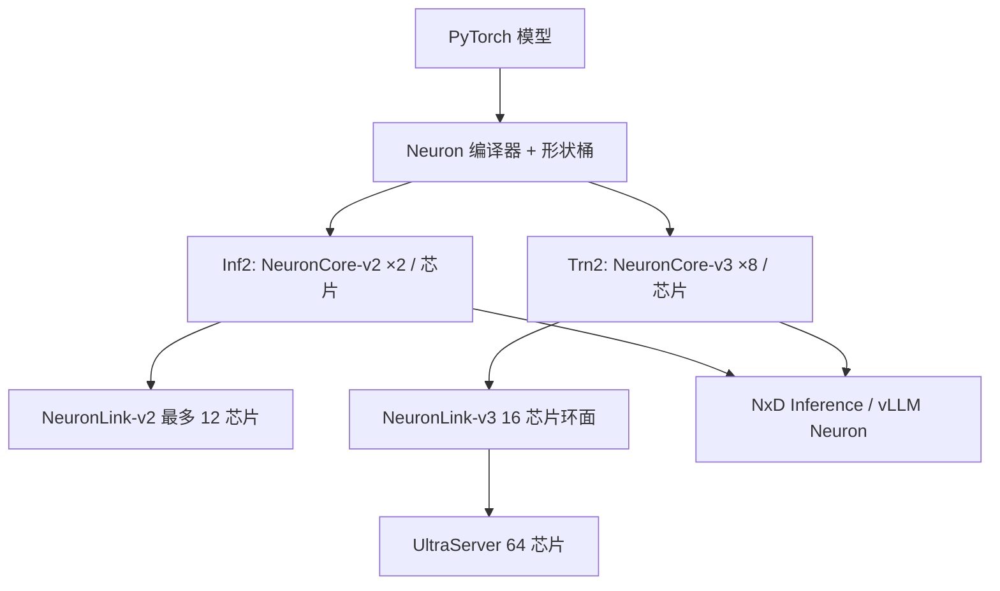

# Trainium2 / Inferentia2

    
同一套 NeuronCore 家族拆成两条产品线：Inferentia2 把两核与 32 GiB 交给 Inf2 做分布式推理，Trainium2 把八核与 96 GiB 交给 Trn2 做训推；软件入口都是 Neuron，不是 CUDA。

    <footer>—— AWS Neuron 硬件文档：Inferentia2 / Trainium2 Architecture；EC2 Inf2 / Trn2 实例页</footer>

Amazon 的加速器不走 NVLink 叙事，而走 **NeuronLink** 与 **Neuron SDK**。Inferentia2（Inf2）是第二代推理芯片；Trainium2（Trn2）是第三代训推芯片，文档也称其可用于推理。二者的可编程表面是 NeuronCore ISA、编译器、以及后来的 NxD Inference / vLLM 插件。本篇按公开文档对齐芯片规格、实例拓扑与软件边界，不把营销页的「相对 P5 性价比 30–40%」写成可复现基准。CUDA 核（Marlin、FlashAttention）不能直接跑在 NeuronCore 上。

## 问题

大模型推理要么单芯片放不下权重与 KV，要么单机放得下但要张量并行。Inf1 的 Inferentia 用 DDR4、无芯片间高速互连，大规模生成式模型只能靠 CPU 中转。Inf2 要补的是：每芯片 **32 GiB HBM**、**820 GiB/s**，以及芯片间 **NeuronLink-v2**，使 Inf2.24/48xlarge 能在加速器侧做 AllReduce / AllGather。Trainium2 则把单芯片算力与容量再抬一档，并让同一实例既能训又能服。

选型问题因此是：模型是否能切进 Inf2 的 2 核/芯片与 192 GB/s 级芯片互连；还是需要 Trn2 的 8 核/芯片、1.28 TB/s 级 NeuronLink-v3 与逻辑核合并（LNC）。软件问题是：图要经 Neuron 编译器冻结形状，动态 decode 靠 bucketing，与 GPU 的即时 kernel 不同。

### 芯片公开规格

Inferentia2：每芯片 **两个 NeuronCore-v2**；文档写 380 INT8 TOPS，190 FP16/BF16/cFP8/TF32 TFLOPS，47.5 FP32 TFLOPS；32 GiB HBM，820 GiB/s；DMA 1 TB/s 带就地压缩；NeuronLink-v2；可编程动态形状与 GPSIMD 自定义算子。cFP8 是 Neuron 文档中的压缩/定制 8-bit 浮点路径，不要直接当成 OCP OFP8 或 Hopper E4M3 检查点。

Trainium2：每芯片 **八个 NeuronCore-v3**；合计约 **1299 FP8 TFLOPS**、667 BF16/FP16/TF32、181 FP32、稀疏约 2563；**96 GiB** 设备内存，**2.9 TB/s**；DMA 3.5 TB/s；NeuronLink-v3 **每芯片 1.28 TB/s**（实例页/架构页另给出 intra-instance 1024 GB/s 一类计量，引用时对表）；16 个 CC-Core 编排集合通信；LNC 把多个物理核合成一个逻辑核。相对第一代 Trainium，文档表写 FP8 约 6.7×、BF16 约 3.4×。

Inf2 实例：xlarge/8xlarge 各 1 芯片（32 GB）；24xlarge 6 芯片、192 GB、芯片间 NeuronLink 192 GB/s/芯片；48xlarge 12 芯片、384 GB、约 2.3 PFLOPS 量级的 FP8/FP16 合计（架构表：2280 TFLOPS）。Trn2.48xlarge：16 芯片、1.5 TB HBM、约 20.8 FP8 PFLOPS、NeuronLink-v3 4×4 环面；UltraServer 把四台 trn2u 合成 64 芯片。

## 方法

编译：PyTorch 模型经 Neuron 编译器生成 NEFF，执行在 NeuronCore 上。形状桶（batch、序列长度）要预先声明。推理推荐路径随 SDK 版本从 `transformers-neuronx` 迁到 **NxD Inference**（`neuronx-distributed-inference`），vLLM 的 Neuron 后端把初始化、编译、连续批交给该栈。AWS 维护的 vLLM fork 才带多机、多模态等尚未上游的特性；开源 vLLM 主线的 Neuron 支持是子集。

并行：Inf2.48xlarge 的 12 芯片用 NeuronLink-v2 做张量并行，集合不经过主机 DRAM。Trn2 的 16 芯片 4×4 torus 更适合更宽的 TP / 流水；LNC 改变「一个逻辑设备」对应多少物理核，从而改变编译单元与内存池。UltraServer 在实例间再拉 NeuronLink 环，使 64 芯片内存池化——这是训推都可能用的规模，不是 Inf2 的产品形态。

### 精度与舍入

Trainium2 文档强调可配置舍入：最近偶数或随机舍入（stochastic rounding），对窄精度训练有意义；推理更常固定 RNE。FP8 峰值是 Trainium2 的一等列，Inf2 表头以 cFP8/FP16/BF16 190 TFLOPS 计。不要把 Trn2 的 1299 FP8 TFLOPS 抄到 Inf2 容量规划里。KV 与权重是否走芯片支持的窄格式，取决于编译器 pass 与 NxD 配置，不是 `dtype=fp8` 一行。

## 机制

NeuronCore 是专用矩阵/向量引擎加片上 SRAM（SBUF 等），靠 DMA 与编译器把数据搬进计算。相对 GPU 的 SM 占用率模型，这里的屋顶线更接近「编译图是否把 DMA 与计算重叠、集合是否走 CC-Core」。动态形状靠 ISA 扩展，但服务里仍以桶为主：桶外长度会触发重编译或填充浪费。Trainium2 的 CC-Core 把集合从通用计算核上卸下来，这与 GPU 上 NCCL 与 GEMM 争 SM 不同：规划 decode 的张量并行时，应看集合是否真的走了这 16 个编排引擎，而不是只看芯片峰值 TFLOPS。

NeuronLink 让张量并行的激活交换不经过主机 CPU，这是 Inf2 相对 Inf1 能做大规模生成式张量并行的物理前提。Inf2 的 192 GB/s/芯片相对 Trn2 的 TB/s 级更窄，宽 TP 的 decode 逐步通信会更早露馅——这是「Inf2 也能分布式推理」与「Trn2 更适合宽模型」的物理差别。内存池化意味着逻辑上更大的 HBM，但延迟与带宽仍随拓扑跳数变；把 1.5 TB 当成单设备均匀带宽是错的。LNC 把若干物理 NeuronCore 合成一个逻辑核，编译器看到的设备数变少、单设备内存变大，用来换更简单的并行图；它不增加硅上的矩阵引擎，只改变切分粒度。

EFA（Trn2 上 EFAv3 3.2 Tbps）是实例间以太网，NeuronLink 是芯片互连。多机 Inf2 没有 UltraServer 那种芯片级跨实例互连，跨机要用网络集合，延迟尺度不同。规划 70B 张量并行时先画在单实例 NeuronLink 域内。

## 边界与工程取舍

### 编译物、核生态与两层网络

没有 CUDA。自定义算子走 GPSIMD 或 NKI（Neuron Kernel Interface），不是 Triton 即插即用。FlashAttention 变体、Marlin、EXL2 核都要重写或放弃。连续批、分页 KV 的成熟度跟 vLLM CUDA 后端不是同一天。编译缓存（NEFF）是部署物：换桶、换 TP 度、换 SDK 都要重编。桶之间的填充浪费会直接打在 decode 延迟上——这是用编译换吞吐的固有税。

Inf2 的 cFP8 与 Trainium2 的 FP8 峰值列，都不保证能加载 NVIDIA TE 的 E4M3 检查点。量化要在 Neuron 工具链里重做。vLLM 主线与 AWS fork 的特性差（多机、多模态）是排障时第一个该问的版本问题：同一份启动脚本在两种安装上来源不同。

何时 Inf2：已在 AWS、模型能切进 12×32 GiB、以推理成本为主、接受 Neuron 编译约束。何时 Trn2：需要 FP8 训练或同实例训推、更大 HBM 与更宽互连、或 UltraServer 级内存池。何时仍用 GPU：依赖 CUDA 核生态、极度动态的 decode、或团队没有 Neuron 排障经验。文档中 Inf2 页眉有时出现 `Trn3` 相关性标记，那是文档分类，不要把 Inferentia2 规格写成 Trainium3。Trn2 UltraServer 的跨实例 NeuronLink 环是可选形态，默认 `trn2.48xlarge` 只有实例内 4×4 环面。

出处：AWS Neuron *Inferentia2 Architecture*、*Trainium2 Architecture*；*Amazon EC2 Inf2 Architecture*、*Trn2 Architecture*；产品页 Amazon EC2 Inf2 / Trn2 instances（芯片数、HBM 合计、NeuronLink、UltraServer）。软件对照 Neuron SDK 与 vLLM Neuron 安装说明。

## 小结

- Inferentia2：2×NeuronCore-v2、32 GiB、Inf2 最多 12 芯片经 NeuronLink-v2 做分布式推理。
- Trainium2：8×NeuronCore-v3、96 GiB、1299 FP8 TFLOPS 量级；Trn2 16 芯片环面，UltraServer 64 芯片。
- 软件合同是 Neuron 编译 + 形状桶 + NxD / vLLM，不是 CUDA 核。
- 窄精度名称（cFP8 vs OFP8）不可与 NVIDIA 检查点互换。
- 芯片互连与 EFA 是两层网络，宽 TP 优先画在 NeuronLink 域内。
- 出处：AWS Neuron 硬件文档与 Inf2 / Trn2 实例页。
