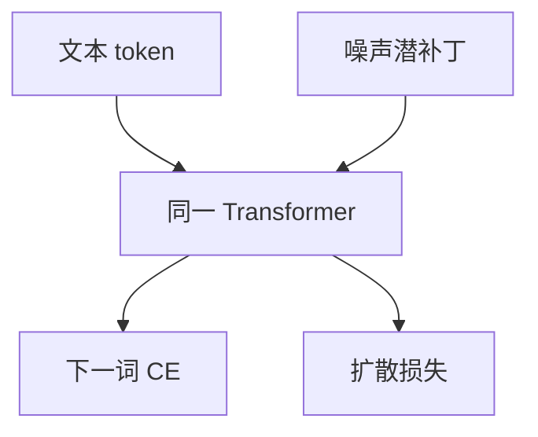

# Transfusion

不必为图像另开一套网。同一 Transformer 对文本做下一词交叉熵，对图像潜变量做扩散损失，一次前向里两种目标。

<footer>—— Zhou 等 Transfusion: Predict the Next Token and Diffuse Images with One Multi-Modal Model</footer>

[上一课](/llm/unified-understanding-generation)用双塔或混合离散目标缝理解与生成。缺口是连续图像与离散文本在同层注意力里共存：文本是词表，图是 [潜空间 VAE](/llm/latent-vae) 的 $z$。Transfusion 把扩散训练塞进语言模型前向。后课蒸馏默认：图像支路仍可能要多步采样。

## 问题

纯离散统一（Chameleon）付 VQ 税。纯连续理解（LLaVA）没有像素生成头。若图像用独立扩散模型，权重不共享，谈图与造图的表征会分叉。Transfusion 的序列是文本 token 与噪声潜补丁交错；注意力按模态用因果（文本）或双向（图像块）掩码。损失是 $\mathcal{L}_{\mathrm{CE}}+\lambda\mathcal{L}_{\mathrm{diff}}$。

这与 [CFG](/llm/cfg-image) 兼容：图像位置走扩散采样，文本仍自回归。

掩码设计是正确性来源：图像补丁若对后续文本泄漏未完成的 $z_0$，训练与推理会不一致。实现必须按论文把图像段设成可双向、对文本因果。

## 方法

VAE 编码图像到潜补丁，加噪后当连续嵌入送入 Transformer（线性映到模型维）。文本位置出 logits；图像位置出噪声预测。训练混合纯文本、文生图、图生文。推理：文生图从噪声 $z_T$ 多步更新图像槽，同时可读文本前缀。

## 机制

共享层让文本条件直接活在每层键值里，不必另接交叉注意力适配器。扩散损失给连续槽稠密梯度，CE 给离散槽。$\lambda$ 决定谁主导：过大则语言模型被图像噪声带偏，过小则文生图不收敛。这是统一训练的主旋钮，不是架构点缀。

## 边界

多步扩散仍贵。下一课把步数压下去，不改「两种损失可以共存」。

## 小结

- Transfusion 在同一 Transformer 里混合 CE 与扩散。
- 图像走连续潜补丁，文本走词表。
- 注意力掩码必须按模态分因果/双向。
- 出处：Zhou 等 Transfusion。
