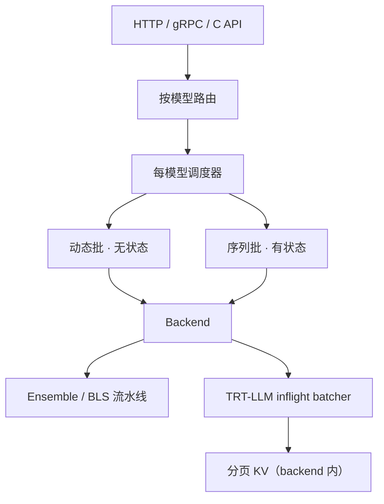

# Triton Inference Server

请求进 HTTP/gRPC 或 C API，按模型交给各自的调度器做动态批或序列批，再交给对应 backend；模型仓库是文件系统上的版本化目录，不是进程内的一张权重表。

<footer>—— NVIDIA Triton Architecture 用户指南</footer>

Triton 要解决的问题比「跑一个 Transformer」更老：数据中心里同时存在着 TensorFlow、PyTorch、ONNX、TensorRT 以及各种自定义前后处理，每家框架自带一套服务进程，批处理、健康检查和指标各写一遍。NVIDIA 从 2018 年的 TensorRT Inference Server 走到今天的 Triton，把这些收成**一个推理服务器进程**：模型仓库、按模型配置的调度与批、可插拔 backend、KServe 风格的 HTTP/gRPC、以及给 Kubernetes 用的就绪/存活探针。生成式 LLM 后来把流式、页式 KV 和 inflight batching 接进 TensorRT-LLM backend；但 Triton 的脊梁仍然是「仓库 + 每模型调度 + backend」，不是 vLLM 那种以 KV 块为货币的中央引擎。本篇写这条脊梁，以及它和 [Dynamo](/llm/nvidia-dynamo) 的分工。

## 问题

在线推理的延迟账单里，框架切换与内存拷贝经常不比 GEMM 便宜。客户端若先在应用层做分词、再把 `input_ids` 发到 GPU 进程、再拉回 token 做反分词，中间两次网络往返加上两次主机/设备拷贝。多模型同时在线时，还要决定谁占用哪张卡、如何把不同到达的小请求拼成对 GPU 友好的批。每家框架自己做这些事，运维面按框架数线性涨。

LLM 把同一问题推到极端：一次请求对应**多个**响应（每个新 token 一次），且执行期很长。传统「一个请求一个张量输出」的事务模型会堵住其他请求的返回。需要一种解耦（decoupled）事务：backend 可以在一次 execute 里零次或多次回响应，客户端必须走双向流式 gRPC，而不是普通 HTTP 的单响应。

### 动态批不是连续批

Triton 的 dynamic batching 面向**无状态**模型：在 `max_queue_delay_microseconds` 窗口里把到达的请求拼成 preferred batch size，然后一次 backend 调用。这与 [Orca](/llm/orca-iteration) / vLLM 的迭代级连续批不是同一算法——后者在每一步前向结束时允许成员进出，KV 作为跨步状态留下。Triton 用 sequence batcher 处理有状态序列（必须粘在同一 model instance），用 TensorRT-LLM 的 inflight batcher 把生成式的连续批下放到 backend 内部。混淆这三层，会在配置里打开 `dynamic_batching` 却指望它管理 KV。

「Triton 支持 LLM」不等于「Triton 实现了 PagedAttention」。分页与 inflight batching 住在 TensorRT-LLM backend（`inflight_batcher_llm`）里。Triton 负责把请求送到这个 backend，并处理流式事务与集成。

## 方法

模型仓库是带版本号的目录树。每个模型一份 `config.pbtxt`：平台或 backend 名、输入输出张量、`instance_group`（同一模型几个执行实例、放 GPU 还是 CPU）、以及可选的 `dynamic_batching` / `sequence_batching`。请求到达后，按模型名路由到该模型的调度器，调度器组批再调用 backend C API。Backend 可以是框架运行时，也可以是自定义前后处理。健康与指标从同一进程暴露，便于挂到 Kubernetes。

多步流水线有两条官方拼法。**Ensemble** 用 DAG 把若干模型的张量边连起来，客户端只看见 ensemble 的输入输出，分词→推理→反分词可以留在服务器侧，少一次网络往返。**BLS**（Business Logic Scripting）在 Python backend 里用代码决定下一步调谁，适合带控制流的管线。TensorRT-LLM 的示例仓库把 `preprocessing`、`tensorrt_llm`、`postprocessing` 收成 `ensemble`，另提供 `tensorrt_llm_bls` 作为可编程替代。

TensorRT-LLM backend 用 MPI 协调多卡。**Leader 模式**适合单模型占满一组 GPU；**Orchestrator 模式**由一个 Triton 进程拉起每卡一个 worker 进程，便于同一节点上多模型。`decoupled_mode` 打开后走流式生成；`batching_strategy` 选 `inflight_fused_batching` 一类策略时，连续批发生在 TRT-LLM executor 内，并配置 `max_tokens_in_paged_kv_cache`、`kv_cache_free_gpu_mem_fraction`、是否启用 KV 复用等。这些旋钮属于 backend，不是 Triton 核心调度器的通用字段。

### 解耦事务与客户端协议

官方文档写明：解耦模型不能用 Triton's HTTP 推理端点（它假定恰好一个响应），标准 gRPC `ModelInfer` 也不行；必须用双向流式 RPC。响应完成靠 `TRITONSERVER_RESPONSE_COMPLETE_FINAL` 一类标志。这对 LLM 网关意味着：OpenAI 兼容的 SSE 若接在 Triton 前面，网关要自己把流式 gRPC 译成 token 事件；不要假设 `v2/models/.../infer` 能流式吐词。ASR 等「一请求多响应」的模型是同一套事务语义的先驱，LLM 只是把响应次数拉到生成长度。

并发执行靠 `instance_group`：同一模型多实例可以同时跑，动态批把请求洒到这些实例上。过小的 instance 数会让 GPU 在排队；过大则权重副本占显存。LLM 的 TRT-LLM 路径通常一个模型占一组 GPU，多模型并存走 Orchestrator，而不是在同一组卡上堆许多 instance。

## 机制

Triton 的加速来自**把组批与拷贝上收到服务进程**，让 backend 看到更饱和的张量，而不是来自某条新的注意力公式。无状态视觉模型上，窗口内到达的小图拼成一批，Tensor Core 利用率上升。有状态对话上，sequence batcher 保证同一会话粘在能看见隐状态的 instance 上——这是 [decode 亲和](/llm/decode-affinity) 在「通用推理服务器」里的旧形式，只是状态那时还不是 Transformer KV。

Ensemble 的机制是服务器侧的 DAG 执行：张量在步骤之间留在设备或被框架认可的共享缓冲里转交，避免「出 GPU → 进网络 → 再进 GPU」。LLM 的 preprocessing 若用 CPU 分词，这一步仍在主机；收益是客户端不必实现与训练一致的 tokenizer，版本跟着模型仓库走。

KServe 协议让 Triton 可以和别的推理运行时互换客户端。它不保证性能模型相同。用同一份 HTTP 测试套去对比 Triton+TRT-LLM 与 vLLM，要比的是端到端 TTFT/ITL，而不是「谁更符合 KServe」。

### 和 Dynamo 的继承关系

NVIDIA 自己把 Dynamo 写成 Triton 在分布式生成式场景上的后继编排：Triton 解决多框架统一与单机吞吐，Dynamo 解决跨节点 PD 分离、KV 感知路由与分层卸载。已有 Triton 企业用户继续走 NVIDIA AI Enterprise 的生产支持；新的多节点推理模型部署被指向 Dynamo。两者可以在集群里并存：Triton 继续伺候分类、嵌入、ASR ensemble，LLM 生成走 Dynamo 或直接走 vLLM/SGLang。不要把 Dynamo 理解成 Triton 的一个 backend 名。

## 边界与工程取舍

Triton 核心不知道 token 预算、前缀树或 goodput。把 DistServe 式的双 SLO 搜索写进 `config.pbtxt` 没有对应字段。动态批的 `max_queue_delay` 对短请求是延迟税，对 GPU 是吞吐补贴；LLM 的 token 级延迟通常由 inflight batcher 与 CUDA graph 决定，再叠一层动态批窗口往往有害。解耦模式下若 backend 在 `ModelInstanceExecute` 返回前不保持「还能接下一批评」的契约，动态批会退化成过早组批，官方文档对此有明确警告。

多机 TRT-LLM 依赖 MPI 拓扑。Leader 与 Orchestrator 选错，会出现「第二个模型起不来」或「world size 不是 1」。KV 复用、分页容量、beam width 全是 backend 配置，Triton 模型管理 API 只能加载/卸载整个模型，不能按块做缓存淘汰。需要集群级 KV 池时，应接到 Mooncake / Dynamo KV Manager / [LMCache](/llm/lmcache)，而不是扩展 `config.pbtxt`。

指标默认偏吞吐与 GPU 利用率，缺少 LLM 服务关心的 KV 占用、前缀命中、P99 ITL。生产要在 backend 或旁路把这些打到同一套 Grafana，否则 Triton 仪表盘显示「GPU 90%」时，用户已经在等长前填。

出处钉 NVIDIA *Triton Architecture* 用户指南、*Decoupled Backends and Models*、TensorRT-LLM Backend README（https://github.com/triton-inference-server/tensorrtllm_backend），以及服务器仓库 https://github.com/triton-inference-server/server。Inflight batching 的算法来源是 Orca 与后续生成式引擎，不是 Triton 核心论文。

## 小结

- Triton 用文件系统模型仓库、每模型调度器和可插拔 backend 统一多框架在线推理。
- 动态批服务无状态模型；序列批服务有状态粘滞；LLM 的连续批在 TRT-LLM inflight backend 内。
- Ensemble / BLS 把分词与反分词留在服务器侧；流式生成必须走解耦事务与双向 gRPC。
- 多卡 TRT-LLM 分 Leader 与 Orchestrator 两种 MPI 模式。
- 分布式 PD、KV 路由与分层卸载交给 Dynamo；Triton 仍覆盖单机多模型与非生成式管线。
- 出处：NVIDIA Triton 架构文档与 `triton-inference-server/server`。
