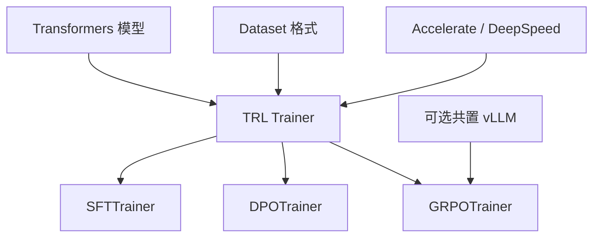

# TRL

    
TRL 把后训练收成一套与 Transformers 共用的 Trainer：数据格式、加速器插件和模型类先对齐，再换 SFT、DPO 或 GRPO 的损失。

    <footer>—— von Werra 等，TRL: Transformers Reinforcement Learning，https://github.com/huggingface/trl</footer>

开源后训练里，最先被实验室复制的往往不是工业集群上的 Hybrid Engine，而是能在一张消费卡上跑通的脚本。Leandro von Werra 在 2020 年把 **TRL**（Transformers Reinforcement Learning）做成 Hugging Face 生态的后训练库：模型来自 `transformers`，数据走 Dataset，分布式走 Accelerate，可选 [PEFT](/llm/lora) / DeepSpeed。官方推荐引用是软件引用 `@software{vonwerra2020trl}`，作者还包括 Belkada、Tunstall、Beeching、Thrush、Lambert、Huang、Rasul、Gallouédec。本篇写 TRL 作为**算法目录与 HF 契约**的位置，以及它为什么在 70B 级在线 RL 上让位给 [OpenRLHF](/llm/openrlhf) / verl，却仍是 [Open-R1](/llm/openr1-recipe) 与大量 DPO 复现的默认入口。不把博客教程里的墙钟写成系统论文。

## 问题

后训练方法的更新快过分布式运行时。一年内社区要从 [PPO](/llm/schulman-ppo) 换到 [DPO](/llm/rafailov-dpo)，再换到 [GRPO](/llm/grpo-paper)，还要接奖励模型、KTO、在线 DPO。若每个算法都自建模型包装、padding、loss mask 与 DeepSpeed 钩子，实验成本会花在胶水上。TRL 的问题定义是：在 Transformers 已经解决的「怎么载入因果 LM」之上，提供一组 Trainer，使换算法不必换数据管道。

另一面是可达性。2023 年 3 月的官方博客用 TRL + LoRA 在 24GB 卡上对 20B 级模型做 RLHF；同年 4 月 StackLLaMA 给出 LLaMA + PPO 的完整食谱；8 月的 Llama 2 DPO 教程把离线偏好变成默认路径。这些材料训练的是社区，不是新的优势估计。代价是：早期 PPOTrainer 把生成做在 HF `generate` 上，没有 vLLM 的 PagedAttention，在线 RL 的生成相会成为墙。OpenRLHF 后来在 GSM8K GRPO 上测到优化后的 TRL 一个 epoch 仍要 5189s，自己 1657s——那是系统对照，说明 TRL 的默认路径不是为长链大规模 rollout 设计的。

### Trainer 目录不是一条 RL 理论

文档把方法分成在线（`GRPOTrainer`、`RLOOTrainer`、实验性 `PPOTrainer` / `OnlineDPOTrainer`）、奖励建模（`RewardTrainer`、实验性 `PRMTrainer`）、离线（`SFTTrainer`、`DPOTrainer`、`KTOTrainer` 等）和蒸馏。同一仓库里 PPO 可以标成实验性，GRPO 反而进稳定 API：这反映 2025 年推理 RL 的实践，不是 Schulman 2017 被废除。引用 TRL 时要写**哪个 Trainer、哪一版文档**，不能说「TRL 等于 PPO」。

软件引用年份是 2020，功能集按发行版变。写「TRL 支持 GRPO」对 2024 年底之后的版本成立，对 StackLLaMA 那一时代不成立。复现应对 `trl.__version__` 而不是仓库创建年。

## 方法

TRL 的数据契约尽量贴近对话：SFT 用 messages 或 completion；DPO 用 chosen / rejected；GRPO 用 prompt 加可验证奖励函数。损失掩码默认不在用户轮上反传，这与 [多轮对话格式](/llm/multiturn-format) 一致，但工具观察是否进 mask 取决于你是否自己提供 `completion_mask`，框架不会因为「看起来像 tool」就自动正确，细节见 [多轮 loss mask](/llm/multiturn-loss-mask)。

分布式上 Trainer 走 Accelerate：单机多卡、DeepSpeed ZeRO、FSDP 都能挂。2025 年 6 月的官方博文 *NO GPU left behind* 把 **共置 vLLM** 接到 GRPO：生成不再走慢的 HF decode，权重在训练进程与 vLLM 之间同步。这缩小了与 OpenRLHF 的生成差距，但编排仍是「一个 Trainer 进程 + 可选推理引擎」，不是 Ray 上多角色 placement。Liger Kernel 的 GRPO 融合核（同年 5 月博文）减的是训练步里的显存与 kernel 启动，不改目标函数。

Open-R1 把 TRL 的 GRPOTrainer 当成可复现的 R1 配方入口：规则奖励、组采样、公开数学数据。这证明 TRL 的价值在**算法与数据格式的可复制**，集群规模仍受制于 HF 训练栈与共置推理。需要 Megatron 检查点或千卡 PPO 时，路径转到 [NeMo-RL](/llm/nemo-rl) 或 verl。奖励模型用 `RewardTrainer` 在偏好对上训标量头，与 InstructGPT 的 RM 阶段同构，但默认不把 RM 与 PPO 焊成一条作业：你可以只训 RM 供离线打分，或把可验证函数直接塞进 GRPO，跳过神经网络奖励。这种拆分让实验室能在同一套数据类上扫完「有 RM 的 PPO」和「无 RM 的 RLVR」，而不必换仓库。

### 在线与离线不要混在同一次对照里

DPO 不需要在线生成，墙钟由偏好对的前向决定，TRL 在这里很强：与 Transformers 的 packing、Flash Attention、LoRA 是同一套优化。GRPO / PPO 必须采样，生成引擎才是主项。把 DPO 微调 Llama 2 的易用性，外推成「TRL 做 R1 规模 RL 也一样省事」，忽略了 rollout。PPOTrainer 仍要价值头与 GAE，显存图像更接近 InstructGPT，而不是 DeepSeekMath 的组相对基线。

Lambert 等 2022 年博客 *Illustrating RLHF* 是概念图，不是 TRL 的吞吐论文。StackLLaMA 是食谱。系统数字应引自对照实验（如 OpenRLHF 文中的 5189s）或你自己的 profiler。

## 机制

TRL 能薄，是因为它把「模型是什么」外包给 HuggingFace。词表、chat template、梯度检查点、设备映射都已存在；Trainer 只覆盖：如何把 batch 收成 logits、如何按 mask 聚合损失、如何把奖励函数的标量广播到 token 优势。GRPO 的组内标准化发生在这一层，数学与 [GRPO 原文](/llm/grpo-paper) 相同，实现细节（是否除标准差、是否 token 级平均）随版本与参数变，必须读当时 docstring。

共置 vLLM 的关键约束是**权重视图**：训练侧可能是 LoRA 或 ZeRO 分片，推理侧要一份可 decode 的完整（或 TP 切分）权重。同步频率若每步都做，生成最新但税高；若多步一同步，则变成轻度 off-policy。TRL 把这条权衡留给配置，不像 [AReaL](/llm/areal-async-rl) 把 staleness $\eta$ 写成一等超参。

### 何时它是正确的默认

单机或数卡、HF 检查点、要扫 DPO/KTO/ORPO 一族损失、需要和 `transformers` 主版本同步：TRL 是正确默认。已经有一份能跑的 SFTTrainer 配置，再把同一数据改成 DPO 列，迁移成本低于换框架。相反，多周转工具、要把 [AgentLoop](/llm/agentloop-server) 接到独立推理服务器、或必须跟 Megatron 预训练权重逐比特对齐时，TRL 不是主路径。消费级单卡上的 LoRA PPO 仍然有教学价值：它把 GAE、KL 和价值头的显存税摊开给人看，但不要把 24GB 卡上的 20B 实验外推成集群配方。生成长度一进长 CoT，HF `generate` 路径会先于优化器成为墙钟，这时共置 vLLM 是补丁，Ray 分角色才是换架构。

## 边界与工程取舍

不要用 TRL 的存在证明「RLHF 已经商品化」。PPO 超参、奖励 hacking、验证器漏洞仍然在。不要把实验性 Trainer 写进生产对照而不钉版本。多模态与 agent 环境（OpenEnv 等）是后加层，覆盖面随发行变化。依赖树与 `transformers` 绑定：升级 Transformers 可能静默改变 padding 或 chat template，损失掩码跟着错。

引用时同时给软件与你用到的方法论文：DPO 是 Rafailov 等；GRPO 是 Shao 等 DeepSeekMath；PPO 是 Schulman 等。TRL 只是实现。

官方仓库 https://github.com/huggingface/trl。文档 https://huggingface.co/docs/trl。对照系统：OpenRLHF arXiv:2405.11143；HybridFlow / verl arXiv:2409.19256。Open-R1 是配方仓库，不是 TRL 的替代实现。

## 小结

- TRL 是 Hugging Face 上的后训练 Trainer 集合，与 Transformers / Accelerate / PEFT 共用契约。
- 离线偏好与 SFT 是它的主场；在线 GRPO 后来靠共置 vLLM 补生成，仍不是 Ray 多角色集群。
- 引用用 von Werra 等 2020 软件条目，并钉 Trainer 名与版本。
- 出处：https://github.com/huggingface/trl；方法原文见 DPO / GRPO / PPO 各自论文。
