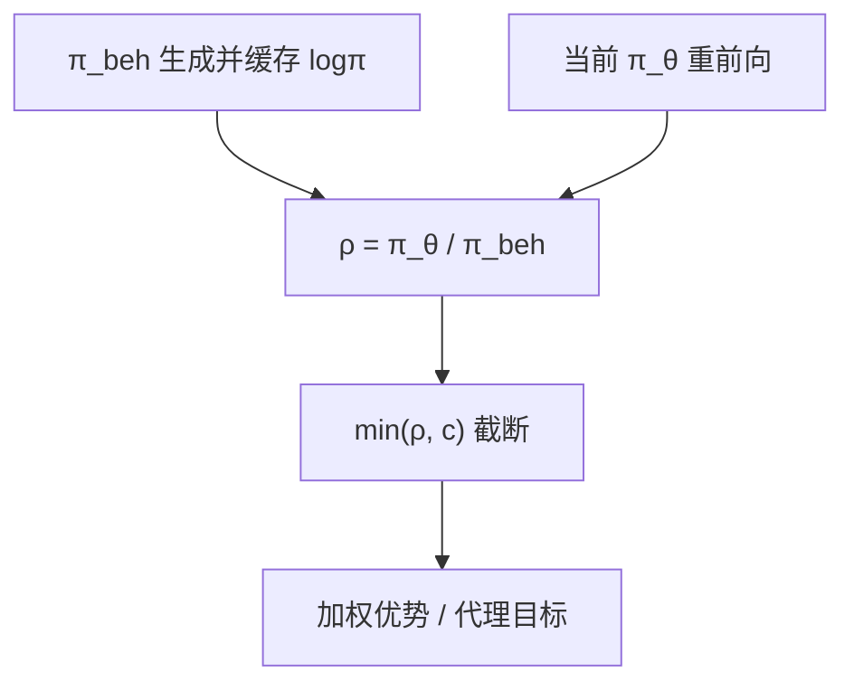

# 截断重要性采样

样本来自旧策略，梯度却对当前策略：比率必须截断，否则长链上的权重爆炸，clip 只是其中一种截法。

<footer>—— Precup 等的重要性采样；Espeholt 等 IMPALA 的 V-trace；PPO clip 与 MiniMax-M1 的 clip-IS</footer>

[上一课](/llm/kl-free-rl)去掉冻结参考的 KL 之后，约束更依赖「这批 rollout 相对 $\pi_{\mathrm{old}}$ 别用过头」。缺口是：**PPO epoch > 1 或异步生成一出现，数据就已经是 off-policy，重要性比率要截断。** 本课写截断 IS，不把 PPO clip 再推导一遍——clip 是截断在代理目标上的实现。[GSPO](/llm/gspo) 把比率改到序列级，是粒度之争，本课先钉 token 级截断。

## 问题

on-policy 时 $r_t=\pi_\theta/\pi_{\mathrm{old}}=1$。更新若干 minibatch 后 $\pi_\theta$ 已变，未截断的 $\pi_\theta/\pi_{\mathrm{old}}$ 在长序列上连乘或逐步乘，方差指数升。PPO 用 $\mathrm{clip}(r_t,1-\varepsilon,1+\varepsilon)$ 限制代理。截断重要性采样（truncated IS）更古典：$\bar\rho=\min(\bar c, \pi_\theta/\pi_{\mathrm{beh}})$，用 $\bar\rho$ 校正期望。V-trace 再对 $\bar\rho$ 与 $\bar c$ 分两层截断，修正价值。LLM 栈里常混用这些词：有人把 PPO clip 叫做 IS，有人另对 logprob 比做 min。

MiniMax-M1 认为多轮 off-policy 下 Clip-Higher 仍丢分叉词，改为对 IS 权重 clip。要点是：**截的是校正权重，还是近端代理，必须说清。** epoch 越多，未截断比率的尾巴越肥，这与「多刷同一批省生成」直接冲突。

### 行为策略是谁

同步 PPO：$\pi_{\mathrm{beh}}=\pi_{\mathrm{old}}$，生成时缓存。异步：$\pi_{\mathrm{beh}}$ 是若干版本前的生成引擎，必须带版本号重算或存储 logprob。用错分母，截断再狠也是错校正。下一课 off-policy 校正把系统与公式接起来。

参考 $\pi_{\mathrm{ref}}$ 不是行为策略。KL 用 ref；IS 用 beh。三份对数概率不要混槽。

## 方法

逐步：$\rho_t=\pi_\theta(a_t\mid s_t)/\pi_{\mathrm{beh}}(a_t\mid s_t)$，$\rho_t\leftarrow\min(\rho_t,c)$。序列：$\rho=\min(c,\pi_\theta(y\mid x)/\pi_{\mathrm{beh}}(y\mid x))$，或长度归一的几何平均（GSPO 方向）。价值用 V-trace 时，另选 $\bar c$。实践：先保证生成时存 $\log\pi_{\mathrm{beh}}$，训练时用当前 $\pi_\theta$ 重前向，禁止用生成时的 $\log\pi_\theta$ 冒充当前。半精度下在 fp32 里算差。

$c$ 与 PPO $\varepsilon$ 不要叠成未声明的双重截断：若目标已是 clip 代理，不必再乘一层 $\min(\rho,c)$，除非论文明确是 clip-IS 变体。

## 机制

未截断 IS 无偏、高方差；截断有偏、低方差。偏差表现为：被截掉的高比率区域不再更新，正是「走得太远的 token」。这与 PPO clip 精神相同。$c$ 太小，有效更新稀；太大，方差回来。长链上 token 级 $\rho_t$ 即使逐步截断，累积仍可偏，这是 GSPO 改序列粒度的动机。本课承认：截断是偏置换方差，不是免费午餐。

$\rho=0$ 的动作（当前策略已赋零概率）梯度消失。词表约束或禁止采样列表变化时，要重对齐。

## 边界与工程取舍

真 on-policy（每步重新生成、单 epoch）截断几乎不触发，本课边际小。异步与大 epoch 才是主场。无 KL 时没有 ref 把策略拉回，截断几乎是唯一近端闸。下一课把校正放到「多版本混合 batch」的系统现实里。

三份对数概率分槽：θ、beh、ref。截断阈值与 PPO ε 若同时存在，必须声明有没有双重截。

## 小结

- 一旦离开严格 on-policy，就要对 $\pi_\theta/\pi_{\mathrm{beh}}$ 截断，控制 IS 方差。
- clip 代理与截断权重是两种实现，不要双重截而不声明。
- 分母是行为策略，不是 $\pi_{\mathrm{ref}}$；必须缓存或按版本重算 logprob。
- 截断有偏；长链粒度问题指向 GSPO。
- 出处：Precup 等 IS；Espeholt 等 V-trace / IMPALA；Schulman PPO；MiniMax-M1 clip-IS。
