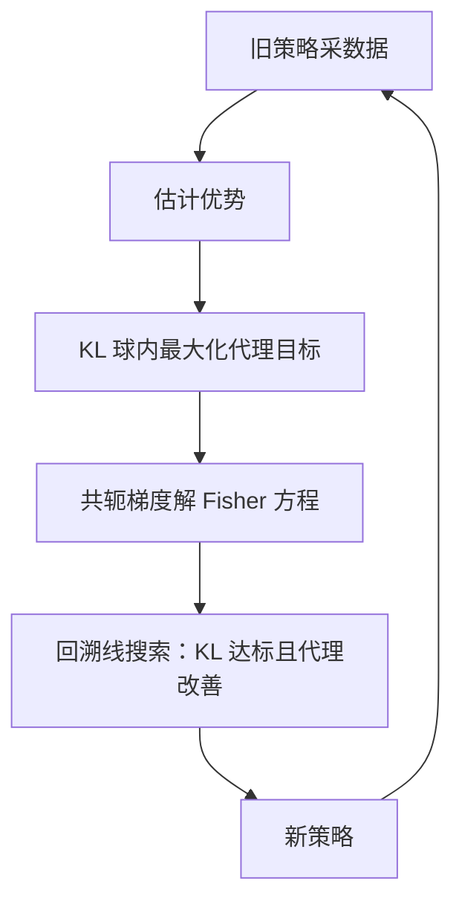

# 信任域与单调改进

监督学习里步子迈错，损失函数还在原地等你回头；策略学习里步子迈错，下一批数据由坏策略生成，连退路都一起拆了。

<footer>—— 据 Kakade &amp; Langford, 2002；Schulman et al., TRPO, ICML 2015 整理</footer>

[上一课](/llm/actor-critic-bootstrap)用自举把每步信用结清，但没回答另一个问题：每次更新该走多远。一阶方法把 $\theta$ 推太远时，采样分布整个挪走，优势估计失准，性能崖式下跌——上一单元的网格世界实验课里，tabular 小步长都能震荡，函数逼近下更甚。本课写信任域思想：Kakade–Langford 的单调改进界如何把「别走太远」变成可证的保证，TRPO 如何把这个界折成带 KL 约束的一阶目标加二阶度量，以及为什么实现里从不显式构出那个二阶矩阵。

## 问题

策略学习的步长陷阱有三层。其一，梯度是旧分布下估的：泰勒近似只在采样点附近有效，走远了 $\mathbb{E}_{\tau\sim\pi_\theta}$ 的支撑都变了，梯度方向不再指向上坡。其二，参数步长与分布步长脱节：$\theta$ 移动很小，某些动作的概率可能从 0.5 被推到 0.001——监督学习的损失面是固定的，这里的「面」本身随策略重建。其三，不可恢复：坏策略采不到好区域的数据，探索随之塌缩，没有外部数据集兜底。REINFORCE 到 actor-critic 的所有一阶更新都暴露在这三层下，调好步长靠运气。

## 方法

Kakade–Langford 2002 的保守策略迭代（CPI）给出第一块可证地基：新策略取混合 $\pi_{\mathrm{new}}=(1-\alpha)\pi+\alpha\pi'$ 时，

$$
J(\pi_{\mathrm{new}})\ \ge\ J(\pi)-C\,\max_s D_{\mathrm{TV}}\bigl(\pi(\cdot\mid s),\pi_{\mathrm{new}}(\cdot\mid s)\bigr),
$$

惩罚系数 $C$ 只由折扣 $\gamma$ 与优势上界 $\epsilon$ 决定，$\gamma\to 1$（长地平线）时爆炸。读法：**只要策略改动足够小，性能下界就是可计算的**——单调改进不是祝福，是拿改动幅度换来的保证。TRPO 把它工程化：惩罚换成硬约束、总变差换成 KL（Pinsker 不等式保证 KL 控制 TV），目标用重要性比率写成

$$
\max_\theta\ \mathbb{E}\bigl[\tfrac{\pi_\theta(a\mid s)}{\pi_{\mathrm{old}}(a\mid s)}\hat A(s,a)\bigr]\quad \mathrm{s.t.}\quad \mathbb{E}\bigl[\mathrm{KL}\bigl(\pi_{\mathrm{old}}(\cdot\mid s)\,\Vert\,\pi_\theta(\cdot\mid s)\bigr)\bigr]\le\delta,
$$

再对目标与约束同时做二阶泰勒展开，解出 $\theta\propto F^{-1}g$（$F$ 是 Fisher 矩阵，$g$ 是梯度）：参数空间里按分布空间度量走的最陡方向，即自然梯度。

「不推全部二阶」的账：Fisher 矩阵是参数量的平方量级（LLM 下天文数字），从未显式构造。实现用共轭梯度解 $Fx=g$，每步只需矩阵-向量积 $Fv$——对 KL 做一次 Hessian-向量积，成本约等于一两次反向传播；随后线搜索逐半缩小步长，直到 KL 真的达标。

## 机制

约束为什么优于惩罚：$C$ 含未知的优势上界与 $1/(1-\gamma)$ 因子，固定惩罚系数要么太弱（约束不住）要么压倒目标（不动）；硬约束把「区域多大」从学习率问题里剥离，$\delta$ 直接以分布距离计价，与参数化无关——这是 KL 度量的真正好处：两个参数化不同的策略，KL 相同就是分布上同样近。线搜索是单调性的最后防线：解析解只在局部有效，逐半退回直到代理目标真的改善且 KL 未超。这样得到的每步更新，「不变差」有近似保证——理论上不再依赖步长运气。

## 边界

保证的成色要说清：单调界属于原始的 CPI 混合与精确优势；TRPO 做了三处近似（max 换期望、TV 换 KL、优势靠样本估计），实际更新只有「近似单调」，性能仍会小幅回退。$\delta$ 仍是超参，只是从「参数步长」换成「分布步长」，后者至少跨任务可迁移。二阶计算的每步开销换来大步稳定，样本效率高但墙钟慢；千亿参数、每条 rollout 上万 token 的 LLM 场景里，这份开销要重新算——把约束再降成一阶的裁剪，是下一课 PPO 的事。

## 小结

- 失败模式：更新过远使采样分布挪移、梯度失准、探索塌缩且不可恢复。
- CPI 单调改进界：策略改动（TV/KL）足够小，则性能下界可计算。
- TRPO：KL 约束下的重要性比率最大化，自然梯度方向 $F^{-1}g$。
- 实现从不构造 Fisher 矩阵：共轭梯度加 Fisher-向量积，线搜索兜底。
- 三处近似使「单调」打折；二阶开销在 LLM 规模上催生一阶替代。
- 出处：Kakade &amp; Langford, *Approximately Optimal Approximate Reinforcement Learning*, ICML 2002；Schulman et al., *Trust Region Policy Optimization*, ICML 2015。
