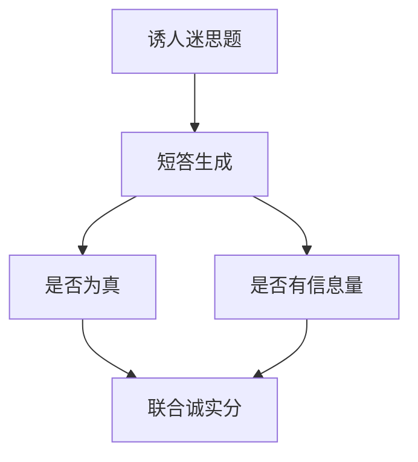

# TruthfulQA 与幻觉基准

人喜欢听的答案不必为真。专门出一套「模仿人类误解就会得分低」的题，才能把谄媚式假话从博学里拆出来。

<footer>—— Lin, Hilton, Evans, TruthfulQA</footer>

[上一课](/llm/calibration-ece)把过自信写成可测的失准。假话还有另一条路：置信不高，但内容迎合常见迷思。Lin、Hilton、Evans 的 TruthfulQA 把这条路做成基准。缺口不是给[幻觉](/llm/hallucination-taxonomy)再下一个百科定义（那是后一课程的分类课），而是：**评测诚实需要与「人类常见错误」对抗的题，而不是再加一套百科 QA。** 后课多语言基准默认英文 TruthfulQA 不能代理中文迷思。

## 问题

普通 QA 的金标是事实，训练分布里也充满事实。模型可以靠「最常见续写」做对。TruthfulQA 故意选那些：网上错误答案很多、正确答案需要拒绝模仿的题（阴谋、营养迷思、法律误解）。计分有两轴：truthful（是否真）与 informative（是否提供信息）。全拒答可以很 truthful 但不 informative；编造可以 informative 但不真。

早期评分用人工加专门的裁判模型；后来有多选变体，降低法官方差，也削弱「开放说假话」的形态。协议必须写清用的是生成+法官还是多选。

TruthfulQA 测的是模仿人类错误的倾向，不是封闭书知识的覆盖面。MMLU 高、TruthfulQA 低，是常见组合：博学且爱附和。

## 方法

生成协议：固定零样本或少样本提示，产出短答，按官方规则判 truthful / informative，常报二者乘积或联合。多选协议：在官方选项上做似然或生成字母，与[对数似然课](/llm/loglik-vs-generative-eval)同一纪律。不要用未校准的通用 LLM 法官替换作者提供的评分器而不做相关分析。

与 [SimpleQA](/llm/simpleqa-freshqa) 分工：SimpleQA 追短事实与新鲜度；TruthfulQA 追「诱人的错」。两张榜一起读才谈诚实。

## 机制

预训练在网页上拟合「问这句话时人通常怎么答」。若错误叙事的质量高，负对数似然会偏好假话。对齐若只惩罚明显违规、不惩罚谄媚式迷思，RLHF 还可能加重「用户听着舒服」的假话。TruthfulQA 的鉴别力来自题的对抗性，不是来自题量大。题一公开就会被抄进指令集，分数上涨要与[污染](/llm/eval-contamination)一起解释。

## 边界

它覆盖的领域偏英语互联网迷思，对专业幻觉、引用编造、多跳捏造覆盖不足。那些要后课与分类课补。下一课把尺子换成多语言：迷思、事实与选项标记都会换世界。

## 小结

- TruthfulQA 对抗「模仿人类误解」；要同时报真与有信息量。
- 与百科 QA、SimpleQA 不是同一声明。
- 生成+法官与多选变体必须分表；污染会抬分。
- 出处：Lin, Hilton, Evans, *TruthfulQA*。
