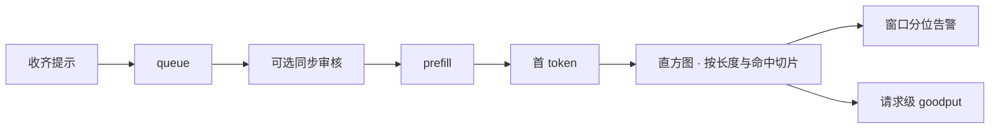

# 追踪：TTFT 分位

    
平均数告诉你典型用户还行；分位曲线才告诉你谁被长提示、缓存未命中和队头阻塞留在了门口。追踪要把这根曲线按桶切开，而不是只往仪表盘扔一个 P99。

    <footer>—— 对照生成服务把 TTFT 作为请求级跨度，用直方图与足够样本估计尾部</footer>

[TTFT](/llm/ttft) 专文定义墙钟从请求接受到首个被接受的输出 token；[服务指标](/llm/serving-metrics) 把它与 TPOT、吞吐并列；[SLO](/llm/serving-slo) 把分位数写成合同。本篇只写**怎么追踪**：时间戳打在哪、直方图怎么切、标签基数如何控制、样本不够时 P99 在撒谎。没有追踪，SLO 是一张不会响的纸；追踪口径错了，告警会冤枉调度器或放过真正的排队。不编造一篇 TTFT percentile tracing 的会议论文。

## 问题

TTFT 是多个阶段之和：网关排队、鉴权与 [encode](/llm/serving-tokenizer-cost)、可能的同步安全卡点、调度等待、前填、第一次采样。只在引擎 kernel 入口打点，会把队列藏掉，看板永远「模型很快、用户很慢」。只在负载均衡器打点，又会把 TLS、客户端慢发完整提示算进去。测点必须与用户可见超时、与 SLO 文本一致：通常是「网关收齐完整提示」到「第一个输出 token 进入返回流」。心跳、空 SSE 注释、工具状态事件不是 token。

第二个问题是聚合。全局 P99 把 128 token 闲聊与 32k 文档问答揉在一起，优化会去修已经很快的那一群。缓存命中与未命中是双峰：混合分位由未命中峰决定，平均被命中流量粉饰。追踪若不按长度桶、命中、模型、是否分块前填分列，P99 就不能指导动作。

### 分位是顺序统计量，不是另一个平均值

窗口内 $N$ 个 TTFT 样本的经验 $p$ 分位，大约是第 $\lceil p(N-1)\rceil$ 个顺序统计量。$N=200$ 时「P99」几乎是最倒霉的一两条，明天换一批请求数字就能跳一倍。P99.9 更甚。没有足够完成量就不要把三九写进告警；改用 P95 加长窗口，或改报超阈值比例。最大值当 SLO 更糟：它随观测时间单调变坏，激励停止测量。

预热阶段的 CUDA 编译、第一次加载适配器、JIT 图捕获，会写成当天最肥的尾巴。稳态分位应丢掉发布后的一段冷启动，或把「冷」标成单独的请求类，避免冤枉连续批。

## 方法

每条请求一条根跨度 `llm.ttft`，属性至少：模型、精度、适配器版本、提示 token 数（encode 后）、输出是否流式、前缀缓存命中长度、队列深度快照。子跨度按预算拆：`queue`、`moderate`、`prefill`、`sample_first`。TTFT 的结束事件与流式协议的第一个合法 token 对齐，见服务指标专文对「被接受的输出 token」的定义。

存储用直方图而非每次都算全量百分位。桶边界应按对数或按产品长度档（例如 0–512、512–2k、2k–8k、8k+ 的 TTFT 毫秒桶），因为延迟跨三到四个数量级。OpenTelemetry 一类导出时，**不要**把 `prompt_tokens` 当高基数标签逐值贴上，否则时间序列爆炸；应先分桶再贴 `prompt_bucket=2k-8k`。用户 ID、会话 ID 只进采样追踪，不进指标标签。

告警看两级。窗口级：某类请求的 $q_{0.99}$ 或超阈值比例持续越线，驱动减批、拒长、限流。请求级：单条 TTFT 超线记入 [goodput](/llm/goodput) 的不合格，用于容量曲线，而不是每条都呼叫。重试去重：同一用户可见尝试只进一次分位，三次内部重试进三次会把尾巴写歪。

### 切片比单个 P99 更有用

最小切片集：长度桶 × 缓存命中/未命中 × 模型。可选再加：是否 [chunked prefill](/llm/chunked-prefill)、是否同步审核、区域。报表先看未命中长提示的 P95/P99，那是前填与排队的真值；再看命中短提示的 P50，那是路径下限。若短提示 P50 也涨，问题在控制面或同步卡点，不在注意力核。

压测与线上共用同一套跨度名。压测要扫并发，画出 P50/P95/P99 TTFT 对 QPS 的三条曲线，拐点是 [SLO](/llm/serving-slo) 工作点。只报空载 92 ms 没有追踪价值。

## 机制

尾部从哪来，追踪就该能指到哪一段子跨度。`queue` 主导：调度与 KV 不足，动作是准入与优先级。`prefill` 主导：提示长度或未切片的原子前填，动作是分块、拆 PD、拒超长。`moderate` 主导：同步分类器或规则，动作是异步化、缩小审核模型、或接受这笔 TTFT 税，见 [内容安全同步卡点](/llm/moderation-inline)。子跨度缺失时，所有优化都变成猜。

### 子跨度把尾巴指到动作

时钟：多机必须 NTP/PTP，跨度用同一时间源。回拨会制造负 TTFT，应丢弃或钳零并计数异常。流式在代理缓冲里攒包，服务端已发出首 token，用户仍未看见——产品 SLO 若承诺「屏幕出字」，测点要放到边缘或接受服务端 TTFT 与体感的差，并在文档写清。

百分位对样本数敏感。经验上，稳定地谈 P99 需要窗口内至少数千完成事件；谈 P99.9 再高一个数量级。流量小的模型不要签三九，改签 P95 或「超 2s 的比例」。

## 边界与工程取舍

追踪自己有成本。每 token 打跨度会把追踪后端打满；TTFT 只关心到首 token，decode 逐步 ITL 应另用摘要直方图，不要为每个 ITL 开跨度。高基数标签是比延迟本身更常见的事故。合规上，跨度属性不要带提示原文。

多区域聚合：全局 P99 会被高延迟区拖住。应先分区再看全局，故障转移是否把用户打到冷区，会在 TTFT 分位上立刻出现双峰，见 [多区域故障转移](/llm/multi-region-failover)。思维链隐藏时，用户可见 TTFT 可能是「最终答案第一个字」，内部已经跑完一段长前填——两个测点都要，只报一个会与产品文案冲突。

不要用日志 grep 的 P99 替代指标直方图。日志采样 1%、指标全量，两条曲线会对不上。合同统计走指标；日志用来下钻那条超线的子跨度。

## 小结

- TTFT 追踪的测点须与 SLO 一致：收齐提示到第一个被接受的输出 token，不含心跳。
- 用直方图与长度/命中/模型切片；禁止把无界 token 数当指标标签。
- 分位需要足够样本；冷启动与内部重试要单独处理，否则尾巴是假的。
- 子跨度区分排队、审核、前填，才能把告警映射到动作。
- 窗口分位驱动降级，请求级违约驱动 goodput；两者都要。
- 出处：对照 OpenTelemetry 直方图实践与生成服务对 TTFT/TBT 分位数的测量惯例；定义见站内 TTFT 与 SLO 专文。
