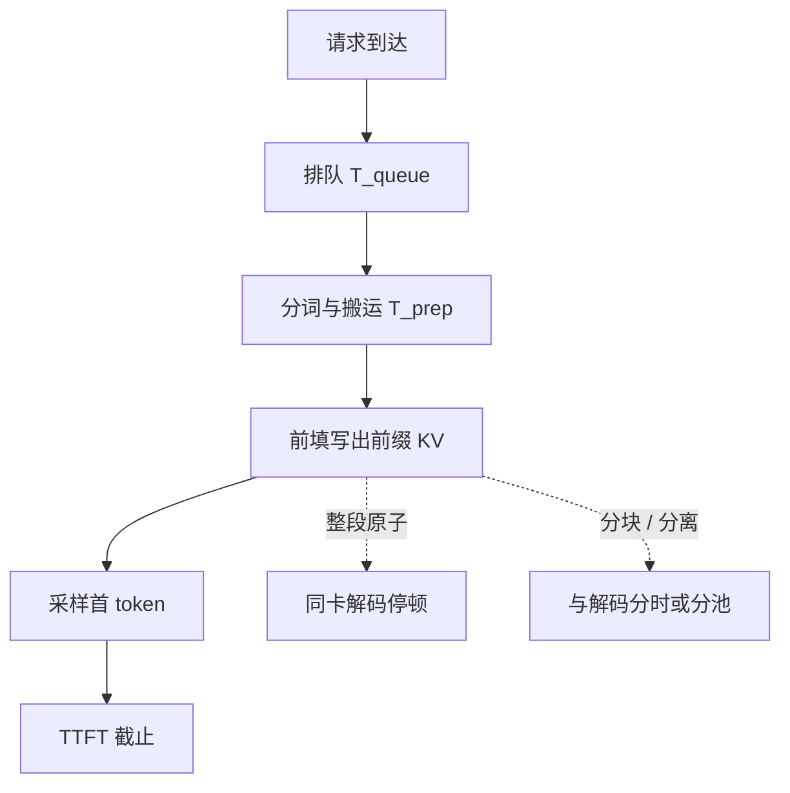

# 首 token 延迟 TTFT

    
用户感知到的「开始说话」，在自回归服务里几乎总是一次完整的前填：提示越长，第一次出字就越像一次按长度二次计费的计算作业。

<footer>—— 对照 LLM 服务中 prefill / decode 两段式延迟分解</footer>

对话产品报延迟，第一刀往往切在首 token 延迟（Time To First Token, TTFT）：请求进入系统到第一个生成 token 离开模型。它不是「模型有多聪明」，也不是整段回答要多久，而是前填（prefill）把提示编成 KV 缓存、再采出第一个词，这一段墙钟。自回归决定了后面每个词都依赖这段前填的结果；前填没结束，解码循环无从开始。本篇只把 TTFT 拆成可测量的分量，并说明它为何对提示长度、批处理和排队极度敏感。交错延迟见 [TPOT / ITL](/llm/tpot-itl)。

## 问题

一次请求的生命周期至少有四段：排队等待调度、提示侧的分词与把张量搬上设备、对整段提示做一次（或若干次）前向得到前缀 KV、对最后一个位置采样得到第一个输出 token。TTFT 是这四段之和，到第一个输出 token 发出为止。产品文案里的「秒回」若只报平均值，会把排队的长尾、超长提示的二次注意力、以及和别人拼批造成的等待混成一个数。

前填与解码的资源画像不同。前填要对长度为 $n$ 的提示做自注意力，分数矩阵是 $n\times n$，算力密度高，接近训练一步；解码每步只有一条新查询，主要在扫已经写下的 KV，带宽密集。把两段的延迟加总叫做「端到端」，无法指导该加卡、该减批、还是该切分前填。TTFT 专门钉住前半段：用户还没看见第一个字之前，系统在付什么账。

### 为何提示长度会主导 TTFT

令提示长度为 $n$、模型宽为 $d$。前填的注意力是 [二次](/llm/attention-quadratic-cost) 的 $O(n^2 d)$，投影与前馈是 $O(n d^2)$。$n$ 从数百涨到数万时，二次项迅速压过线性项。更糟的是调度：许多引擎把一次前填当成原子作业，必须整段算完才轮到该请求的解码，也才轮到同卡上其他已在生成的请求。一条长提示因此同时抬高自己的 TTFT，并抬高别人的 [交错延迟](/llm/tpot-itl)。

TTFT 不是首个 token 的模型内部激活时间，而是墙钟。同一条提示，空载单请求与满载拼批可以差一个数量级。评测必须写并发、队列深度和是否允许抢占，否则「92 ms」这类数字无法迁移。

## 方法

把 TTFT 写成可加的预算，而不是一个黑盒标量：

$$
T_{\mathrm{TTFT}} = T_{\mathrm{queue}} + T_{\mathrm{prep}} + T_{\mathrm{prefill}} + T_{\mathrm{sample}}^{(1)}.
$$

$T_{\mathrm{queue}}$ 是调度器尚未把该请求编进某个前向步之前的等待；$T_{\mathrm{prep}}$ 含分词、填充、拷到设备，通常远小于前填，但在极短提示上会露出来；$T_{\mathrm{prefill}}$ 是主导项，等于对该提示（或它的若干 chunk）跑完前向、写出 KV 的时间；$T_{\mathrm{sample}}^{(1)}$ 是第一次采样与解码后处理，相对前填通常可忽略，除非词表投影或约束解码极重。

测量时应用同一把尺子。从网关收到完整提示算起，到第一个输出 token 进入返回流；不要从「模型 kernel 启动」算起而把排队藏掉，也不要把流式协议的第一个心跳包当成第一个 token。百分位比均值重要：P50 描述典型会话，P99 描述被长提示或队头阻塞打穿的用户。SLA 应分长度桶——128 token 的闲聊和 32k 的文档问答不是同一个 TTFT 合同。

### 调度如何改写同一条公式

连续批处理把新请求插进迭代之间，能降低 $T_{\mathrm{queue}}$，但若新来的是整段长前填，下一次前向会被它拖长，同批解码的 ITL 和后来者的 TTFT 一起变差。应对有两条常见路。[Chunked prefill](/llm/chunked-prefill) 把 $T_{\mathrm{prefill}}$ 切成多段，每段与解码拼成混合批次：自己的 TTFT 往往变长（要等更多迭代），别人的生成不被一次长作业堵住。[SplitFuse](/llm/splitfuse) 进一步用 token 预算把短提示拼满前向。另一条路是前填/解码分离：前填副本专吃 $T_{\mathrm{prefill}}$，解码副本不再被前填拖住；KV 要在网上搬，TTFT 里会多一项传输。

## 机制

用户看见第一个字，必须已经有位置 $n$ 的隐状态。因果模型里，这个隐状态依赖提示里全部合法键值，所以前填不能「先出字再补算上下文」——除非改成流式编码器或块级近似，那已不是标准解码器只 LLM 的合同。TTFT 的计算下界因此随 $n$ 走：短提示下界可能是一次权重读出（模型很大、提示很短时，前填也像带宽问题）；长提示下界是注意力二次项。GQA、MLA 减的是随后解码要搬的 KV 宽度，对前填 FLOPs 的帮助有限，因为查询头数通常仍在。

排队机制把下界变成分布。若调度是 FCFS 且前填原子，队长为 $k$ 条长作业时，新请求的 $T_{\mathrm{queue}}$ 是这 $k$ 段前填之和，P99 TTFT 由队头的超长提示决定。按 token 预算切片之后，单次前向时间有上界，排队变成「还要几块」，尾延迟从「碰上一条 100k 提示」变成可预测的块数乘块时延。这并不降低总计算量：同一条提示的 $T_{\mathrm{prefill}}$ 总和甚至因反复读已写 KV 而略增，换来的是可调度性。

不要把首 token 的采样温度、系统提示缓存命中和 TTFT 混为一谈。前缀缓存命中时 $T_{\mathrm{prefill}}$ 可以接近零，TTFT 退化成排队加一次短前向；未命中时同一用户再来一条长文档，数字会跳回二次曲线。报表应分列命中与未命中。

### 与产品指标的错位

聊天界面的「已开始输出」可能是前端骨架或工具调用的状态事件，不是模型 token。多模态提示要把图像编码算进前填，TTFT 含视觉塔；只报语言模型核时间会看起来很快。推测解码的草稿模型若先出字，用户侧 TTFT 可变短，但验证失败回滚时，真正的首个被接受 token 仍可能晚到。评测协议必须写清：计时点是第一个被接受的输出 token，还是第一个被采样的草稿。

## 边界与工程取舍

压 TTFT 的手段会伤别的指标。减小批次、拒绝长提示、给前填单独的 GPU，都能让首字变快，但吞吐下降或成本上升。把 chunk 切得很碎，单次前向变短，ITL 好看，同一条提示要跨更多步才能凑齐 KV，TTFT 变差；chunk 太大则回到原子前填。分离式服务在 KV 体积大、互连慢时，传输项会吃掉前填加速。没有一种调度能同时让「空载短提示的 TTFT」和「满载长文档的吞吐」都达到各自的单目标最优。

数值上不要用单卡空载的 TTFT 去签多租户 SLA。权重未常驻、专家未命中、编译核第一次启动，都会在冷启动上叠一层，只应出现在发布检查，不应写进稳态延迟。半精度溢出、过长序列的注意力核回退到物化实现，会让 $T_{\mathrm{prefill}}$ 突然非线性恶化，这是实现问题，不是定义问题。

MoE 上 TTFT 还可能被冷专家搬运主导：前填路由发散，缺页一次是整份 FFN。这时加卡或量化专家比再抠注意力核更有效。把稠密模型上的 TTFT 曲线直接套到稀疏模型上，会漏掉这条存储层次。

## 小结

- TTFT 是请求到达至第一个生成 token 的墙钟，主导项通常是提示前填，而不是采样本身。
- 可分解为排队、准备、前填与首次采样；长度桶和百分位必须分开报。
- 前填对长度二次，且常被当成原子作业，因而既抬高本请求 TTFT，也阻塞他人解码。
- 分块前填与混合批次用可预测的迭代时间换更长的自身 TTFT；分离式服务用 KV 传输换互不干扰。
- 前缀缓存命中会让 TTFT 接近排队加短前向，未命中则回到二次曲线，不可用一个平均数概括。
- 产品「开始输出」事件、多模态编码、推测解码的草稿，都可能让计时点与模型 token 错位。
- 出处：对照 vLLM 一类服务系统的 prefill/decode 分解，以及 Sarathi-Serve 对前填阻塞生成的讨论。
