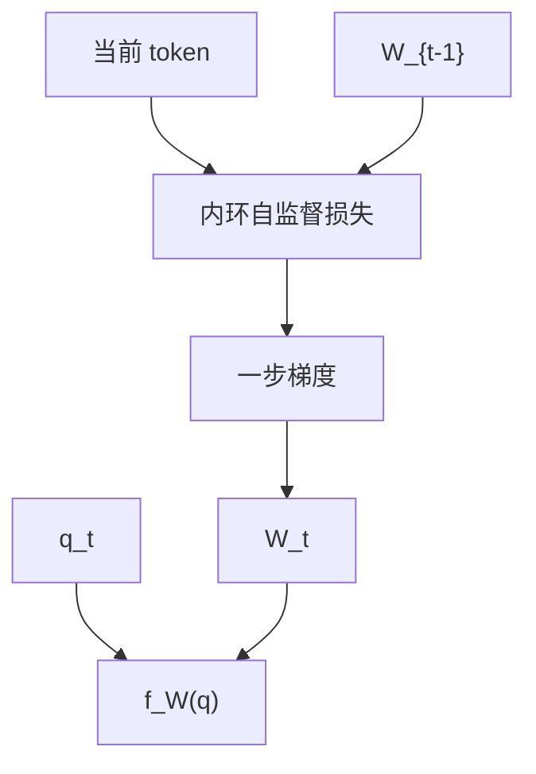

# TTT 测试时训练层

把隐状态当成一个小模型的权重，每个 token 对自监督损失做一步梯度下降；推理时这条更新仍然发生。

<footer>—— Sun et al., Learning to (Learn at Test Time): RNNs with Expressive Hidden States, 2024</footer>

[上一课](/llm/delta-rule-memory)的擦除-写入是固定公式。若把「让 $Sk$ 接近 $v$」看成损失 $\ell(W;x_t)$，则更新 $W\leftarrow W-\eta\nabla_W\ell$ 就是一步测试时训练（Test-Time Training, TTT）。本课把线性 RNN 的状态重新解释为**内环权重**，外环仍是普通反向传播训投影与学习率。后课长卷积不再维护这种可学习状态，先把「测试时还在学」钉死。

## 问题

固定扫描规则无论门控还是 delta，表达力被更新族锁死。想要更强的内环（例如小型 MLP 当记忆，而不只是线性映射 $S$），就需要一个原则来导出更新，而不是每次手写 rank-1 公式。缺口是：**规定内环模型与自监督损失，用梯度定义状态转移**，使训练与推理都执行同一内环。

这与部署时用测试集微调整网不是一件事。TTT 层的内环只动那一小份状态权重，外环参数冻结于推理，且损失来自当前序列的 token 自身（如重建 $x_t$ 或预测邻域），不来自标签。

外环梯度要穿过内环的梯度步，实现上是高阶导数或展开后的反传。步数一多，这就是 unrolled 优化，贵且脆。

## 方法

内环模型 $f_W$，例如线性 $f_W(k)=Wk$，或两层 MLP。每个时间步构造损失，如 $\|f_W(k_t)-v_t\|^2$。一步（或少量步）SGD / 带动量的更新得到 $W_t$，输出 $y_t=f_{W_t}(q_t)$。Sun 等人比较线性与 MLP 内环：MLP 更表达，状态是 MLP 的权重向量，体积更大。

并行化：线性内环加平方损失时，更新常能写成与 delta 类似的形式，可扫描。MLP 内环逐步成分更重，硬件感知更难。课序默认先理解线性 TTT 与 delta 的亲缘，再承认 MLP TTT 是表达力换速度。

### 内外环分工

外环学：如何把 $x$ 编成 $q,k,v$、内环学习率、初始化 $W_0$。内环学：当前序列上的那份 $W$。换一篇文档，$W$ 重置，这是与普通层权重的差别——普通层跨文档共享，TTT 状态按序列重建。

## 机制

自监督损失把「记忆该满足的约束」说清楚：见到 $(k,v)$ 之后，再用 $k$ 去读应得到 $v$。梯度步是满足约束的通用方法，delta 规则是它在线性平方损失下的近亲。MLP 内环让约束可以非线性，容量上升，也失去 SSD 那样干净的对偶。

长序列上每步都更新，$W$ 可能过拟合最近 token 而忘早期约束——内环同样需要隐式遗忘（学习率、权重衰减、有限容量）。TTT 不是无限记忆，它是把遗忘交给优化动力学。

与「测试时在用户数据上微调整模型」的隐私与延迟模型完全不同。TTT 层不把用户数据写入外环检查点。

## 边界

MLP 内环的训练稳定性、吞吐、实现成熟度都弱于 Mamba / GLA。本课不是建议把主干注意力全部换成 TTT。它提供一条概念桥：线性状态更新 = 内环一步学习。评测应报内环类型与状态体积，只报「用了 TTT」无法复现。下一课长卷积把记忆放进滤波器系数，推理不再逐步改权重，内环消失。

## 小结

- TTT 层把隐状态当小模型权重，每 token 对自监督损失做测试时梯度步。
- 线性平方损失下与 delta 规则近亲；MLP 内环更表达、更难并行。
- 外环学编码与学习率，内环权重按序列重置，不写入检查点。
- 有限容量加持续更新仍会忘；不是无损记忆。
- 出处：Sun et al., 2024。
