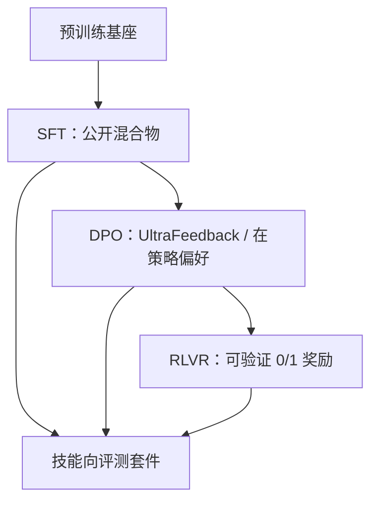

# Tulu / Tulu 2 / Tulu 3

没有单一指令集在所有评测上同时最好；后训练的进步来自把数据混合物、偏好方法和可验证奖励拆开测量，而不是换一个更响亮的聊天名字。

<footer>—— Ivison / Wang 等 Tulu；Ivison 等 Tulu 2；Lambert 等 Tulu 3，Allen Institute for AI</footer>

Allen Institute for AI 的 Tulu（写作 TÜLU）不是某一个基座架构，而是一套**把后训练做成可复现实验**的配方：公开混合物、公开代码、按技能拆开的评测，以及从 7B 到几十上百亿的全参检查点。2023 年的 *How Far Can Camels Go?* 用 LLaMA 扫了约十二个公开指令集，给出第一代 Tulu 混合物；同年的 *Camels in a Changing Climate* 换成 Llama 2，引入 [DPO](/llm/dpo) 与 UltraFeedback，把开放聊天推到当时 GPT-3.5 附近；2024–2025 年的 Tulu 3 再叠第四段——用程序可检查的奖励做强化学习（RLVR），并覆盖 Llama 3.1 与 [OLMo](/llm/olmoe) 家族。本篇按三篇论文的贡献写：技能会随数据源分化、偏好阶段改的是开放生成而不是所有基准、可验证奖励只在有真值的任务上补第三种梯度。工程仓库 `open-instruct` 后来会改超参，脊梁仍是这三次测量。

## 问题

指令微调在 2023 年已经有许多公开资源：人工众包（OpenAssistant、Dolly）、教师蒸馏（Alpaca、Vicuna 式 ShareGPT）、带思维链的 FLAN 变体。实验室习惯的做法是「选一个当时最火的集，报一张 Arena 或 GPT-4 裁判表」。这会把三件事缠死。第一，不同来源强化的技能不同——代码、多语、安全和开放写作并不共享同一条损失面。第二，人类或模型偏好评分对知识与推理的分辨力很弱，Tulu 原文明确写了：偏好评测与基准评测暴露的能力差对不上。第三，没有共同的开发/留出协议时，混合物很容易污染评测题面，分数变成记忆。

Ai2 要回答的不是「再训一个更会聊天的 LLaMA」，而是：在**只使用公开数据**的约束下，后训练还能把哪些技能推到多近闭源助手，以及每一步（SFT、偏好、RL）各自买到了什么。这要求把评测写成技能向量，而不是一个平均「有用性」。

### 技能向量而不是一张排行榜

第一篇骆驼论文把评测拆成事实知识、推理、多语、代码、安全与开放指令遵循，并用自动指标、模型裁判和人工对照一起看。结论很不讨喜：没有一个数据集或简单拼接在所有轴上同时最优；某个集在 MMLU 类知识上好看，换到开放写作就塌。Tulu 混合物是折中，不是发现了「唯一正确的指令分布」。把 Tulu 理解成「数据越多越好的汇编」，会丢掉这篇论文真正的方法贡献——**用同一套基座扫来源，逼出技能与来源的对应关系**。Tulu 这个名字来自骆驼，不是新的预训练目标。权重挂在别人的基座上（LLaMA / Llama 2 / Llama 3.1 / OLMo 2），贡献在后训练配方与评测协议。和只开聊天权重、不公开混合物与超参的模型，不是同一类可引用对象。

## 方法

三代配方可以收成一条加长的管道，每代只加一段，并重做混合物。

**Tulu（2023）**。基座是 LLaMA 6.7B 到 65B。监督数据来自约十二个公开指令集，从人工策划到合成蒸馏都有；最终 Tulu 混合物把高质量开放资源拼在一起做全参微调。论文同时放出整套指令微调模型，便于别人只换一个来源做对照。关键实验发现是：来源会「揭开或增强」特定技能，单集做不到全能；当时最好的开放指令模型在他们的套件上平均约到 ChatGPT 的 87%、GPT-4 的 73%，缺口同时来自基座与数据。

**Tulu 2（2023）**。基座换成 Llama 2（另有 Code Llama 上的 Code Tulu 2）。混合物 V2 相对 V1 做了两件事：加入当时新的高质量蒸馏（如 Evol-Instruct、OpenOrca 一类解释痕迹），并**削减**过大的 FLAN 切片——他们发现少而精的混合物在 7B 上平均大约好 8%，与「高质量少量示范」的方向一致。第二段是 DPO：在 SFT 之后用 UltraFeedback（约 6.4 万条、GPT-4 排序的完成）做偏好，学习率低到 $5\times 10^{-7}$，$\beta=0.1$，约三轮。DPO 把 AlpacaEval 一类开放生成抬了一大截（论文报平均约 13% 量级），对多数能力基准没有系统性毁掉；多语（TyDiQA）会掉，因为偏好数据几乎没有多语。Tulu 2+DPO 70B 是当时公开的最大 DPO 模型之一，AlpacaEval 与 MT-Bench 进入开放权重前列，Chatbot Arena 上与 GPT-3.5-turbo-0314 同一档。他们还测了 [QLoRA](/llm/qlora)：长文开放生成上全参明显强于 QLoRA，差距随宽度缩小。

**Tulu 3（2024）**。管道收成四段：先为技能定向策数据并相对 Tulu 3 Eval **去污染**；再 SFT；再 DPO（在策略合成偏好加离线偏好上扫混合物）；最后 **RLVR**——Reinforcement Learning with Verifiable Rewards。RLVR 不训奖励模型，只在有程序真值的任务上给 0/1：数学（GSM8K、MATH 一类）与可检查的指令约束（[IFEval](/llm/ifeval) 式格式）。奖励来自验证器，优化仍是策略梯度族。模型覆盖 Llama 3.1 的 8B / 70B / 405B 以及 OLMo 2；70B 在他们的核心技能平均上超过 Llama 3.1 70B Instruct 等同期开放指令模型。公开对象包括数据、代码、评测与配方，而不只是权重。

### 偏好阶段买的是开放生成

Tulu 2 已经把这件事写清楚：DPO 主要抬 Arena / AlpacaEval / MT-Bench，对知识与推理基准常常近似平移。Tulu 3 把偏好数据改成「选定提示上的在策略合成 + 离线」，并继续用技能套件守住不要为聊天而牺牲数学。若只用 GPT-4 当裁判、又用 GPT-4 排序的偏好集训练，分数会自我强化；Ai2 因此保留非裁判基准，并把开发与留出拆开。读 Tulu 的「超过 GPT-3.5」必须看是哪一张表：开放写作、Arena 与 MMLU 不是同一个索赔。

## 机制

后训练的梯度来源在三代里逐步加宽。SFT 是教师或标注员完成上的交叉熵，定义「助手该如何开口」。DPO 把成对比较写成策略相对参照的对数比，推动「更像赢回答、不像输回答」，但不引入新的真值。RLVR 只在验证器能判定对错的子集上给稀疏奖励，把数学最终答案和格式约束变成可优化的标量。三者不是互相替代：SFT 给分布，DPO 给主观偏好，RLVR 给可检查任务上的正确性。跳过 SFT 直接 RL，策略往往不会格式化地写出可解析答案；只用 DPO 而不做 RLVR，数学的对错没有进入损失。

去污染是 Tulu 3 的方法学贡献，不只是卫生条款。后训练数据若含评测题面，SFT 会变成背题。他们强调提示相对评测套件去重，并把评测分成开发用与留出未见。没有这一步，混合物消融无法解释。

RLVR 与后来流行的 [GRPO](/llm/grpo) / 结果监督同属「可检查任务上的 RL」，但 Tulu 3 论文的主张是配方级的：在开放后训练栈里加第四段，而不是提出一种新的优势估计器。复现时应看他们的验证器定义与提示集，而不是把任意数学 RL 都叫做 Tulu 3。

### 基座更换不等于配方作废

从 LLaMA 到 Llama 2 再到 Llama 3.1 / OLMo 2，同一套「混合物 + DPO +（后来的）RLVR」被重跑。论文要证明的是配方可迁移，不是某一个检查点永远 SOTA。Code Tulu 2 额外说明：继续代码预训练的基座，再用通用 V2 混合物微调，代码基准上升、AlpacaEval 一类开放写作大约掉两成量级——后训练不能把预训练域的偏置完全洗掉。选基座仍然是后训练的第一超参。

## 边界与工程取舍

Tulu 系列的上限受公开数据与公开教师约束。混合物里大量 GPT-4 / ChatGPT 完成，许可证、污染和「学教师口吻」都在。用 GPT-4 裁判评开放生成，会偏爱像 GPT 的学生；Arena 能部分校正，但不能消掉训练分布本身。安全与多语在早期混合物里偏弱，Tulu 2 的 TyDiQA 回退是明确失败模式，不是脚注。

RLVR 只覆盖验证器能写出来的任务。开放写作、模糊建议、多约束但不可程序化的指令，没有 0/1。把 RLVR 当成通用对齐，会在没有真值的轴上无梯度，甚至因数学专项而风格漂移。405B 级实验证明配方能上规模，并不证明每个实验室都付得起同一套扫混合物的预算。

不要把 Hugging Face 上某个 `tulu-*-instruct` 权重直接当成对应论文的全部声明。日期后缀、是否含 DPO、是否含 RLVR、基座是 Llama 还是 OLMo，必须对模型卡。引用贡献时指向三篇论文与 `allenai/open-instruct`，而不是某一个 7B 聊天文件。

与只谈人写/合成配比的文章相比，Tulu 的单位是**可消融的后训练阶段**。它不替代 [指令数据清洗](/llm/sft-data-sources)，而是假定你已经能把来源标签进混合物，再问阶段与技能的因果。

## 小结

- Tulu 把开放后训练收成可复现配方：公开混合物、按技能拆开的评测、以及可对照的全参检查点。
- 第一代表明不同指令来源对应不同技能，偏好评测覆盖不了基准上的能力差。
- Tulu 2 换 Llama 2、收紧混合物，并用 UltraFeedback 上的 DPO 抬开放生成；QLoRA 在长文上弱于全参。
- Tulu 3 加去污染、在策略偏好与 RLVR，使数学和可检查指令遵循进入第四段梯度。
- DPO 主要买聊天与写作；RLVR 只在有验证器的任务上买正确性；二者都不替代基座与 SFT 分布。
- 出处：Wang / Ivison 等，*How Far Can Camels Go?*，2023；Ivison 等，*Camels in a Changing Climate*，arXiv:2311.10702；Lambert 等，*Tülu 3: Pushing Frontiers in Open Language Model Post-Training*，arXiv:2411.15124。代码 https://github.com/allenai/open-instruct。
