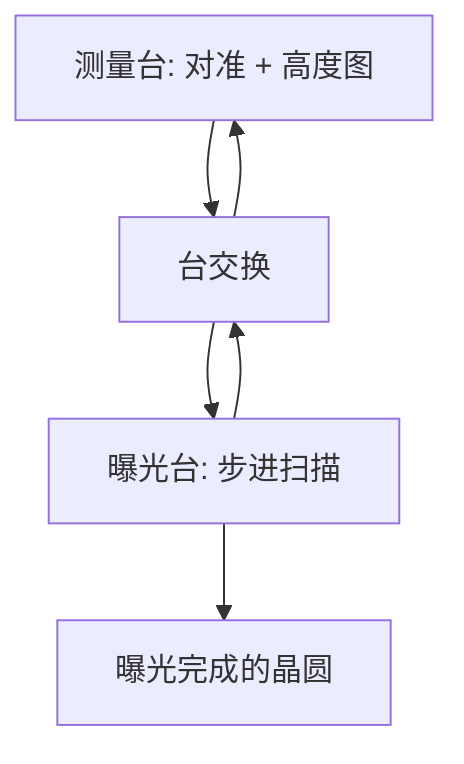

# 双工件台 Twinscan 提高产能

TWINSCAN 是第一套、也仍是唯一以两个完整晶圆台模块工作的光刻平台：一块在曝光，另一块在装载、对准与表面测绘，然后交换。

<footer>—— ASML, TWINSCAN: 20 years of lithography innovation（公开故事，2021）</footer>

扫描投影的时间账很简单：每一片晶圆既要被量（对准、调平），也要被照（场逐条扫描曝光）。若只有一个工件台，测量与曝光串行，光源与镜头在测量阶段闲着。ASML 的 TWINSCAN 把测量和曝光拆到两张晶圆台上并行，交换后继续。产能单位是每小时晶圆数（wph），不是「镜头更快」。本篇只讲双工件台在时间轴上做了什么，以及它如何同时服务产能与[套刻](/llm/litho-overlay)网格密度。

## 问题

300 mm 晶圆上有数十个曝光场。每个场要同步扫描掩模台与晶圆台；整片还要在曝光前得到高度图，以免浅焦深下离焦。测量点加密能改善调平与高阶对准，但在单台架构里直接吃掉曝光时间。光源功率与扫描速度拉高之后，瓶颈会从「照得不够快」变成「测得不够勤」或「交换开销太大」。问题是：如何让投影物镜几乎连续有片可照，同时仍做密网格计量。

双工件台不是双镜头，也不是一次照两片。光学仍是一套投影物镜、一个照明与一台掩模台。并行的是晶圆侧的机械与计量。把它理解成「两个扫描机焊在一起」，会高估光学成本、低估交换与校准的难度。

### 测量与曝光争的是同一段墙钟

对准波长、调平传感器、场间网格，都必须在曝光前完成。单工件台机型把这段放进片周期。双台把这段挪到另一张正在「暗室」里被测绘的片子上。曝光台只负责扫描曝光与必要的实时同步。ASML 公开文本的句子就是：table one 曝光时，table two 装片、对准、测绘，然后换位。片周期近似由 $\max(T_\mathrm{expose}, T_\mathrm{measure})+T_\mathrm{swap}$ 决定，而不是两者相加。

若测量时间已经短于曝光时间，再加密网格的边际产能代价接近零——这正是双台的要点。单台架构上，同样的加密会线性拉长片周期。

## 方法

架构上有两个完整的晶圆台模块，交替进入曝光位与测量位。测量位做对准传感器读标记、调平（高度图）、以及后续高阶校正所需的采样。曝光位做步进–扫描。NXT 一代还把平面电机、短光束定长编码器网格写入定位，降低气流与热对长光程干涉仪的干扰；SPIE 公开论文里 NXT:1950i 把双台与平面电机、编码器放在同一套产能–套刻叙事里。

交换必须足够短，否则并行收益被 $T_\mathrm{swap}$ 吃掉。两张台的 mag 与旋转匹配、卡盘间的指纹，进入匹配套刻与 dedicated chuck 讨论。产线若要求片在同一卡盘上量、同一卡盘上照，那是套刻策略，不是否定双台；双台提供的是两套卡盘轮流工作的时间重叠。

### 公开产能数字只钉机型与年份

ASML 2021 年公开故事写：2008 年首款 NXT（TWINSCAN NXT:1950i）把产能提高到超过 200 wph，overlay 到 2.5 nm；当时领先的 NXT 浸没可到 295 wph、overlay 到 1 nm 量级。NXT:1470 干式被写成首台超过 300 wph 的光刻机。这些是厂商对特定平台的公开规格或宣传点，带年份与机型。本篇不把 wph 外推成某节点晶圆厂的出片良率，也不编造「双台让良率提高百分之几」。

## 机制

产能来自利用率。投影镜头与 ArF 激光是最贵的连续运转资源；让它们在测量时空转，等效于降低资本效率。双台把测量藏进另一片的曝光窗口。若 $T_\mathrm{measure}\approx T_\mathrm{expose}$，理想加速接近 2 倍减去交换；若曝光更长（高剂量、多重图形、慢扫描），加速变小，但密网格仍然「免费」。因此双台对[多重曝光](/llm/duv-multipattern-cost)特别值钱：临界层剂量高、场多，测量需求也高。

套刻收益来自时间预算。可以在测量台采更多标记、更密的高度点，而不把 wph 打穿。ASML 把「双重图形要求更紧的 overlay 与 CD」与 NXT 双台平台写在同一技术论文里，逻辑是：没有并行计量，套刻与产能是直接交易；有了并行，交易变缓。镜头畸变操纵、ORION 等多色对准，是叠加在双台时间轴上的精度手段，不是双台本身。

TWINSCAN 商标指 ASML 双台扫描机平台，覆盖干式、浸没与后来的 EUV 机族在晶圆台概念上的延续。不要把「Twinscan」写成一种照明或一种胶。

### 与步进机单台历史的对照

早期步进机一场一停，片周期由步进、对准与曝光串行相加。扫描机已经把场内运动变成掩模与晶圆同步扫描；TWINSCAN 再把片间计量并行化。产能史是「运动与计量从光学临界路径上拿掉」，不是「波长变短所以 wph 变高」。事实上 EUV 的片产量可以低于浸没 DUV，正因为光源与真空，而不是因为少了一个工件台。

## 边界与工程取舍

双台增加机械、校准与软件状态机的复杂度。两套卡盘的热、夹持指纹必须纳入匹配套刻。若产线坚持 dedicated chuck overlay（同一卡盘量与照），调度要保证交换后的身份一致，不能把「双台」理解成可以任意把片扔到另一张台上而不记账。干式成熟层更看重速度，ASML 把 NXT 平台延伸到干式正是这一逻辑；临界层更看重 overlay 与和 EUV 的 cross-matching。

不要用某一张「295 wph」去规划所有层。剂量、照明模式（偶极往往光通量更苛刻）、是否浸没、以及上下料与涂胶显影轨道，都会改实际 wph。轨道联机后，光刻单元产能是扫描机与轨道的最小值。双台解决的是扫描机内部测量–曝光串行，不是涂胶碗的节拍。

本篇引用的 wph 与 overlay 数字均来自 ASML 公开故事或产品页，且带机型。不把它们写成 7 nm / 5 nm 的良率或所有客户现场的平均出片。

## 小结

- TWINSCAN 用两个完整晶圆台：曝光与测量并行，交换后继续。
- 片周期由较慢的那一侧加交换时间决定，而不是测量加曝光的串行和。
- 并行计量使密网格对准与调平不必直接牺牲 wph，服务套刻与浅焦深。
- 公开产能数字必须钉机型与年份；NXT:1950i 一代有超过 200 wph 的公开表述。
- 双台不是双镜头；光学仍是一套投影与照明。
- 实际单元产能还受轨道、剂量与照明模式限制。
- 出处：ASML 公开故事 *TWINSCAN: 20 years of lithography innovation*；de Klerk 等，SPIE 对 NXT:1950i 双台浸没平台的论文。
