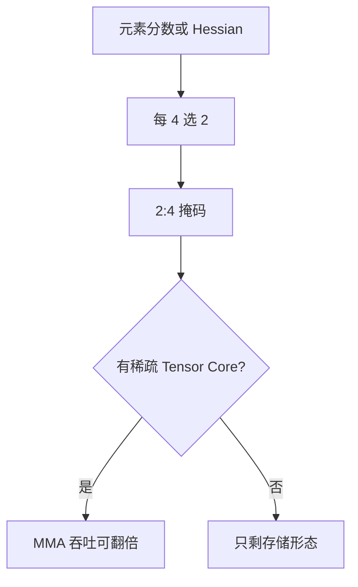

# 2:4 结构稀疏

每四个连续权重里恰好两个为零。这不是又一种打分，是 Ampere 稀疏 Tensor Core 认得的模式；掩码对了，吞吐才有机会翻倍。

<footer>—— Mishra et al., Accelerating Sparse Deep Neural Networks, 2021；SparseGPT / Wanda 均可在选择阶段加 N:M 约束</footer>

[上一课](/llm/wanda) 给出元素分数，默认掩码任意。[非结构化稀疏](/llm/unstructured-sparsity) 已经把「研究表稀疏 vs 墙钟」劈开。本课补硬件合同：**N:M**，LLM 上最常见的是 2:4。缺口是把 SparseGPT / Wanda 的选择器加上模式约束，而不是剪完再硬塞零。后课 Sheared LLaMA 把删除单位抬到层与通道，走另一条加速账。

## 问题

NVIDIA Ampere 起，稀疏 Tensor Core 要求沿输入通道每 4 个元素 2 个非零（2:4），才能走标称 2× 的 MMA 吞吐。50% 非结构稀疏在计数上同密度，在核上仍是密矩阵：索引不规则，Tensor Core 不接。问题变成：在 2:4 可行集里选哪两个留下，使层输出误差最小。可行集比非结构小得多，质量通常略差；换来的是**有核就不只省存储**。

不要把 2:4 与「通道剪枝 50%」混报。通道剪枝留下的是更瘦的密 GEMM，任意 GPU 都能加速；2:4 留下原形状，只改内部模式，没有对应核就零加速。

Hopper 仍支持 2:4。没有稀疏 Tensor Core 的加速器上，2:4 只是一种正则化的掩码，不要写进吞吐对比。

## 方法

在 Wanda 分数或 SparseGPT 的重建目标上，对每个长度为 4 的窗口只保留分数最高（或补偿后最不疼）的 2 个。SparseGPT 论文明确支持把 N:M 写进选择阶段。剪完必须用稀疏核或至少用密×掩码模拟验收质量；报加速必须在真实 2:4 kernel 上测，含 dequant / 反稀疏开销。

与量化叠：先 2:4 再 GPTQ，或联合选格子与掩码，校准都要走真实掩码前向。宣传「4-bit × 2:4 = 8×」是连乘禁令，量化基础课已经写过。

## 机制

2:4 把每组 4 个权重的组合从 $\binom{4}{k}_{\text{任意}}$ 收到 $\binom{4}{2}=6$ 种模式。误差的不可补偿分量变大，所以同等 50% 下 PPL 通常高于非结构。补偿（SparseGPT）比纯 Wanda 更能把留下的 2 个值挪到减少重建误差的位置——2:4 下补偿的相对价值往往比非结构更大，因为自由度更少。

Decode 小 batch 时，瓶颈常在权重加载。2:4 若真按一半字节加载，带宽墙场景也能收益；若实现先展开成密 FP16 再乘，收益消失。要看的是加载路径，不是 MMA 宣传。

## 边界与工程取舍

不要在选完非结构掩码后再最近邻投影到 2:4，质量会掉一截。不要对 embedding / lm_head 盲目 2:4，词表行的模式与隐藏层不同，且核支持差。下一课结构化剪枝的 LLM 实例：Sheared LLaMA 直接改架构宽度，不依赖稀疏核。

## 小结

- 2:4 是硬件模式，不是新的重要性分数。
- 选择必须在 N:M 约束内做；事后投影会丢质量。
- 无稀疏 Tensor Core 则不要报 2×。
- 禁止与量化 bit 连乘成加速比。
- 出处：Mishra et al., 2021；Frantar & Alistarh, SparseGPT；Sun et al., Wanda。
