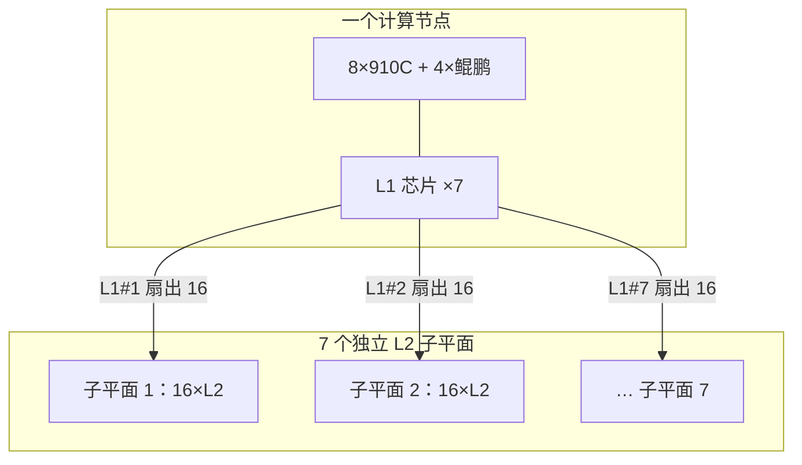

# L1 板载交换 + L2 通信柜、七子平面

    
每个计算节点七颗板载 L1 交换，一一对着超节点里七个独立的 L2 子平面；上行聚合与节点内 UB 容量对齐，L2 不做带宽超额认购。

<footer>—— CloudMatrix384 论文对板载 L1、通信柜 L2 与七子平面的公开拓扑</footer>

[CloudMatrix 384](/llm/cloudmatrix-384) 的 UB 网不是「所有卡插进一台巨大交换机」。公开结构是两级：计算节点上的 **L1 板载 UB 交换芯片**，以及 4 个通信柜里的 **L2 UB 交换**。L2 被划分成 **7 个独立子平面**。每个节点的 7 颗 L1 与这 7 个子平面一一对应；每颗 L1 扇出 16 条链路，连到本子平面里的每一颗 L2 芯片。论文把该网络写成无阻塞：L2 层没有带宽超额认购，节点到 L2 的聚合上行与节点内部 UB 容量对齐。本篇只写这一层拓扑怎么读，端口速率用论文已给出的数字，不推断未给出的机柜内走线长度。

## 问题

48 个计算节点、每节点 12 个处理器（8 NPU + 4 CPU）要全互连，若做成单级大交换，端口基数、供电和故障域都会集中到一个箱子。若做成节点两两直连，链路数按节点对数增长，布线先崩。两级星型（节点内汇聚到 L1，L1 再进 L2）用 $O(N)$ 量级的上行逼近全互连的带宽目标，这是数据中心 Clos 也熟悉的思路；此处的差别是：交换芯片讲 [UB](/llm/ub-lingqu)，L2 放在专用**通信柜**而不是每柜一个 ToR 以太网，而且切成七个平行平面而不是一张共享的脊。

切平面要回答：为什么是 7，而不是 1 或 48。公开配置里，每颗 910C 带七个高速收发器接入 UB；节点上放 7 颗 L1，与收发器/上行分组相匹配。一颗 L1 对应一个 L2 子平面，故障时可以损失一个平面的带宽，而不必把整张超节点网一分为二。把七个平面理解成「七个独立的以太网 VLAN」不准确——它们是 UB Scale-Up 的带宽切片。

### 无阻塞在这句话里的意思

论文的无阻塞指：L2 交换层不过度订阅，节点内 UB 容量与「节点→L2」聚合上行匹配，因此跨节点流量在交换层不被人为收成更细的管道。它不是「任意 kernel 都能以该规格打满 384 卡」。近端 HBM、核启动、集合通信算法仍会限制有效带宽。无阻塞是拓扑承诺，不是应用屋顶线。

每个 L2 子平面含 16 颗 L2 UB 交换芯片；每颗 L2 芯片提供 48 个 28 GB/s 端口——这是论文写明的交换侧规格。单颗板载 L1 向上一层提供 448 GB/s 上行。不要把这些端口速率加总后当成「应用可见的 384 路全连接带宽」。

## 方法

读拓扑时按「节点 → 平面 → 通信柜」三步。

节点：8×910C + 4×鲲鹏经 UB 链接到 7 颗板载 L1，节点内是单层 UB 平面。处理器之间的盒内协同走 L1，不必出柜。出节点：每颗 L1 只进入自己的 L2 子平面，扇出 16 条，连到该平面 16 颗 L2 的每一颗。48 个计算节点都如此挂上同一组七平面，于是任意两节点之间可以经「源 L1 → 某 L2 → 目的 L1」相遇，而不经过第三计算节点转发。

通信柜：4 柜容纳全部 L2。计算柜与通信柜的相对位置决定跨柜必须走光还是还能走电，见 [跨柜光模块](/llm/ub-optical-cabinets)。编排上，MatrixLink 一类组件管链路与 QoS；业务作业仍应假设「七平面是一份 UB 域」，不要让调度器按平面把 TP 组拆碎——除非产品文档明确支持按平面分域，384 论文把超节点写成一个逻辑节点。

### 七平面与单卡 UB 带宽如何对上

论文给每颗 910C 最高约 392 GB/s 单向 UB。七个平面并行，是把这张卡的 UB 带宽切到七组上行，而不是让一张卡只吃一个 28 GB/s 端口。规划集合通信时，应把「平面数」当成路径多样性：拥塞或单平面故障时，APR 一类机制（[UB-Mesh](/llm/ub-mesh)）可以在仍存活的平面上借路。应用不必自己做七路打散，但要把 HCCL 绑定在整个超节点域，而不是绑定「我只用平面 3」。

CPU 的 UB 约 160 GB/s 单向每插槽，同样经这 7 颗 L1 进平面。CPU–NPU 与 NPU–NPU 共享平面资源，池化 DRAM 的流量会与 TP All-Reduce 争用。把 KV 池打满再叠满载 EP，是同一套 L1/L2 上的调度问题，不是两张物理网。

只有 NPU 参加 RDMA 平面；L1/L2 描述的是 UB Scale-Up。不要把 3.2 Tbps 节点 RDMA 加进 L2 端口表。三平面分开记账。

## 机制

两级交换把「盒内全连」与「跨节点全连」拆开：盒内最短，跨节点固定多一到两跳交换，再加跨柜介质。七平面把单点交换故障的爆炸半径从「整网」降到「七分之一带宽」，代价是控制面要维护七张平行的链路状态。无过订阅意味着通信柜的端口与线必须按峰值配齐——这正是专用通信柜存在的原因：把 L2 的供电、光模块密度和散热从计算柜里拿出来，计算柜专注 8+4。

与对称 Clos 相比，这里的「脊」是 UB L2 而不是以太网脊；叶子是板载 L1 而不是 ToR。因此柜内计算托盘之间的 TP 不应再绕一圈数据中心叶子。编程若把 HCCL 默认套到 VPC 网卡，等于绕开七子平面。

### 故障：平面、柜、节点

一颗 L1 坏：该节点在对应平面的上行丢失，节点总 UB 下降，其他平面仍在。一个 L2 子平面坏：全域该切片带宽丢失，七分之六仍在。一个通信柜坏：影响落在该柜承载的 L2 芯片集合，可能跨多个平面，爆炸半径大于单平面。一个计算节点坏：48 减 1，域还在。运维手册应按这四层写，而不是只写「NPU 掉了一张」。

## 边界与工程取舍

不要把七子平面画成七个独立的超节点来调度小作业，除非编排层明确支持平面级切片。不要用以太网的 oversubscription 经验去「节省」L2 端口——论文的无阻塞假设会被打破，宽 EP 先受害。不要发明第七平面与第七颗收发器之外的「隐藏第八平面」。端口 28 GB/s、L1 上行 448 GB/s、NPU 392 GB/s 只引用论文，换代以后以新文档为准。

相对 [UB-Mesh](/llm/ub-mesh) 论文里的柜内 2D 全直连，384 用 L1/L2 两级交换实现超节点规模，是可布线约束下的实现，不是对递归全互连原则的否定。

出处：arXiv:2506.12708 中计算节点、图 5 一类 L1–L2 拓扑、七子平面与无阻塞表述。通信柜数量为 4，计算柜 12。

## 小结

- L1 在计算节点板载，7 颗交换对应 7 个 L2 子平面；L2 在 4 个通信柜。
- 每颗 L1 扇出 16 条到本平面全部 L2 芯片；拓扑按论文为无阻塞、L2 不过度订阅。
- 七平面是 UB 带宽切片与故障隔离，不是七个以太网 VLAN，也不是七个调度域（除非产品另说）。
- CPU 与 NPU 的 UB 流量共享这些平面；RDMA 另账。
- 故障分层：L1、子平面、通信柜、计算节点。
- 出处：CloudMatrix384 公开论文的交换拓扑章节。
