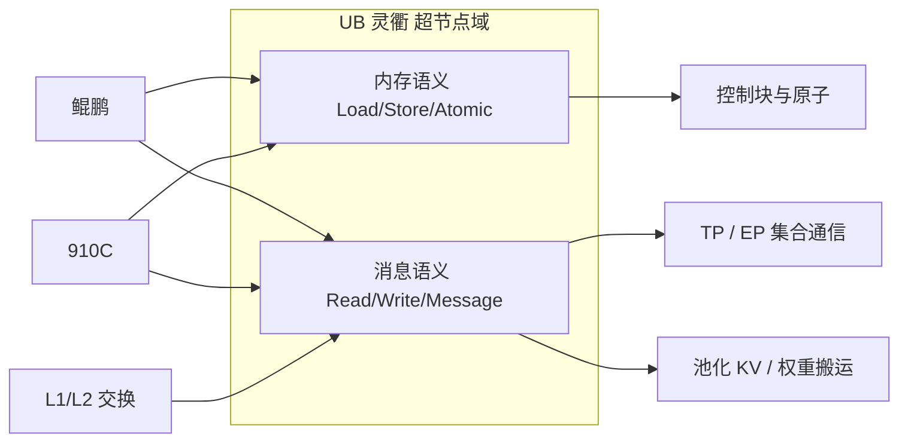

# 统一总线 UB 灵衢：内存语义 + 消息语义

    
UB 同时支持同步的 Load/Store/Atomic 与异步的 Read/Write/Message，于是 CPU、NPU 与交换可以用同一套 IO 控制器，而不再把 PCIe、NVLink、RDMA 三种协议叠在一条数据路径上。

<footer>—— UB-Mesh 论文对 Unified Bus 的公开界定；协议细节当时声明将另行发布</footer>

灵衢是华为对统一总线（Unified Bus, UB）的产品名。在 [CloudMatrix 384](/llm/cloudmatrix-384) 里，UB 平面把 384 颗 910C 与 192 颗鲲鹏收进同一张高带宽网，承担 Scale-Up。它要解决的不是「再做一种更快的以太网」，而是把传统 AI 集群里**分裂的三种互连**合成一种：主机到设备的 PCIe、设备之间的专用链、节点之间的 RDMA。UB-Mesh 论文写明：UB 同时提供内存语义与消息语义；基于 UB，CPU、NPU 乃至低基数交换（LRS）可以复用同一套 IO 控制器。本篇只写这一对语义对软件意味着什么。论文脚注写过协议规格将另行发布——未发布的包头、链路编码、重传状态机，本文不编。

## 问题

GPU 集群的数据路径是拼出来的：CPU 与 GPU 之间 PCIe，节点内 GPU 之间 NVLink，跨节点 InfiniBand 或 RoCE。每跨一次协议，就要转换、排队、换地址空间。LLM 的 TP All-Reduce、MoE All-to-All、以及把 KV 放到主机 DRAM 再取回，会反复穿过这些边界。编程模型也分裂：CUDA 统一内存、NVLink SHARP、NCCL、ibverbs 各管一段。昇腾若只在节点内保留 HCCS、节点间再挂 RoCE，则超节点仍然是「很多台服务器」，CPU 内存不能作为 NPU 的一等公民。

UB 要回答：同一套链路能否既像总线一样被处理器发出 Load/Store，又像网络一样发消息、做 RDMA 式的 Read/Write？若只能消息，池化内存就要走显式拷贝；若只能一致性 Load/Store，跨柜规模和故障隔离会变得像一台巨大 SMP，难以工程化。公开设计选择了**两者都要**。

### 两种语义不是两个网

内存语义：同步 Load/Store/Atomic，适合小粒度、需要顺序与原子的访问，例如锁、计数、控制块。消息语义：异步 Read/Write/Message，适合大块张量、集合通信、KV 页搬运。它们共享物理链路与 IO 控制器，靠操作类型分流，而不是柜顶两套线。把 UB 理解成「就是 RDMA 改个名」，会丢掉 Load/Store；理解成「就是把 HCCS 拉长」，会丢掉消息与多跳交换。正确的心理模型是：域内一种控制器，两种访问动词。

UB-Mesh 论文把协议详细规格标为将发布。因此不要在容量规划里填写未出现在 CloudMatrix384 / UB-Mesh 论文中的单通道比特率编码方案，或发明一种「灵衢 opcode 表」。已公开的是语义类别与系统级带宽，不是芯片手册级的包格式。

## 方法

软件分层应对齐语义，而不是对齐旧网卡驱动名。

集合通信（HCCL 的 All-Reduce、All-to-All）应走消息语义：大块、异步、可与计算重叠。这是 TP / EP 的主路径。池化 DRAM 与远端 HBM 上的 KV、权重暂驻，可用异步 Read/Write，把「内存池」做成服务，而不是每个 worker 自己 mmap 一张跨 16 柜的共享虚拟地址——后者是否对程序员暴露，要以当时编程指南为准，本文不发明机柜级 `malloc`。控制面的轻量同步（队列头、完成标记）才考虑 Atomic / Store。昇腾 AI Core 上，公开材料还描述过用 MTE（memory transfer engine）做远程大块搬移：那是面向 AI 的异步类 Load/Store，不是 GPU 上那种同步标量 Load。把它当成 CUDA `ld` 会在延迟隐藏上判断失误。

三平面分工见 CloudMatrix384：UB 平面给超节点内 Scale-Up；RDMA 平面给超节点间；VPC 给管控与存储。UB 的内存+消息只承诺在超节点域内。跨超节点仍用 RoCE，不要把灵衢动词套到对象存储路径上。

### 控制器复用带来的资源池化

因为 CPU、NPU、交换都讲 UB，带宽分配可以从「PCIe 固定几条、NVLink 固定几条」变成在同一组链路上按负载切：论文把这写成灵活 IO 分配与硬件资源池化。CloudMatrix 愿景里的四件事——跨节点 TP/EP、按负载组合 CPU/NPU/内存、AI 与数据密集融合、CPU DRAM 聚成内存级存储——都依赖「NPU 不必经过 CPU 才能碰到另一颗 NPU 或远端 DRAM」。当前 384 仍是每节点 8+4 的物理配比，池化是逻辑的；物理上拆成纯 CPU 柜与纯 NPU 柜是论文中的未来方向。

「点对点、无需 CPU 中介」指数据面。固件、驱动、MatrixLink 代理仍跑在节点上，擎天卡仍做南北向。不要写成超节点里没有 CPU 也可以启动 OS。

## 机制

传统混合互连的税在协议转换：GPU 上的张量要变成 RDMA 工作请求，再在对端变回设备内存。UB 域内同一控制器，减少转换与多次排队。消息语义的大块搬运可以对齐 Cube 的砖块大小；内存语义的原子保证控制面不靠以太网往返。L1/L2 交换转发的是 UB 包，对上仍是这两种动词，所以跨柜之后软件接口可以不变，变的是跳数与是否走光模块。

延迟隐藏因此要按动词选。同步 Load 跨柜会把核卡住，不适合热路径上的逐元素访问；decode 的 KV 应按块异步 Read 进近端 HBM。这与 GPU 上「不要在 kernel 里远程硬读整段 KV」是同一条纪律，只是远程从 NVLink 换成了 UB。

### 与 HCCS、RDMA 的接缝

节点内历史上的 [HCCS](/llm/hccs-to-ub) 提供缓存一致性，面向 8 卡盒。UB 把域撑到多柜，一致性边界与消息边界如何划，以公开文档为准：不要假设 384 颗 NPU 共享一个单一 cache-coherent 地址空间。RDMA 平面在 384 上仍然独立，保证与标准 RDMA 栈互操作；UB 不是把 RoCE 废掉，而是把最密的那一档通信收进超节点。

## 边界与工程取舍

不要用 UB 替代数据中心网络：检查点、跨 AZ、对象存储仍走 VPC/RDMA。不要在未提供统一编址 API 的软件栈里手写跨柜指针。不要把 UB-Mesh 论文里相对 Clos 的成本倍数（例如光模块减少比例）当成 CloudMatrix 384 机房的采购清单——那是架构论文相对基线的估计。协议未公开部分，驱动与 HCCL 版本必须与超节点固件绑定，自行解析包等于在未授权层上工作。

对框架，HCCL 仍是集合通信入口；下面走 UB 还是 RoCE，由进程组是否落在同一超节点决定。选错平面，语义还在，屋顶线差一档。

出处：arXiv:2503.20377 UB-Mesh 文中 Unified Bus 的同步/异步操作分类与控制器复用；arXiv:2506.12708 CloudMatrix384 对 UB 平面能力的描述。不引用未发布的 UB 协议规范正文。

## 小结

- 灵衢 UB 在超节点内同时提供内存语义（Load/Store/Atomic）与消息语义（Read/Write/Message）。
- 一种 IO 控制器覆盖 CPU、NPU 与交换，才能做资源池化、少协议转换。
- TP/EP 与大块 KV 走异步消息；控制块才用同步原子。AI Core 上的远程搬移是异步大块，不是标量 Load。
- 域外仍是 RDMA 与 VPC；UB 不消灭以太网。
- 协议细节未公开则不编；软件以 HCCL 与厂商编程指南为准。
- 出处：UB-Mesh 与 CloudMatrix384 公开论文。
