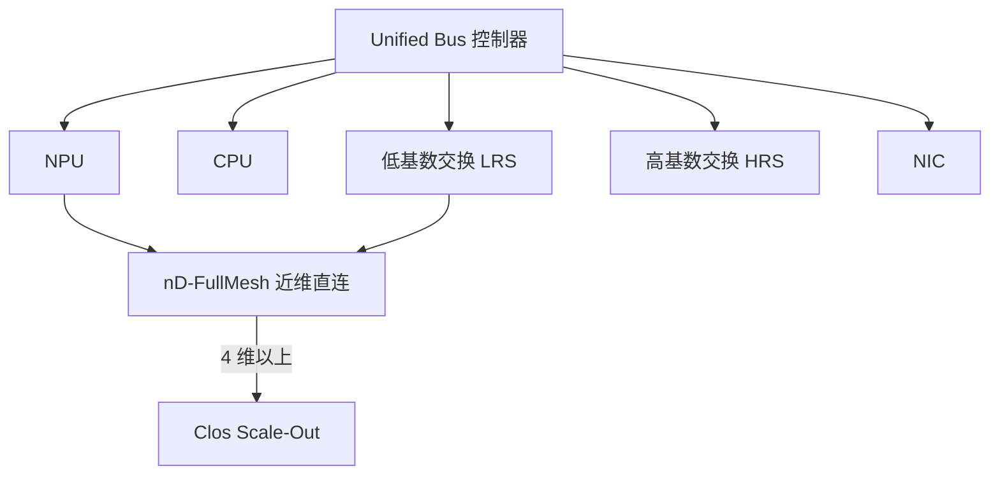

# UB-Mesh 统一总线

    
拓扑论文里真正改协议栈的那一刀，是用一种 Unified Bus 把 NPU、CPU、低/高基数交换和网卡连起来，从而取消 PCIe、专用加速器链路与 RDMA 三套 IO 控制器。

    <footer>—— Liao et al., UB-Mesh: a Hierarchically Localized nD-FullMesh Datacenter Network Architecture, arXiv:2503.20377</footer>

[UB-Mesh](/llm/ub-mesh) 已经写过递归 nD 全互连与短距电直连优先。[灵衢](/llm/ub-lingqu) 已经写过内存语义与消息语义对软件意味着什么。本篇回到 **arXiv:2503.20377** 把 **Unified Bus（UB）** 当成互连技术本身来读：为什么论文认为三套异构互连是通信墙的一部分；UB 如何让积木（NPU、CPU、LRS、HRS、NIC）共用控制器并做带宽分配与池化；以及相对非过订阅 Clos 的成本、可用性与训练线性度数字该钉在哪条基线上。协议包头、链路编码、重传状态机，论文声明将另行发布——未发布的字段不补。CloudMatrix384 的 UB 是该设计的生产递归，物理图按 [384 SKU](/llm/cloudmatrix-384) 的 L1/L2，不按文中 4D-Pod 插图抄。

## 问题

论文把下一代 AI 数据中心写成四条同时要满足的需求：规模（万卡到十万卡级训练已被公开讨论）、每节点超过约 3.2 Tbps 量级的加速器互连、成本（对称 Clos 把带宽涨 10–100× 时互连投资同阶膨胀）、可用性（光模块数量把整簇 MTBF 打到分钟级）。传统 GPU 集群的数据路径是拼出来的：CPU–GPU 走 PCIe，节点内 GPU 走 NVLink，跨节点走 InfiniBand 或 RoCE。每跨一次协议，就要转换、排队、换地址空间。LLM 的 TP All-Reduce、MoE All-to-All、以及把 KV 放到主机 DRAM 再取回，会反复穿过这些边界。

只改拓扑、不改总线，积木仍然不能对等：CPU 内存无法成为 NPU 的一等公民，交换芯片也要为每一种协议各做一套端口。论文的第三条原则之外，还有一句工程断言：**所有部件用同一种 UB 互连**，才能灵活分配 IO、做硬件资源池化，并给跨层优化留接口。

### 统一总线替换的是三套协议栈

UB 要同时像总线一样被处理器发出同步 Load/Store/Atomic，又像网络一样发异步 Read/Write/Message。若只能消息，池化内存就要走显式拷贝；若只能一致性 Load/Store，跨柜规模会变得像一台巨大 SMP。公开设计两者都要，共享物理链路与 IO 控制器。把 UB 理解成「就是 RDMA 改名」，会丢掉 Load/Store；理解成「就是把 HCCS 拉长」，会丢掉消息与多跳交换。

积木表是：专用 NPU / CPU、低基数交换 LRS、高基数交换 HRS、网卡。LRS 做柜内聚合与 CPU–NPU，降低对昂贵高基数交换的依赖。柜间在电信号可达范围内直连；超出 4 维的规模接 Clos。这一代论文实现把 **UB-Mesh-Pod 定在 4 维**，使规模叙述可以落到约 8K NPU 的高带宽域——那是架构论文的 Pod 设计，不是 CloudMatrix 384 的 384 卡装箱单。

论文脚注把协议详细规格标为将发布。容量规划只能用语义类别与系统级评估，不能填写未出现的单通道比特率或 opcode 表。OpenURMA 一类后续工作讨论的是公开规格上的清洁室实现，不改变 2503.20377 当时「细节另文」的边界。

## 方法

构建顺序与并行对齐。高频、大带宽的并行维（TP、部分 SP、域内 EP）放在低维全互连上，让多数传输走 0–2 跳。DP、跨 Pod 放在高维或 Clos。数据放置与集合通信要拓扑感知：All-Path Routing（APR）、源路由压缩头、拓扑感知无死锁流控（TFC，公开描述为用很少的虚拟通道做全路径）、链故障时直接通知而非逐跳扩散。

UB 在方法上的独特处是 **IO 带宽可分配**：同一套控制器上，哪些通道给近维直连、哪些给 LRS 上联、哪些给主机，可以按机柜角色调，而不必先决定「这块端口是 PCIe 还是 NVLink」。池化则来自对等：NPU 可以直接访问另一颗 CPU 的 DRAM、另一颗 NPU 的 HBM，而不经过「先到本机 Root Complex 再转发」的默认路径。论文把这写成相对异构互连的灵活性，而不是已经公布的机柜级 `malloc` API。

### 积木与带宽分配

LRS 的存在，是为了让 CPU–NPU 与柜内聚合不必消耗 HRS 端口。HRS 留给真正需要高基数的那一维。NIC 仍在，因为南北向与存储不会因为 Scale-Up 统一了就被取消——CloudMatrix384 后来把 RDMA / VPC 写成另外两平面，与这篇架构文的「UB 做 Scale-Up 主体」一致。64+1 备援：每柜多一颗经 LRS 接入的备份 NPU，故障时改走一跳而不把整组降成 7 卡。这是 Pod 文中的机制；384 SKU 的备援以产品文档为准，不要把 64+1 抄进 8 卡节点运维手册。

论文估计短距无源电缆约占全部线缆的 86.7%，相对非过订阅 Clos 可减少约 98% 的高基数交换机与约 93% 的光模块。这些是相对其 Clos 基线的评估，不是某一交付清单上的器件计数。

## 机制

短距电直连降低单跳距离、功耗和光模块故障率；递归全互连降低「本维」交换跳数。UB 把这两件事焊在同一套动词上：近端既可以是 Load，也可以是 Message，程序员不必在三种 SDK 之间搬缓冲区描述符。APR 让流量借闲置的维间路径；集合通信若仍按单环默认映射，会浪费 Mesh 的多路径。HCCL / 通信库需要拓扑感知。

相对 Clos 的训练性能，论文称多种 LLM 训练任务相对昂贵 Clos 基线的性能下降在约 7% 以内，线性度 95%+；系统成本效率约 2.04×，可用性叙述中有 7.2% 的相对提升。这是其实验条件下的结果，用来说明「少光模块不一定把训练打穿」，不能当成任意模型与并行度的保证。

### 路由与故障恢复

Mesh 有环，APR 又允许多跳，流控必须防死锁。TFC 被描述为拓扑感知、用 2 条虚拟通道级的资源做无死锁全路径。源路由把转发指令压进短头。链路故障用直接通知加快重路由，而不是等逐跳收敛。这些属于网络系统：框架工程师不必实现，但必须知道拥塞与故障后路径集合会变，集合通信的性能不是一条水平线。

## 边界与工程取舍

不要用 nD-FullMesh 去替换数据中心南北向以太网。不要在只有 ToR Clos 的机房「用软件模拟 UB」。不要把 1024 NPU 的 4D-Pod、384 NPU 的 CloudMatrix、以及后续更大 SuperPoD 的公开产品宣传展开成同一个规格表。电直连的距离是物理极限；柜列拉太长就必须上光。

协议未完全公开时，不要在容量规划里填写未出现的单通道速率。成本账：少 HRS 与少光模块是论文主张的系统优势；运维要补上拓扑感知的值班能力。可用性依赖备援与快速重路由，而不是假设铜缆永不坏。

出处：arXiv:2503.20377。CloudMatrix384（arXiv:2506.12708）声明其 UB 为 UB-Mesh 之递归。本篇只写统一总线作为互连技术与论文评估，拓扑递归见 UB-Mesh 专文。

## 小结

- UB-Mesh 论文用 Unified Bus 把 NPU/CPU/LRS/HRS/NIC 收进同一套 IO 控制器，替换三套异构互连。
- UB 同时提供内存语义与消息语义，用来做带宽分配与资源池化；协议细节当时声明另文。
- 相对非过订阅 Clos：约 98% 少 HRS、约 93% 少光模块、约 2.04× 成本效率、训练下降约 7% 以内——均钉论文基线。
- 出处：Liao 等，arXiv:2503.20377。
