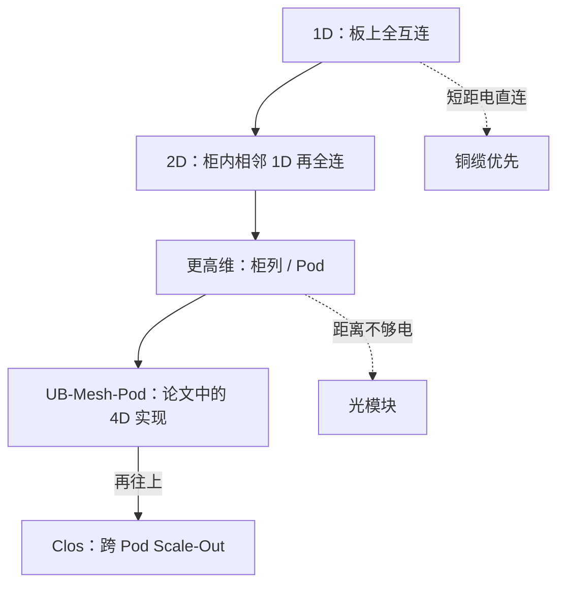

# UB-Mesh：递归 nD 全互连、短距电直连优先

    
从板上的一维全互连递归到机柜、柜列与 Pod：能用电直连的跳数就不要改走长距交换与光模块。

<footer>—— Jiang et al., UB-Mesh: a Hierarchically Localized nD-FullMesh Datacenter Network Architecture, arXiv:2503.20377</footer>

UB-Mesh 是华为公开的 AI 数据中心网络架构：用**层次化、局部优先的 n 维全互连**（nD-FullMesh）替代对称 Clos 作为 Scale-Up 主体，并用 [统一总线 UB](/llm/ub-lingqu) 把 NPU、CPU、低/高基数交换和网卡连起来。CloudMatrix384 论文写明，384 超节点的 UB 设计是 UB-Mesh 的**递归落地**。本篇写拓扑原则与论文里的工程取舍：短距电直连优先、分层带宽、以及 UB-Mesh-Pod 作为 4 维实现。不把论文中 4D-Pod 的 1024 NPU 设计直接当成 [CloudMatrix 384](/llm/cloudmatrix-384) 的 SKU，也不把相对 Clos 的成本倍数写成你机房的报价。

## 问题

LLM 训练与推理的通信有局部性：张量并行、序列并行往往发生在近邻设备上；数据并行、跨 Pod 同步可以更远、更稀。经典 Clos 对所有流量一视同仁，用大量高基数交换机和光模块提供非阻塞，成本与故障率（光模块数量）随规模恶化。论文把需求写成：高带宽给短距、可接受的带宽给长距、少光模块、高可用。对称 Clos 满足性能，不满足成本与可靠性约束。

直接全连接所有 NPU 又会让链路数按 $O(N^2)$ 爆炸。需要一种拓扑：在每一层上看起来是全互连（低跳数），层与层之间递归展开，物理上优先用短铜缆，只有层间距离超出电信号范围才上光。这就是 nD-FullMesh 的动机。

### 递归全互连在说什么

一维：一块板上相邻 NPU 彼此全连。二维：相邻的一维网再彼此全连，对应机柜内。三维、四维：柜列、楼层内的机柜组。论文把虚拟拓扑映射到物理组织，并在这一代把 **UB-Mesh-Pod 定在 4 维**，4 维以上仍用 Clos，以平衡成本与灵活性。递归的要点是：**每一维都优先直连**，而不是每一维都回到核心交换机。跳数与距离同时被压在「这一维的局部」里。

论文估计短距无源电缆约占全部线缆的 86.7%，相对非过订阅 Clos 可减少约 98% 的高基数交换机与约 93% 的光模块，系统成本效率约 2.04×，可用性叙述中有 7.2% 的相对提升。这些是论文相对其 Clos 基线的评估，用来理解「电直连优先」的方向，不是 CloudMatrix 384 交付清单上的器件计数。

## 方法

构建顺序与并行对齐。把高频、大带宽的并行维（TP、部分 SP、域内 EP）放在低维全互连上，让多数传输走 0–2 跳。把 DP、跨 Pod 放在高维或 Clos。数据放置与集合通信要拓扑感知：论文为此提出 All-Path Routing（APR）、源路由压缩头、拓扑感知无死锁流控（TFC，公开描述为用很少的虚拟通道做全路径）、以及链故障时的直接通知而非逐跳扩散。

硬件积木包括专用 NPU / CPU、低基数交换 LRS、高基数交换 HRS、网卡，全部经 UB 互联。LRS 做柜内聚合与 CPU–NPU，降低对昂贵高基数交换的依赖。柜间在电信号可达范围内做直连全互连；论文把「一行四柜、再在列向全连」写成与有源电缆距离相匹配的工程点。超出 4 维的规模，用 Clos 接许多 Pod，而不是强行 5 维全连——那是这一代的显式取舍。

### 与 CloudMatrix 384 的关系

384 超节点是生产 SKU：12 计算柜 + 4 通信柜，L1 板载 + L2 子平面，见 [七子平面](/llm/ub-l1-l2-planes)。它体现同一原则——局部全互连、UB 统一、能用电则用电——但物理图是两级交换的无阻塞结构，不是把论文插图里的 64+1 机柜 4D-Mesh 原样贴上。读拓扑时分清：**架构论文的 Pod 设计**与**已交付的 384 卡超节点**。递归二字在 CloudMatrix 文中指 UB 设计延续 UB-Mesh，不指定维数必须等于 4。

可靠性上，论文描述过 64+1：64 颗常规 NPU 加一颗经 LRS 接入的备份，故障时改走一跳而不把整组降成 7 卡。这是 UB-Mesh-Pod 文中的机制；384 SKU 的备援以产品文档为准，不要把 64+1 抄进 8 卡节点的运维手册。

APR 让流量借闲置的维间路径。集合通信若仍按单环默认映射，会浪费 Mesh 的多路径。HCCL / 通信库需要拓扑感知；把以太网 Clos 的 ring 参数搬过来，等于关掉论文里那套优化。

## 机制

短距电直连降低的是单跳距离、功耗和光模块故障率；递归全互连降低的是「本维」的交换跳数。两者合在一起，TP 类流量不必爬 Clos 的叶子–脊–叶子。分层带宽则承认：远维链比近维细，这与 LLM 通信矩阵匹配——近的密、远的稀。代价是拓扑不对称：编程必须知道自己在哪一维，故障绕路会改变跳数（64+1 就是直连改一跳）。Clos 的对称性换的是「任意一对都一样」；Mesh 换的是「大多数对都很近」。

相对 Clos 的训练性能，论文称多种 LLM 训练任务相对昂贵 Clos 基线的性能下降在约 7% 以内。这是其实验条件下的结果，用来说明「少光模块不一定把训练打穿」，不能当成你的模型与并行度的保证。

### 路由与死锁

Mesh 有环，APR 又允许多跳，流控必须防死锁。TFC 被描述为拓扑感知、用 2 条虚拟通道级的资源做无死锁全路径。源路由把转发指令压进短头，减轻逐跳查大表。这些属于网络系统，框架工程师不必实现，但必须知道：拥塞与故障后的路径集合会变，集合通信的性能不是一条水平线。

## 边界与工程取舍

不要用 nD-FullMesh 去替换数据中心南北向以太网。不要在只有 ToR Clos 的机房「用软件模拟 UB-Mesh」。不要把 1024 NPU 的 4D-Pod、384 NPU 的 CloudMatrix、以及未来更高维扩展开成同一个规格表。电直连的距离是物理极限；柜列拉太长就必须上光，原则变成「优先」而不是「禁止光」。

成本账：少高基数交换与少光模块是论文主张的系统优势；运维要补上拓扑感知的值班能力。可用性依赖备援与快速重路由，而不是假设铜缆永不坏。

出处：arXiv:2503.20377。CloudMatrix384（arXiv:2506.12708）声明其 UB 为 UB-Mesh 之递归。协议细节当时未完全公开，不在此补。

## 小结

- UB-Mesh 用递归 nD 全互连做局部高带宽，短距电直连优先，远距才上交换与光。
- 这一代论文实现取 4D-Pod，再往上接 Clos；维数是工程折中。
- 多数 TP/SP 应对齐到 0–2 跳；集合通信要吃多路径。
- CloudMatrix 384 是该原则的生产递归，物理图按 384 SKU 的 L1/L2，不按 1024-Pod 插图抄。
- 相对 Clos 的成本与性能数字属于论文基线，不作通用 SLA。
- 出处：UB-Mesh 与 CloudMatrix384 公开论文。
