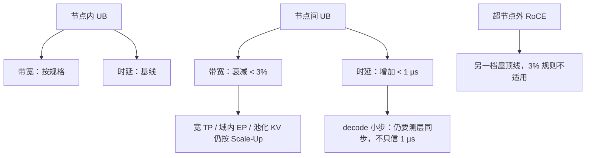

# 节点间带宽衰减与微秒级时延

    
节点间带宽衰减低于 3%，节点间时延增加低于 1 µs；对带宽主导的 AI 集合通信，这点附加开销通常进不了端到端的一阶项。

<footer>—— CloudMatrix384 论文表 1 一类对节点内 vs 节点间 UB 的公开对照</footer>

[CloudMatrix 384](/llm/cloudmatrix-384) 把 48 个计算节点收成一块逻辑节点，论据之一是：**跨节点 UB 的表现接近节点内**。公开论文写明，节点间带宽衰减低于 3%，节点间时延增加低于 1 µs，并判断现代 AI 负载更吃带宽、这点时延对端到端影响很小。本篇把这组数字放回屋顶线：它们允许宽 TP / 宽 EP 离开 8 卡盒，但不把跨节点路径变成封装内 Die 互连，也不允许用「已经近本地」当借口把 HCCL 打到 RDMA 平面上还报同样的数。数字只引用论文，不编造未给出的分位数、尾时延或单 kernel 微基准。

## 问题

程序员的旧模型是：`localhost` 上的 8 卡是快的，跨 `hostname` 是慢的，慢一个数量级以上。若超节点跨节点仍然慢一档，384 只是高密度机房，逻辑节点不成立，MoE dispatch 与分布式 KV 仍要按以太网来设计。若宣传「完全等于节点内」而不给衰减，规划会把最满的 All-to-All 按盒内带宽乘 48，交换层一过载就原形毕露。论文给出的是**有界衰减**：不到 3% 的带宽、不到 1 µs 的附加时延。问题变成：这 3% 与 1 µs 分别打在训练和 decode 的哪一项上。

另一半是比较对象。节点内已经包含 L1 交换；节点间再经 L2 与 [跨柜光](/llm/ub-optical-cabinets)。对照的是「同一套 UB 动词、多两跳交换」，不是「HCCS 盒内一致性 cache line」对「跨柜 Load」。把低于 1 µs 的附加时延理解成远程原子操作与本地 L1 cache 一样快，会在控制面热路径上误用内存语义。

### 带宽衰减 3% 不是随机丢包

衰减描述的是有效吞吐相对节点内规格的下降：交换、光、编码、流量管理合在一起的系统结果。它不是「每条消息 3% 概率丢失」。过订阅、PFC/ECN 配错、平面故障导致七分之一带宽消失，都会远超 3%。论文数字假设拓扑按无阻塞交付、平面完整。容量规划应把 3% 当健康超节点的标称税，把平面故障当独立的降级档。

392 GB/s 单向是论文给每颗 910C 的 UB 配置量级。节点间若按「低于 3% 衰减」理解，应用可见带宽仍在同一档，而不是掉到 400 GbE 那一档。不要用 3% 去反推一种未公开的交换内部速率。

## 方法

并行与 SLA 按两张表来写。

带宽表：TP All-Reduce、EP All-to-All、KV 块在 UB 上的搬运，按节点内规格减去不超过 3% 来做一阶规划，并留出与 CPU 池化流量的争用。不要按 RoCE 网卡的 400 Gbps 去规划超节点内 EP。若进程组跨出超节点，改用 RDMA 表，3% 规则作废。

时延表：附加低于 1 µs 是路径级增加。集合通信的端到端时延还要加软件栈、启动、同步。训练大微批时，计算覆盖这 1 µs 很容易。Decode 每层一次 All-Reduce、每步多层：1 µs × 层数 × 同步次数可能叠进 TPOT，尤其在小 batch、核已经很短时。论文说「对端到端影响微乎其微」，背景是带宽主导的 AI 任务；[推理张量并行](/llm/infer-tp) 里 decode 的同步税是另一条曲线。规划 decode 的宽 TP 时，用本超节点上的步时间测量，而不是只用表 1 的 1 µs 做乘法作文。

### 近本地对软件意味着什么

调度可以把超节点当一份加速器：KV 不必钉在「产生它的那 8 卡」上，prefill 与 decode 池之间经 UB 取缓存，论文把这写成降低数据局部性约束。近本地是这条架构的定量许可证。它仍建议：热 KV 尽量近端 HBM；CPU DRAM 池是第二层；对象存储是第三层。近本地不是「任意远端 HBM 与本地 HBM 同一屋顶线」——HBM 规格是 3.2 TB/s 封装级，UB 是数百 GB/s 量级，差一档的是介质，不是节点内外。

测量时应钉：节点内一对 NPU、跨节点一对 NPU、跨平面故障注入、以及是否与 RDMA/VPC 流量争用。只报一个「接近」而不报对照条件，无法回归。

论文把 AI 负载写成主要依赖带宽而非时延。这条对大块 GEMM 后的 All-Reduce 成立。对同步 Load、小原子、以及 decode 里 payload 只有 $b\times d$ 的 All-Reduce，时延份额上升。近本地是系统设计目标，不是免除微基准的豁免函。

## 机制

附加时延来自 L2 转发、光转换和更长的串行链路，量级被做到亚微秒到约 1 µs。附加带宽税来自编码、流控和最忙平面上的争用，系统测量收敛到 3% 以内。因为 LLM 集合通信的消息通常足够大，流水线能盖住 1 µs；小消息时，启动延迟与同步次数重新占主导——这时该减 TP 度或增大连续批，而不是怀疑光模块「没有达到 3%」。

与以太网 hop 的差别是数量级：数据中心叶子转发常在微秒以上再加排队。UB 增加的低于 1 µs 把跨节点留在加速器互连的世界里，这才配得上「逻辑节点」。一旦误走 VPC，数字从 1 µs 跳到另一张表。

### 和封装内、盒内的层次

910C 封装内 Die 互连（约 270 GB/s 单向量级）比 UB 更近。节点内 L1 比跨 L2 更近。近本地说的是 **L1 域 vs L2 域** 的接近，不是三层抹平。Die 级专家切分、8 卡 TP、48 节点 EP 应分别对照三张屋顶线。把 1 µs 加到 Die 间通信上是张冠李戴。

## 边界与工程取舍

不要把低于 3% / 低于 1 µs 抄到另一个机房布局（更长光纤、不同过订阅）上当保证。不要在平面缺失时仍用健康数字做 SLA。不要用该表对比 NCCL 在 NVLink Switch 上的测量，除非双方都公布了同样的消息尺寸与并行度。CloudMatrix-Infer 在 DeepSeek-R1 上的 tokens/s 是整栈结果，不能反推「因为 1 µs 所以吞吐是某某」。

decode 服务若 TPOT 预算只有十几毫秒，应用自己测层同步；论文同时给出过更严 TPOT 下吞吐下降的例子，说明延迟约束一旦变紧，系统会主动降 batch，近本地并不能取消吞吐–时延权衡。

出处：arXiv:2506.12708 中节点间相对节点内的带宽衰减与时延增加；设备 UB 规格同文。不引用未公开的尾时延曲线。

## 小结

- 论文公开：节点间 UB 带宽衰减低于 3%，时延增加低于 1 µs，作为逻辑节点的定量依据。
- 该数字适用于健康、无过订阅的 UB 域；平面故障和误走 RoCE 都不在此列。
- 大块、带宽主导的 TP/EP 可按近本地规划；decode 小步仍要测同步税。
- 近本地是 L1 vs L2，不是 HBM vs UB，也不是 Die 互连。
- 换机房、换光纤长度后必须重测，不能把表 1 当物理定律。
- 出处：CloudMatrix384 公开论文表 1 一类对照；并行纪律见 [Scale-Up](/llm/scale-up-vs-scale-out)。
