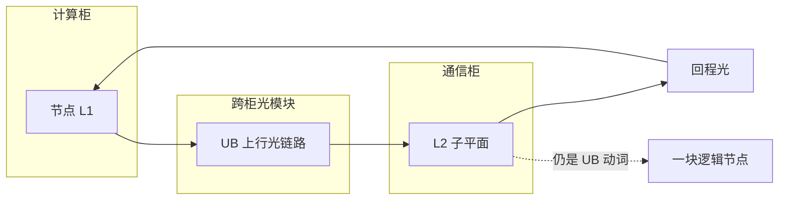

# 跨柜光模块把多柜收成一个逻辑节点

    
计算柜与通信柜不在同一背板里；把 L1 接到 L2 的跨柜介质是光模块，软件仍看见一个 UB 域，而不是十六个独立机柜。

<footer>—— 对照 CloudMatrix384 十六柜形态与 UB-Mesh「电直连优先、距离不够则上光」的公开原则</footer>

[CloudMatrix 384](/llm/cloudmatrix-384) 横跨 16 个机柜：12 个计算柜放 48 个节点，4 个通信柜放 [L2 UB 交换](/llm/ub-l1-l2-planes)。柜与柜之间没有一块能插 384 颗 NPU 的巨型背板。短距铜缆够用的是节点内、至多柜内背板；柜间距、通信柜与计算柜之间的扇出，公开架构用**光模块**把 UB 链路延长。逻辑上，这些光链路仍是 UB 平面的一部分，HCCL 进程组可以把 384 颗 910C 当成一块 Scale-Up 域。本篇写「光」在超节点里的职责：收口距离，而不是另建一张以太网。不填写未公开的光模块只数、每瓦比特或眼图。

## 问题

Scale-Up 想要的是低跳数、高带宽、内存/消息语义不断档。Scale-Up 的物理敌人是距离：电直连有长度上限，机房里 16 柜并排后，L1 到 L2 的线会超过无源铜缆的舒适区。[UB-Mesh](/llm/ub-mesh) 的原则是能用电就用电，减少光模块以降低成本和失效率；但原则不是「超节点禁止光」。一旦拓扑需要把多柜接到中心交换层，光是把 UB 动词送到对面柜子的介质，不是把语义降成 RoCE。

若跨柜改走数据中心以太网，384 张卡立刻回到 Scale-Out：TP All-Reduce 穿叶子，节点间带宽与时延不再「接近节点内」，超节点名存实亡。若坚持全铜，布线长度、信号完整性和柜布局会把规模钉死在单柜。CloudMatrix 的选择是：柜内/板上优先电，**跨柜 UB 用光**，通信柜专门承担光模块密度与 L2 供电。

### 光模块接的是 UB，不是 VPC

VPC 平面上的擎天网卡也可以是高速以太网光口，那是南北向与存储。本篇的光模块指 **L1–L2 之间的 UB 上行**。两者可能并存在同一机房，甚至同一柜的不同托盘，但软件平面不同。把光模块计数混进「这台机器有多少 400G 以太网口」，会把 Scale-Up 端口当成 Scale-Out 端口来规划拥塞。RDMA 平面的 400 Gbps 级链路同样可以是光，那是超节点之间；384 内部的逻辑节点靠 UB 光，不靠把 RDMA 在柜间再绕一圈。

SemiAnalysis 等第三方拆解讨论过光模块数量与功耗。那些不是华为论文里的规格表。本文只采用「十六柜 + 通信柜承载 L2 + 跨柜需要光」这一形态结论，不转述未写入 CloudMatrix384 / UB-Mesh 论文的模块清单。

## 方法

物理布局按「计算柜环绕或夹着通信柜」来理解：L2 集中，L1 分散，中间是光纤。每颗 L1 扇出 16 条到本子平面的 16 颗 L2，这些扇出在跨柜时就是光链路。七个子平面意味着七组平行的光纤束。运维上，光模块故障首先表现为某一平面、某一节点上行的误码或掉链路，MatrixLink 一类控制面负责切路径；业务侧应把超节点看成可降级的整域，而不是自动拆成 48 台独立服务器继续跑 64 路 TP。

逻辑节点的编程不变：进程仍按 NPU 设备号组 HCCL，KV 池仍按 UB 地址/消息访问。介质从铜换成光，不应当要求框架换一套 API。需要换的是值班：光模块的备件、清洁、固件与计算 NPU 不在同一个 SKU 里；通信柜的维护窗口等于逻辑节点的维护窗口。

### 与电直连如何分工

节点内 8+4 到板载 L1：短距电。柜内若还有背板连接，优先电。出柜到通信柜：光。超节点之间：RoCE 光或电视机房而定，已是 Scale-Out。UB-Mesh 论文里短距无源电缆占线缆估计的大部分，正是因为大量互连被压在板、柜局部；384 要把 48 节点接到 4 个通信柜，剩下那截「非局部」必须光。读成本时不要只用 Clos 的「全光」去比，也不要假装 384 是全铜超节点。

液冷与供电在通信柜同样是柜级设施：光模块密集处的热设计属于交付工程。算法工程师可以不选模块型号，但不能在可用性模型里把通信柜当成「没有计算所以不重要的空柜」。

华为公开材料把超节点写成紧耦合逻辑节点，节点间性能接近节点内。光的插入损耗与转发跳数已被算进那张「接近」里。不要在光路上再叠加一次「按以太网 3 微秒 hop」的经验值去改 TP 度。

## 机制

光模块做的是物理层：把 UB 的高速串行信号送到另一柜的 L2 端口。L2 转发的仍是 UB 包，Load/Store 与 Message 动词不在光纤上改写。因此「逻辑节点」成立于协议与编排，光纤只是让协议够得着。额外代价是：光电转换的失效模式（模块、链路、连接器）和铜不同，MTBF 模型应按光链路条数来做——这正是 UB-Mesh 想少用光的原因。384 在规模与少光之间取了折中：比全 Clos 少很多光，比单柜全铜多一截跨柜光。

跳数上，跨节点路径是 L1–L2–L1，相对盒内多两跳交换加一段光。论文用系统测量说明这段附加时延在微秒级、带宽衰减很小，见 [近本地性能](/llm/ub-near-local-perf)。机制上，这就是「逻辑节点」可对 TP/EP 成立的定量依据：框架看到的是一块加速器，物理上是光连起来的 16 柜。

### 故障爆炸半径

一批光模块或一柜 L2 掉线，逻辑节点的带宽或连通性降级。调度应摘域，而不是让剩余平面硬扛原 TP 度直到 NCCL/HCCL 超时。更换光模块的操作在通信柜，计算柜上的训练进程仍要按超节点作业来暂停。这与「只换一张计算刀片」的 HCCS 八卡机不同，见 [HCCS 到 UB](/llm/hccs-to-ub)。

## 边界与工程取舍

不要把跨柜光模块写成「昇腾的 InfiniBand」。不要在未提供 UB 的普通机柜之间用以太网交换机「模拟通信柜」。不要公开未发布的模块速率表。距离再拉长（机房跨列、跨层）是否仍保证「接近节点内」，要以该部署的测量为准；论文的近本地数字绑的是其 384 超节点布局，不是任意光纤公里数。

与 NVL72 单柜铜缆交换的对照：华为用多柜 + 光换更大的 Scale-Up 域；NVIDIA 用单柜高密度换更短的电。两者都是 Scale-Up，介质策略不同，不能把光模块数量直接当成谁更先进的分数。

出处：CloudMatrix384 论文的 16 柜与通信柜角色；UB-Mesh 论文的电直连优先与光模块成本/可靠性讨论。模块级 BOM 不以第三方拆解为准。

## 小结

- 16 柜超节点靠跨柜光模块把计算柜的 L1 接到通信柜的 L2，软件仍是一块 UB 逻辑节点。
- 这些光链路属于 UB Scale-Up，与 VPC/RDMA 光口分平面记账。
- 电直连覆盖板/柜局部，光覆盖柜间距；原则是优先电，不是禁止光。
- 通信柜维护 = 逻辑节点维护；光故障按域降级，不要拆成 48 台独立机继续宽 TP。
- 附加时延与带宽衰减用论文的近本地指标理解，不套以太网 hop 经验。
- 出处：CloudMatrix384 与 UB-Mesh 公开论文。
