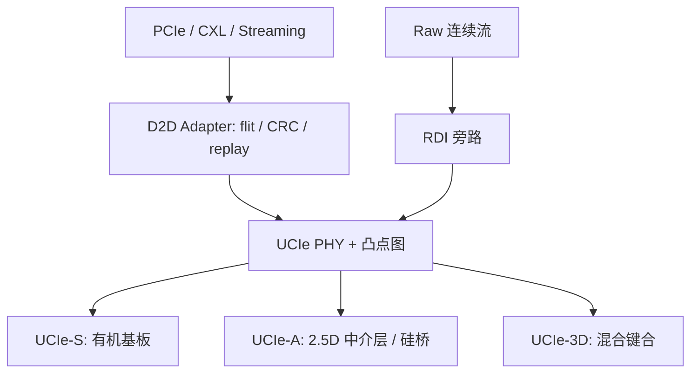

# UCIe die-to-die

UCIe 要在封装这一级给出可互操作的裸片互连：物理层、裸片到裸片适配器、以及可复用 PCIe 与 CXL 的协议栈，使不同厂商的 chiplet 能在同一 SiP 里混装。

<footer>—— UCIe Consortium 规范概述：包级无处不在的互连，覆盖 D2D I/O 物理层、协议与软件栈</footer>

单片 GPU 把逻辑、SRAM 与 I/O 做在同一块硅上，面积、良率和光刻场一起撞墙。Chiplet 把功能切开，再在封装里用短距互连拼回去。历史上每家有自己的平行接口：Intel 的 AIB、TSMC 客户常用的 GLink、以及一堆专有 SerDes。Universal Chiplet Interconnect Express（UCIe）由产业联盟在 2022 年推出 1.0，把这件事收成开放规范：同一套凸点图与训练序列，上面可以走流式数据，也可以走 PCIe 或 [CXL](/llm/cxl-memory-pool) 事务。本篇写 die-to-die 这一跳——从凸点节距到适配器到协议——以及它和中介层、HBM 各管哪一段。不把未出现在联盟公开材料里的某款 GPU 内部链路速率写成 UCIe 数字。

封装载体见 [CoWoS-L / CoWoS-R](/llm/cowos-l-r)；HBM 本身仍走 JEDEC 栈接口，不是 UCIe 替代 HBM PHY。

## 问题

封装内互连要同时满足三件事：沿裸片边缘的线性带宽密度（GB/s/mm shoreline）、单位面积密度、以及每比特能量。边缘不够长，再快的每针也喂不饱 AI 加速器的片间激活；能量太高，chiplet 切分省下的工艺成本会被互连功耗吃回去。专有接口在单一供应商垂直整合里能做到很密，但第二家的 I/O die、第三家的加速器 tile 对不上凸点图，也没有共同的合规测试。UCIe 要解决的不是「再发明一条更快的 SerDes」，而是给出多厂商能对拍的物理层与协议分层，并把已经存在的 PCIe / CXL 软件模型接到封装内。

联盟把封装分成两档。**UCIe-S**（standard package）走有机基板上的较长走线，凸点节距约 $100$–$130\,\mu\mathrm{m}$，适合成本敏感、距离稍长的 2D 拼装。**UCIe-A**（advanced package）走 2.5D 中介层或硅桥，节距约 $45\,\mu\mathrm{m}$ 并向更密走，岸线带宽密度高一个数量级。2.0 再加 **UCIe-3D**：混合键合、凸点可到 $10\,\mu\mathrm{m}$ 乃至 $1\,\mu\mathrm{m}$ 功能节距，对象是垂直叠芯而不是并排。把三种密度写成「UCIe 有一个带宽」，规划会错档。

### 速率代数与集群宽度

1.0 / 1.1 的主数据速率从 4 GT/s 到 32 GT/s。公开对照里，UCIe-S 的一个 x16 集群在 32 GT/s 下主带宽约 512 Gb/s/方向。UCIe-A 每个集群更宽（公开材料写 64 通道一档），岸线密度目标明显高于 S。3.0 把数据速率加到 48 GT/s 与 64 GT/s，联盟公开 KPI 把 UCIe-A 的岸线带宽密度写到约 278–370 GB/s/mm 量级（随节距与速率），并把 3.0 高速档的能耗目标写在约 $0.5$–$0.75\,\mathrm{pJ/bit}$。这些是规范目标与白皮书表，不是某次硅后测量。BER 在 48 GT/s 与 64 GT/s 上的目标不同（公开材料分别写 $10^{-15}$ 与 $10^{-12}$），靠 CRC 与 replay 收可靠性，不能把 64 GT/s 当成「免费翻倍」。

UCIe 的带宽密度按封装类型分栏。引用时写清 UCIe-S / UCIe-A / UCIe-3D、数据速率和凸点节距。只说「用了 UCIe」无法判断一条激活总线能不能养活切分后的 GEMM。

## 方法

栈自下而上三层。物理层负责差分或单端的 die-to-die I/O、时钟、训练、旁带；旁带在 3.0 里可达约 100 mm 量级，用来管更灵活的 SiP 拓扑，而不是当主数据通道。凸点地图与通道集群是合规的核心：对拍的两颗裸片必须在封装规则里对上。**Die-to-Die Adapter** 做可靠传输：flit、CRC、重传、可选的链路层多协议复用。Adapter 之上，FDI（Flit-aware Die-to-Die Interface）把 PCIe / CXL 一类 flit 协议接到适配器；RDI（Raw Die-to-Die Interface）允许绕过适配器，把原始带宽交给专用流——例如 SoC 与 DSP 之间的持续传输，3.0 把 Raw Mode 的连续流写进用例。

协议选择决定软件看见什么。走 CXL，封装内的 I/O die 可以像一台 CXL 设备那样被主机枚举，内存与加速器语义与机架侧一致，只是物理跳从电缆变成凸点。走 PCIe，现有驱动与配置空间模型可复用。走 streaming，得到的是低开销的用户定义流，没有 PCIe 那套事务，适合切分后的脉动阵列或激活转发。合规测试覆盖物理与协议，联盟的目标是「混厂商 chiplet」而不只是「同一家切两块」。

落到 AI 加速器：计算 tile 与 I/O tile 之间走 UCIe-A 或硅桥上的 UCIe；计算 tile 与 [HBM](/llm/hbm3e) 之间仍走 HBM PHY 与中介层逃逸，那是 JEDEC 的宽同步接口，位宽和训练序列都不是 UCIe 集群。有人讨论用 UCIe 语义接 on-package 内存以降低能耗，那是研究与提案路径，产品默认仍是 HBM 立方体坐在 CoWoS 上。规划封装时把「逻辑—逻辑」和「逻辑—HBM」画成两条边，不要共用一条带宽预算。

### 与 CoWoS、EMIB 的分工

UCIe 是接口规范，不是代工厂封装商标。TSMC [CoWoS-L](/llm/cowos-l-r) 的 LSI 桥提供亚微米铜线，用来实现 UCIe-A 或专有 D2D；Intel EMIB 是另一条硅桥。规范写节距与电气，代工厂写 RDL、TSV、翘曲。一张「UCIe 兼容」的 chiplet 仍要选一个封装 PDK：凸点工艺、保持区、电源垫密度必须进同一份基板设计。2.0 的 3D 路径与 [混合键合 HBM](/litho/hbm-hybrid-bonding) 用的是同类键合物理，但协议与凸点图仍以 UCIe-3D 为准，不能把 HBM 底座的混合键合直接叫 UCIe。

## 机制

短距平行接口用很多针、相对中等的每针速率，换取比长距 SerDes 低的能量。UCIe 1.x 的 NRZ、源同步或转发时钟、以及 3.0 在 48/64 GT/s 上的四分之一速率时钟，都是在「针数 × 速率」乘积与信号完整性之间折中。均衡在 3.0 里写明 3-tap TX FFE、可选 RX CTLE / DFE；S 与 A 在 3.0 高速档都要求 RX 端接。这些是 PHY 能把 BER 收到目标的条件，不是软件可关的特性。

适配器的 replay 把物理层偶发错误从「整包失效」变成「多几个 flit 时间」。对训练步进，偶发 replay 可被流水掩盖；对 decode 逐步同步，额外的不确定延迟会进 TPOT 尾部。封装内 D2D 通常仍远好于机架 CXL，但「chiplet 切分免费」不成立：切一刀就多一条必须对齐的时钟域、一条必须训练的链路、一份必须在测试夹具上证明的凸点良率。

岸线密度的分母是裸片边缘毫米数。计算 tile 若四周都要接 HBM，留给 UCIe 的边可能不够。这是 floorplan 问题，不是把 GT/s 再翻一倍能单独解决的。3.0 提高速率，正是为了在岸线约束下抬带宽，而不是取消布局约束。

### 管理面、修复与汽车档

1.1 为汽车与高可靠补了运行期可测性（如 parity flit 注入）与监控。2.0 把可管理性做得更完整：旁带、MCTP 一类管理织物、集群级修复。3.0 再加重运行期重校准与更长旁带。对数据中心加速器，修复意味着某条 lane 失效时仍能降速运行，而不是整颗 SiP 报废。测试插入点从「单片探针」变成「已知好裸片 + 封装后互联测试」；UCIe 的合规项是为了让第二家的 I/O die 在同一套测试向量下过关。没有修复与测试，多厂商 chiplet 只是白皮书。

功耗账要按 TX / RX / 公共电路拆。3.0 公开材料把高速档大致写成四成 TX、四成 RX、两成公共。空闲与节电状态影响的是平均功耗；峰值仍按全宽训练后的集群算。把「pJ/bit 目标」乘上从未跑满的平均带宽，会低估封装热设计。

## 边界与工程取舍

不要用 UCIe-S 的 32 GT/s x16 去满足必须坐在中介层上的 HBM 级带宽。不要假设两家都宣称 UCIe 的裸片可以在任意基板上互连——凸点工艺与 PDK 必须匹配。不要把 3.0 的 64 GT/s 写进尚未按 3.0 设计的 1.0 PHY。不要把封装内 UCIe 延迟当成机架 CXL 延迟；协议可以同名，物理跳数差两档。HBM4 的 2048 位接口仍是 JEDEC 内存立方体的事，见 [HBM4](/llm/jedec-hbm4)，与 UCIe 集群并行存在。

生态上，开放规范降低的是接口风险，不降低供应链风险：先进封装产能、中介层良率、已知好裸片库存仍然决定能不能出货。合规 logo 保证的是互连合同，不保证某款 AI chiplet 的软件栈已经把 CXL.mem 或 streaming 跑通。

出处：UCIe Consortium 规范页（1.0 物理层 + 适配器 + PCIe/CXL 协议；2.0 的 UCIe-3D；3.0 的 48/64 GT/s 与公开 KPI 表）；联盟 *Introducing the UCIe 3.0 Specification* 公开幻灯中的岸线密度、BER 与能耗目标。具体产品凸点图以该产品封装手册为准。

## 小结

- UCIe 标准化封装内 die-to-die：PHY、适配器、PCIe/CXL/streaming（及 Raw）协议。
- UCIe-S / A / 3D 对应有机基板、2.5D 高密度、混合键合垂直叠芯，带宽密度不可混列。
- 1.x 主速率至 32 GT/s；3.0 至 48/64 GT/s，靠均衡与 replay 收 BER，不是免费翻倍。
- 逻辑—逻辑走 UCIe；逻辑—HBM 走 JEDEC 栈与中介层，两条边分开预算。
- 规范是互连合同，封装 PDK、测试与岸线布局才是能出货的条件。
- 出处：UCIe Consortium 公开规范说明与 3.0 介绍材料。
