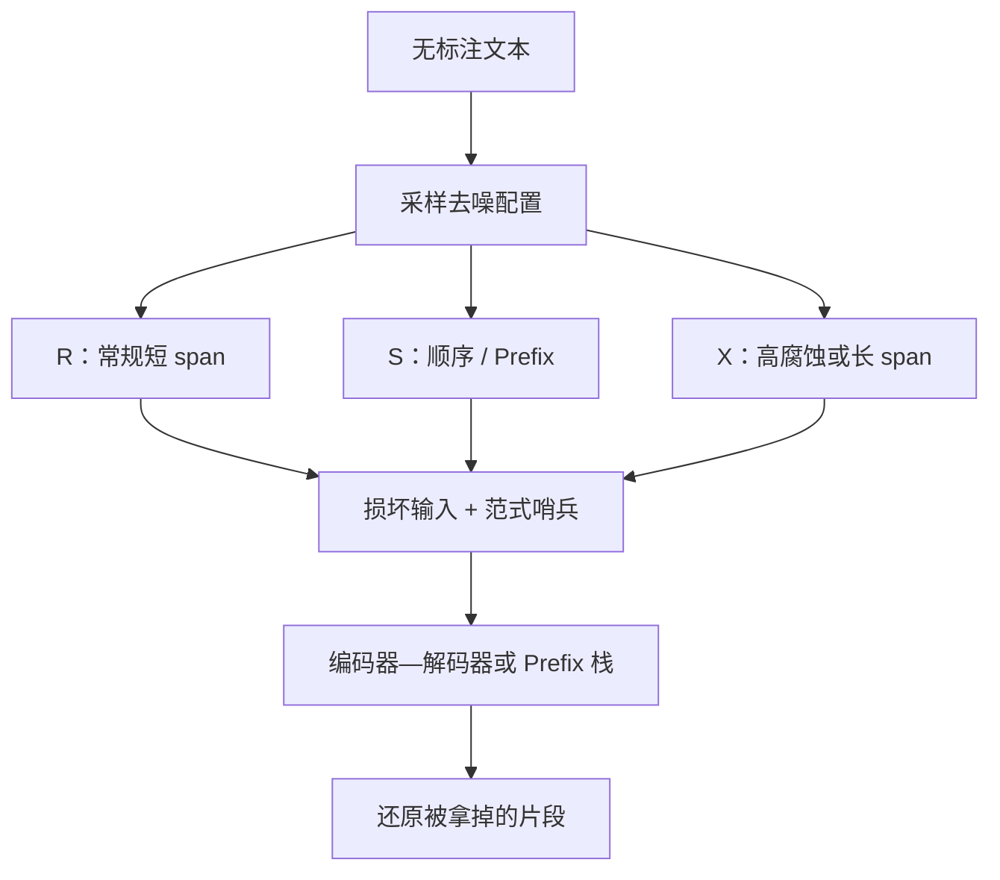

# UL2 / 混合去噪

把不同的预训练目标都写成「损坏输入、还原目标」，再按配比混合几种损坏方式——同一套参数同时借到跨度重建、前缀生成与极端残缺下的长生成。

<footer>—— Tay et al., Unifying Language Learning Paradigms</footer>

UL2（Unified Language Learner）的核心不是新的层，而是 **Mixture-of-Denoisers（MoD）**：把若干种去噪任务按比例抽进同一个预训练。Tay 等人把常见目标收成三类损坏——常规跨度腐蚀（R）、顺序式 / 前缀式（S）、极端腐蚀（X）——并在输入前加上范式哨兵，让模型知道当前是哪一种洞。它要解决的问题很具体：只做 T5 式 span 腐蚀的模型不擅长提示续写；只做 Causal LM 的模型不擅长填局部洞；用一个目标通吃，会在另一类任务上留死角。本篇写混合去噪如何统一，不把 UL2 20B 的全部分数表抄进来。

## 问题

自监督语言预训练看起来五花八门：下一个 token、随机掩码、span 哨兵、前缀生成。它们其实都是「给定损坏的 $x$，还原被拿掉的 $y$」。差别在损坏的几何：洞短还是长、洞是否保持从左到右的顺序、输入还剩多少。单一几何会带来单一归纳偏置。Raffel 等人的 T5 主力是短跨度、约 15% 腐蚀，擅长局部重建与理解微调，少样本提示续写偏弱。GPT 式因果目标擅长续写，局部填空要靠把槽挪到句末。UniLM 用掩码切换三种任务，已经是「混合」，但损坏仍偏 token 级。UL2 把混合从掩码种类推进到**损坏超参的混合物**，并显式加入极端残缺。

第二个问题是任务指示。混合物若在分布上 silently 切换，模型要靠输入长得像哪一种洞来推断任务，容易混。UL2 在输入加 `[R]` / `[S]` / `[X]` 一类范式 token，把「现在要玩哪一种去噪」写成可学习的条件。

### 三种损坏覆盖三种能力

R-denoiser：常规 span 腐蚀，跨度较短、腐蚀率中等，接近 T5。学局部可逆性与词汇重建。S-denoiser：严格顺序，相当于 Prefix LM——看见一段前缀，生成后续，前缀双向、目标因果。学续写与提示。X-denoiser：极端，长跨度或高腐蚀率（原文把「很长的 span」或「很高的腐蚀比例」视为 extreme），输入只剩少量证据，要还原大块文本。学在信息很少时仍保持长生成，介于 R 与语言建模之间。

MoD 是目标混合物，不是参数混合物。不要写成 MoE。专家路由与去噪范式哨兵是两件事。UL2 可以建在编码器—解码器或能表达 Prefix 掩码的栈上；公开的 UL2 20B 走的是可做 text-to-text 的那类架构，细节以 Tay 等原文为准，不在这里发明层数表。

## 方法

训练时每一步从去噪器集合中采样一种（或一种配置），按该配置损坏输入、构造目标，并在输入端放置对应哨兵。Tay 等人把最终混合物描述为若干离散配置的并：多个 R（不同平均 span 与腐蚀率）、一个 S（顺序、跨度数为 1 的前缀式）、多个 X（高腐蚀或很长 span）。配置数在原文里收成大约七种再混合；S 的比例不必占一半——公开叙述里 S 需要存在，但过多的 S 会挤掉 span 学习，消融表明少量顺序去噪往往更划算。精确的 $\mu$、$r$ 以论文表格为准，这里只保留定性：R 短而稀，X 长或密，S 是一条顺序洞。

损失仍是对目标 token 的教师强制交叉熵。与 BERT 的差别是目标常常是被挖掉的 span 序列（带哨兵），而不是在原位分类；与 GPT 的差别是输入端可见的不一定是严格左上下文，取决于当前采样到 R 还是 S。推理或微调时，选与下游最像的哨兵：填空与理解偏 `[R]`，提示续写偏 `[S]`。

### 为何需要 X，而不是只混 R 与 S

R 的洞短，模型习惯「局部拼图」。S 的洞是整段后缀，习惯「接着写」。二者之间有一段空白：洞又长、上下文又残，既不是短填空也不是完整前缀。X 填这段空白，并提高每个样本里被预测 token 的比例，有一点样本效率上的好处。消融上，X 单独不够，R 仍是理解任务的主力；S 单独会变成近因果模型，丢掉 span 归纳偏置。混合物的价值是互补而不是平均。

## 机制

哨兵把任务条件写进嵌入，后续层可以对不同损坏几何使用不同的内部算法：看见 `[S]` 时更依赖前缀双向编码再因果展开；看见 `[R]` 时更依赖局部双侧证据还原短 span。若没有哨兵，几何仍可从洞的排布里统计出来，但早期训练会把三种任务的梯度搅在同一套无条件表示里。混合采样则保证每种几何都反复出现，避免灾难性的「只记住最后一种目标」。

与 UniLM 的关系：UniLM 混合的是掩码图案（双向 / 因果 / 前缀），损坏主要是 token 掩码。UL2 混合的是**损坏过程参数**，掩码可以始终是「编码器看损坏输入、解码器因果还原」，或在 S 上启用 Prefix。统一的层次更高：连 GPT 与 T5 都被写成同一种「输入→目标」接口的不同损坏。这为后来在同一个检查点上做少样本提示与微调提供了共同的预训练前缀。

极端腐蚀会让目标变得很长，batch 的 token 预算会被 X 样本吃掉。实现上要对各去噪器做长度打包，否则名义上的均匀混合会在实际 token 比例上偏向 X。配比应按目标 token 计，不只按样本条数计——与端侧蒸馏的配比教训相同。

### 不是「三个损失相加」就叫 UL2

有人把 MLM 损失和 Causal 损失直接加在同一 batch 上，不改损坏几何、不加哨兵。那是浅混合，梯度尺度还要对齐，否则 Causal 的密集监督会压过 15% MLM。UL2 的做法是：每种配置单独成例，损坏与目标成对出现，哨兵区分，再按设计比例采样。复制时应复制这套接口，而不是只复制三个字母 R、S、X。

## 边界与工程取舍

UL2 增加数据流水线复杂度：要维护多种损坏器、哨兵、打包器。收益在「既要提示又要微调理解」的通用检查点上；若产品只做聊天续写，纯 Causal 更简单。若只做抽取，BERT / T5-R 可能够。端侧学生很少从 UL2 混合物直接训起，更常见是教师已经 UL2 或 T5，再蒸馏成 Causal SLM——此时学生未必保留哨兵接口。

公开的 UL2 20B 检查点与论文方法绑定；不要把后来任意「混合目标」的模型都称为 UL2。引用写 Tay et al.，*Unifying Language Learning Paradigms*。腐蚀率、span 均值、S 的精确比例以原文配置表为准，本文不编造未核对的小数。Google 研究博客对 R/S/X 的通俗说明可作对照，仍以论文为准。

范式哨兵在微调时可以弃用或改成任务名文本（T5 风格）。若预训练严重依赖哨兵而微调从不给，会有轻微裂缝；通常任务文本已经提供了更强的条件。

## 小结

- UL2 用混合去噪器把预训练统一成「损坏→还原」，而不是统一成某一层结构。
- R 接近 T5 短 span；S 接近 Prefix / 顺序生成；X 用长 span 或高腐蚀连接二者。
- 范式哨兵标明当前几何；应按配置采样并按目标 token 控制真实配比。
- 与 UniLM 的掩码混合互补：UL2 混合的是损坏超参，UniLM 混合的是可见性图案。
- 单一目标更简单；MoD 适合要同时服务提示与理解的通用检查点。
- 出处：Tay et al.，*Unifying Language Learning Paradigms*；R 的 span 腐蚀对照 Raffel et al.，T5。
