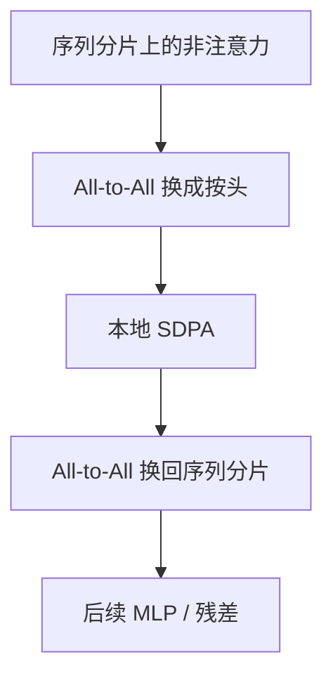

# DeepSpeed Ulysses

沿序列维切开注意力的激活，用 All-to-All 把各分片上的头凑齐再算注意力，长上下文才不必让每张卡存下整段 $s$。

<footer>—— Jacobs 等，DeepSpeed Ulysses</footer>

[上一课](/llm/comp-comm-overlap)把已有通信藏进 GEMM。长文档上采样把 $s$ 推到 32k、128k 时，激活显存按 $s$ 涨，TP 切的是隐藏维，挡不住序列轴。Korthikanti 的序列并行沿序列切 LayerNorm 与 Dropout；Ulysses 把注意力也做成序列维切分：先 All-to-All 换成按头完整、按序列分片，算完再 All-to-All 回去。本课不重讲重叠手法。缺口是这种序列并行（SP）与 TP、PP 如何分工，以及它与环形注意力一类长序列方法的边界。

## 问题

注意力激活与 KV 在训练时随 $s$ 线性涨（重计算可换时间），softmax 的中间量也大。只靠 TP，每卡仍持有全长 $s$。只靠把微批切小，GEMM 效率掉、PP 气泡相对变大。需要第四维：切序列。Ulysses 的选择是：非注意力模块保持按序列分片（每卡 $s/P_{\mathrm{sp}}$），进入注意力前 All-to-All，使每卡持有全部 $s$ 但只持有部分头，用现成的融合注意力核，再 All-to-All 还原。

与 [张量并行](/llm/tensor-parallel) 按头切注意力看起来像同一件事，分工不同：TP 切的是始终存在的头分片，通信是 All-Reduce；Ulysses 的 All-to-All 是布局变换，进出注意力各一次。两者可以叠，但要避免把头切两次切碎。

### 通信体积

All-to-All 的体积 $\propto b\times s\times d$，与 TP 激活通信同阶。$s$ 极大时，$T_{\mathrm{comm}}$ 可能超过注意力计算，重叠也盖不住。SP 度不是越大越好：应让每卡序列分片仍够长，注意力核有事可做。

Ulysses 不把因果掩码改成块稀疏。复杂度仍是每头 $O(s^2)$，只是分摊到不同卡的头上。真正降复杂度是 Ring Attention 或稀疏核，不是本课。

## 方法

选定 SP 组（通常与数据并行组正交的一组卡）。前向：各模块在序列分片上算到注意力入口 → All-to-All（序列维↔头维）→ 本地 SDPA → All-to-All 回来。反向对称。与 PP 叠加时，微批的序列长度是切分后的全局 $s$，阶段边界传递的激活也是分片后的形状，协议要在框架里一次定死。

与 1F1B 的接口：SP 通信发生在阶段内部，应与阶段间发送重叠，但缓冲区不能别名。长 $s$ 时优先保证 Ulysses 的 All-to-All 完成再发 PP，或给两者不同的网络优先级——拓扑课再谈。

### 与词表无关、与 batch 有关

切分沿 $s$，要求打包后的序列可被 $P_{\mathrm{sp}}$ 整除，或允许 padding。指令样本变长、FIM 重排后长度变化，加载器必须按 SP 对齐补齐，否则集合通信形状不一致。这是数据课与并行课的接缝。

梯度累积把多个微批合成优化步，每微批仍要单独做 Ulysses 通信。累积不减少 SP 通信次数，只减少优化器频率。

## 机制

布局变换把「长序列、全头」的存储问题，变成「短序列分片、算注意力时换全长少头」。数学上 SDPA 不变。通信模式从规约变成置换，类似 MoE 的 All-to-All，但置换键是序列块与头，不是专家 id。落后者对这种密集同步更敏感：一卡慢，整个 SP 组停。

## 边界

Ulysses 救不了注意力平方复杂度的墙，只救显存与部分墙上时间。上下文再长应换算法。它与 DualPipe 双流叠加时，All-to-All 次数翻倍，需要实测。下一课回到所有并行轴都还没关掉的那颗旋钮：梯度累积与微批大小，它决定 $M$、$b$ 以及上述通信体积的常数。

## 小结

- 本课不重讲藏通信；只补沿序列切分注意力激活的 Ulysses 布局。
- 进出注意力两次 All-to-All，SDPA 公式不变，复杂度仍平方。
- SP 度与 TP 头切分不要重复切碎；序列长度要对齐加载器。
- 与 PP 阶段边界的发送是两条通信，优先级要定。
- 出处：Jacobs et al., *DeepSpeed Ulysses*；Korthikanti et al., 序列并行与激活重计算。
