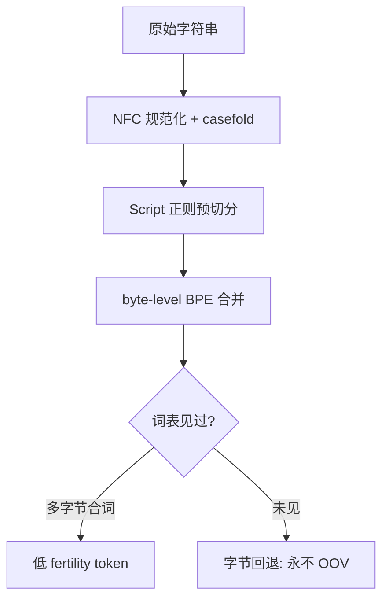
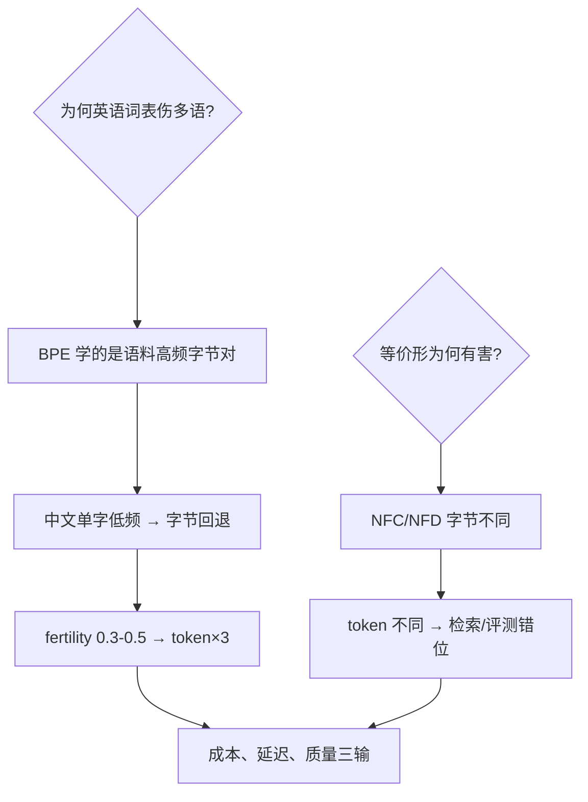

# Unicode 分词陷阱

同一个「不」字，UTF-8 三字节、GBK 两字节：BPE 切完 token 数不同、账单不同、智力不同——Unicode 是分词器脚下最深的坑。

<footer>—— 据 Petrov et al.「Language Model Tokenizers Introduce Unfairness」(2023)；Unicode TR#13 分行与 NFC 规范化</footer>

[BPE 合并规则](/llm/bpe-merge-rule)讲词表大小，本课讲编码层：UTF-8 字节流进 BPE 之前，Unicode 本身已经埋了等价形、组合字符与方言码位三重坑。缺口是**Unicode 分词陷阱**——为什么同一个字符串换个写法 token 数就翻倍，以及工程上怎么防。本课不做编码学通识。

## 问题

三重坑。**等价形**：「é」可是一个码位 U+00E9，也可拆成 e + 组合尖符 U+0301——视觉相同、字节不同、token 化不同，检索与评测双双错位。**切分差异**：中文、韩文在 UTF-8 是 3 字节/字，日文假名也是 3 字节，而 emoji 高达 4 字节——BPE 词表若以英语为主语料，非拉丁文本 fertility（字符/token 比）骤降。**规范化不一致**：NFC 与 NFD 产生的串在数据库里都不相等，遑论 token 相等。

术语翻译：fertility（生育率）= 平均每个 token 覆盖的字符数，越低越费 token；NFC/NFD = Unicode 规范化的组合式/分解式；Zalgo 文本 = 恶意叠加几十个组合符让单「字」膨胀成百字节。

数字实例：「é」NFC 单码位 2 字节，token 1 个；NFD 两码位 3 字节，常被切成 2–3 个 token。印地语天城文一个「字」由辅音 + 元音符号 + 组合符拼成，英语为主的 BPE 词表下 fertility 低到 0.3——同样一段话 token 数是英语的 3 倍多，API 账单与上下文窗口同步×3。

## 方法

工程防坑四件套：**入口规范化统一**（进 tokenizer 前 NFC + 统一大小写折叠）；**字节回退兜底**（GPT 式 byte-level BPE——任何字节序列都有 token 表示，永不 OOV，代价是罕见 Unicode 碎成字节）；**按 Script 预切分**（tiktoken 式正则把拉丁/汉字/数字/标点先分段，BPE 只在段内合并——防跨文字垃圾 token）；**评测集 NFC 化**（对比模型输出与参考答案前先归一化，否则 1 个 token 的差异污染评测）。

直觉类比：Unicode 像「同一道菜的三种写法」——「宫保鸡丁」「宫保雞丁」「gong bao ji ding」，菜相同、字面全异；入口规范化是「先统一成简体再进后厨」，字节回退是「不认识的字就按笔画逐笔拼」——保证能下单，只是慢且贵。

## 机制

机制核心：BPE 的合并统计由**训练语料的编码形态**决定，词表学到的不是「字」而是「语料中高频的字节对」。英语主导语料里，中文单字从未高频出现 → 中文 fertility 低；等价形未归一 → 语料里 NFC/NFD 各占一半 → 两套 token 都学了个半吊子。Zalgo 攻击的机制同源：组合符可以无限叠加，字节回退让 100 个组合符 = 数百 token = 数百倍账单与上下文占用——这是安全漏洞不只是质量问题。Petrov et al. 的实测：同一语义任务，非拉丁语言的推理成本与延迟数倍于英语，且准确率因「上下文窗口被 token 垃圾挤占」而下降。

常见误区：以为「byte-level = 万能」——它保证合法性与可逆性，不保证效率与公平；另一误区是训练前后归一化不一致：训练语料 NFC、推理输入 NFD，同一个词走两条 token 路径，模型表现像「没见过这个词」。

## 边界

规范化不是免费的：德语 ß 与 ss 的 casefold 合并、日文片假名长音符号的历史歧义，说明「统一形态」本身就是语言学决策。多语模型的正解是**语料配额**（保证每语言高频 n-gram 进词表）而非纯技术修补；tokenizer 换代是破坏性变更——词表即模型的骨骼。与[注意力掩码与填充](/llm/attention-mask-padding)的接续：token 化之后，batch 里长短不一的序列靠 padding 对齐，掩码的坑接踵而来——坑从字节一路埋到张量。

直觉类比：tokenizer 像海关，byte-level BPE 是「人不认识也放行」的最低海关——任何旅客（字节串）都能入境；但无签证（未见 n-gram）者被逐件开箱（按字节拆），通关时间（token 数）翻十倍，且开箱期间占满候机厅（上下文窗口）。

## 小结

- Unicode 三坑：等价形、fertility 不公、规范化不一致。
- 防坑四件套：NFC 入口、byte 回退、Script 预切分、评测归一化。
- token 不公平 = 成本/延迟/质量的三重放大器。
- 出处：Petrov et al. 2023；GPT-4 tiktoken 实现；Unicode Standard Annex #15。
